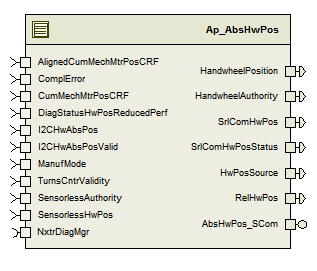

> **Source document:** `AbsHwPos_TcI2cVd/doc/Absolute_Handwheel_Position_TcI2cVd_MDD.docx`
>
> This page was converted automatically from the original document so it can be browsed online. Original format: Word document (`.docx`, 248 paragraphs, 18 tables, 1 embedded figures).

**Author:** Jared Julien (kzdyfh) **Last saved by:** Balani, Spandana **Revision:** 23

---

# Module  -- Absolute Handwheel Position TcI2cVd

# High-Level Description

The Absolute Hand Wheel Position Function is responsible for determining the steering wheel hand wheel position using either a Turns Counter estimate of motor position during key off and sensorless learnt internal hw position (for eg. Sensorless Vehicle Dynamics, Stored Last Position, Travel Exclusuin, etc) or  I2C digital hw position sensor and sensorless learnt internal hw position.

# Figures

# Variable Data Dictionary

For details on module input / output variable, refer to the Data Dictionary for the application.  Input / output variable names are listed here for reference.

(Note: Full variable names required in table.)

(Note: All global variables including End Of Line data used should be shown here)

| Module Inputs | Module Outputs | Module Outputs |
| --- | --- | --- |
| CumMechMtrPosCRF_Deg_f32 | CumMechMtrPosCRF_Deg_f32 | HandwheelPosition_HwDeg_f32 |
| AlignedCumMechMtrPosCRF_Deg_f32 | AlignedCumMechMtrPosCRF_Deg_f32 | HandwheelAuthority_Uls_f32 |
| TurnsCntrValidity_Cnt_u08 | TurnsCntrValidity_Cnt_u08 | RelHwPos_HwDeg_f32 |
| I2CHwAbsPos_HwDeg_f32 | I2CHwAbsPos_HwDeg_f32 | HwPosSource_Cnt_u16 |
| I2CHwAbsPosValid_Cnt_lgc | I2CHwAbsPosValid_Cnt_lgc | SrlComHwPos_HwDeg_f32 |
| SensorlessHwPos_HwDeg_f32 | SensorlessHwPos_HwDeg_f32 | SrlComHwPosStatus_Cnt_u16 |
| SensorlessAuthority_Uls_f32 | SensorlessAuthority_Uls_f32 |  |
| ComplError_HwDeg_f32 | ComplError_HwDeg_f32 |  |
| DiagStatusHwPosReducedPerf_Cnt_lgc | DiagStatusHwPosReducedPerf_Cnt_lgc |  |
| ManufMode_Cnt_enum | ManufMode_Cnt_enum |  |

## Module Internal Variables

This section identifies the name, range and resolutions for module specific data created by this module.  If there are no range restrictions on the variable, the term “FULL” is placed into the table for legal range.

| Variable Name | Resolution | Legal Range (min) | Legal Range (max) | Software Segment |
| --- | --- | --- | --- | --- |
| AbsHwPos_HwPosState_Cnt_M_enum | 1 | See Data Dictionary | See Data Dictionary | ABSHWPOS_START_SEC_VAR_CLEARED_UNSPECIFIED |
| AbsHwPos_HandwheelPositionLPF_M_str.SV_Uls_f32 | Single precision Float | See Data Dictionary | See Data Dictionary | ABSHWPOS_START_SEC_VAR_CLEARED_UNSPECIFIED |
| AbsHwPos_HandwheelPositionLPF_M_str.K_Uls_f32 | Single precision Float | See Data Dictionary | See Data Dictionary | ABSHWPOS_START_SEC_VAR_CLEARED_UNSPECIFIED |
| AbsHwPos_SrlComHwPosStatus_Cnt_M_u16 | 1 | See Data Dictionary | See Data Dictionary | ABSHWPOS_START_SEC_VAR_CLEARED_16 |
| AbsHwPos_VehCntrValid_Cnt_M_lgc | n/a | See Data Dictionary | See Data Dictionary | ABSHWPOS_START_SEC_VAR_CLEARED_BOOLEAN |
| AbsHwPos_VehCntrOfstLearn_Cnt_M_lgc | n/a | See Data Dictionary | See Data Dictionary | ABSHWPOS_START_SEC_VAR_CLEARED_BOOLEAN |
| AbsHwPos_HwAtoMtrAFltAcc_Cnt_M_u16 | 1 | See Data Dictionary | See Data Dictionary | ABSHWPOS_START_SEC_VAR_CLEARED_16 |
| AbsHwPos_HwPosSource_Cnt_M_u16 | 1 | See Data Dictionary | See Data Dictionary | ABSHWPOS_START_SEC_VAR_CLEARED_16 |
| AbsHwPos_VehCntrOffset_HwDeg_M_f32 | Single Precision Float | See Data Dictionary | See Data Dictionary | ABSHWPOS_START_SEC_VAR_CLEARED_32 |
| AbsHwPos_AlignedHwPos_HwDeg_M_f32 | Single precision Float | See Data Dictionary | See Data Dictionary | ABSHWPOS_START_SEC_VAR_CLEARED_32 |
| AbsHwPos_AlignedCumMtrPos_HwDeg_M_f32 | Single precision Float | See Data Dictionary | See Data Dictionary | ABSHWPOS_START_SEC_VAR_CLEARED_32 |
| AbsHwPos_PrevHandwheelPosition_HwDeg_M_f32 | Single precision Float | See Data Dictionary | See Data Dictionary | ABSHWPOS_START_SEC_VAR_CLEARED_32 |
| AbsHwPos_HandwheelAuthority_Uls_M_f32 | Single precision Float | See Data Dictionary | See Data Dictionary | ABSHWPOS_START_SEC_VAR_CLEARED_32 |
| AbsHwPos_TempHwPos_HwDeg_M_f32 | Single precision Float | See Data Dictionary | See Data Dictionary | ABSHWPOS_START_SEC_VAR_CLEARED_32 |
| AbsHwPos_SrlComHwPos_HwDeg_M_f32 | Single precision Float | See Data Dictionary | See Data Dictionary | ABSHWPOS_START_SEC_VAR_CLEARED_32 |
| AbsHwPos_TargetHwAuthority_Uls_M_f32 | Single precision Float | See Data Dictionary | See Data Dictionary | ABSHWPOS_START_SEC_VAR_CLEARED_32 |
| AbsHwPos_RelHwPos_HwDeg_M_f32 | Single precision Float | See Data Dictionary | See Data Dictionary | ABSHWPOS_START_SEC_VAR_CLEARED_32 |

### User defined typedef definition/declaration

This section documents any user types uniquely used for the module.

| Typedef Name | Element Name | User Defined Type | Legal Range (min) | Legal Range (max) |
| --- | --- | --- | --- | --- |
| HwPosStateType | HWPOS_STATE_INIT HWPOS_STATE_SENSORINVALID HWPOS_STATE_SENSORVALID HWPOS_STATE_INPUTINVALID | uint8 uint8 uint8 uint8 | 8 4 2 14 | 8 4 2 14 |

# Constant Data Dictionary

## Calibration Constants

This section lists the calibrations used by the module.  For details on calibration constants, refer to the Data Dictionary for the application.

| Constant Name |
| --- |
| k_GearRatio_Uls_f32 |
| k_UseTurnsCntr_Cnt_lgc |
| k_HwPosAuthorityStep_Uls_f32 |
| k_HwPosOutputLPFCoeffFc_Hz_f32 |
| k_HwPosOutputLPFError_HwDeg_f32 |
| k_TurnsCntrAuthority_Uls_f32 |
| k_I2CHwAuthority_Uls_f32 |
| k_VdAuthority_Uls_f32 |
| k_MaxVehCntrOffDiff_HwDeg_f32 |
| k_KinmIntDiagMaxRackLimit_HwDeg_f32 |
| k_HWAtoMtrADiffLimit_HwDeg_f32 |
| k_HwAtoMtrAError_str |
| k_VehCntrOffValidLimit_HwDeg_f32 |
| k_MinSensorlessAuthority_Uls_f32 |
| k_MaxSensorlessAuthority_Uls_f32 |

## Program(fixed) Constants

### Embedded Constants

All embedded constants whose values are provided in Eng units will be evaluated to the equivalent counts by using the FPM_InitFixedPoint_m() macro within the #define statement.

#### Local

| Constant Name | Resolution | Units | Value |
| --- | --- | --- | --- |
| D_HWPOSMAX_HWDEG_F32 | Single Precision Float | HwDeg | 1600 |
| D_RELHWPOSMAX_HWDEG_F32 | Single Precision Float | HwDeg | 3200 |
| D_INVALIDOFFSET_HWDEG_F32 | Single Precision Float | HwDeg | 65535 |
| D_NOAUTHORITY_ULS_F32 | Single Precision Float | Uls | 0 |
| D_MAXAUTHORITY_ULS_F32 | Single Precision Float | Uls | 1 |
| D_SRCUNKNOWN_CNT_U16 | 1 | Cnt | 65534 |
| D_SRCTURNSCNTR_CNT_U16 | 1 | Cnt | 1 |
| D_SRCI2CSENSOR_CNT_U16 | 1 | Cnt | 2 |
| D_SRCSENSORLESS_CNT_U16 | 1 | Cnt | 3 |
| D_HWPOSSTATUSFAULT_CNT_U16 | 1 | Cnt | 0xFFFF |
| D_HWPOSSTATUSUNKNOWN_CNT_U16 | 1 | Cnt | 0xFFFE |
| D_HWPOSSTATUSVALID_CNT_U16 | 1 | Cnt | 0x5555 |
| D_TCVCOMPUTING_CNT_U08 | 1 | Cnt | 0 |
| D_TCVVALID_CNT_U08 | 1 | Cnt | 100 |
| D_TCVINVALID_CNT_U08 | 1 | Cnt | 255 |
| D_TRIMPERFORMED_CNT_U16 | 1 | Cnt | 0xAAAA |
| D_TRIMNOTPERFORMED_CNT_U16 | 1 | Cnt | 0 |

#### Global

This section lists the global constants used by the module.  For details on global constants, refer to the Data Dictionary for the application.

| Constant Name |
| --- |
| D_2MS_SEC_F32 |

### Module specific Lookup Tables Constants

This is for lookup tables (arrays) with fixed values, same name as other tables.

| Constant Name | Resolution | Value | Software Segment |
| --- | --- | --- | --- |
| None |  |  |  |

# Functions/Macros used by the Sub-Modules

## Library Functions / Macros

The library and functions / Macros that are called by the various sub modules are identified below,

LPF_KUpdate_f32_m

LPF_OpUpdate_f32_m

Abs_f32_m

Limit_m

DiagPStep_m

DiagNStep_m

DiagFailed_m

## Data Hiding Functions

Rte_Pim_EOLVehCntrOffset()->EOLVehCntrOffset_HwDeg_f32

Rte_Pim_EOLVehCntrOffset()->EOLHwPosTrimPerformed_Cnt_u16

## Global Functions/Macros Defined by this Module

None

## Local Functions/Macros Used by this MDD only

### Trim Not Performed Diagnostic

| Function Name | TrimNotPerfDiag | Type | Min | Max | UTP Tol. |
| --- | --- | --- | --- | --- | --- |
| Arguments Passed | ManufMode_Cnt_T_enum | ManufModeType | 0 | 2 | n/a |
| Return Value | n/a |  |  |  |  |

#### Description

# Software Module Implementation

## Runtime Environment (RTE) Initial Values

This section lists the initial values of data written by this module but controlled by the RTE. After RTE initialization, the data in this table will contain these values.

| Data | Value |
| --- | --- |
| Rte_InitValue_AlignedCumMechMtrPosCRF_Deg_f32 | 0 |
| Rte_InitValue_ComplError_HwDeg_f32 | 0 |
| Rte_InitValue_CumMechMtrPosCRF_Deg_f32 | 0 |
| Rte_InitValue_DiagStatusHwPosReducedPerf_Cnt_lgc | FALSE |
| Rte_InitValue_HandwheelAuthority_Uls_f32 | 0 |
| Rte_InitValue_HandwheelPosition_HwDeg_f32 | 0 |
| Rte_InitValue_HwPosSource_Cnt_u16 | 0 |
| Rte_InitValue_I2CHwAbsPos_HwDeg_f32 | 0 |
| Rte_InitValue_I2CHwAbsPosValid_Cnt_lgc | FALSE |
| Rte_InitValue_ManufMode_Cnt_enum | 0 |
| Rte_InitValue_RelHwPos_HwDeg_f32 | 0 |
| Rte_InitValue_SrlComHwPos_HwDeg_f32 | 0 |
| Rte_InitValue_SrlComHwPosStatus_Cnt_u16 | 0 |
| Rte_InitValue_TurnsCntrValidity_Cnt_u08 | 0 |
| Rte_InitValue_ SensorlessAuthority _Uls_f32 | 0 |
| Rte_InitValue_ SensorlessHwPos _HwDeg_f32 | 0 |

## Initialization Functions

### Init: AbsHwPos_Init

#### Design Rationale

None

#### Store Module Inputs to Local copies

ManufMode_Cnt_T_enum = Rte_IRead_AbsHwPos_Init1_ManufMode_Cnt_enum()

#### Description

#### Store Local copy of outputs into Module Outputs

Rte_IWrite_AbsHwPos_Init1_SrlComHwPosStatus_Cnt_u16 (AbsHwPos_SrlComHwPosStatus_Cnt_M_u16)

Rte_IWrite_AbsHwPos_Init1_HwPosSource_Cnt_u16 (AbsHwPos_HwPosSource_Cnt_M_u16)

## Periodic Functions

### Per: AbsHwPos_Per1

#### Design Rationale

AbsHwPos_Per1 function does the RelHwPos output, and the remaining functionality that runs at 2ms is done in AbsHwPos_Per2.  The 2ms is split into two periodics so that the Vehicle Dynamics 2ms periodic can be called in between them, since the two components each use output(s) from the other.

#### Program Flow Start

Rte_Call_AbsHwPos_Per1_CP0_CheckpointReached()

#### Store Module Inputs to Local copies

AlignedCumMechMtrPosCRF_Deg_T_f32 = Rte_IRead_AbsHwPos_Per1_AlignedCumMechMtrPosCRF_Deg_f32()

ComplError_HwDeg_T_f32 = Rte_IRead_AbsHwPos_Per1_ComplError_HwDeg_f32()

CumMechMtrPosCRF_Deg_T_f32 = Rte_IRead_AbsHwPos_Per1_CumMechMtrPosCRF_Deg_f32()

#### Scale and Compensate Mtr Pos Signals used in Calculation

#### Store Local copy of outputs into Module Outputs

Rte_IWrite_AbsHwPos_Per1_RelHwPos_HwDeg_f32(RelHwPosLimited_HwDeg_T_f32)

#### Program Flow End

Rte_Call_AbsHwPos_Per1_CP1_CheckpointReached()

### Per: AbsHwPos_Per2

#### Design Rationale

Initial implementation used SetRamBlockStatus in place of WriteBlock to minimize writes to EEPROM, however, Aparna made it clear that all writes to EOLVehCntrOffset_HwDeg_f32 must happen immediately and not at power down thus necessitating the WriteBlock call.

#### Program Flow Start

Rte_Call_AbsHwPos_Per2_CP0_CheckpointReached()

#### Store Module Inputs to Local copies

DiagStatusHwPosReducedPerf_Cnt_T_lgc = Rte_IRead_AbsHwPos_Per2_DiagStatusHwPosReducedPerf_Cnt_lgc()

I2CHwAbsPosValid_Cnt_T_lgc = Rte_IRead_AbsHwPos_Per2_I2CHwAbsPosValid_Cnt_lgc()

I2CHwAbsPos_HwDeg_T_f32 = Rte_IRead_AbsHwPos_Per2_I2CHwAbsPos_HwDeg_f32()

TurnsCntrValidity_Cnt_T_u08 = Rte_IRead_AbsHwPos_Per2_TurnsCntrValidity_Cnt_u08()

SnsrlessAuthority_Uls_T_f32 = Rte_IRead_AbsHwPos_Per2_SensorlessAuthority_Uls_f32()

SnsrlessHwPos_HwDeg_T_f32 = Rte_IRead_AbsHwPos_Per2_SensoressHwPos_HwDeg_f32()

ManufMode_Cnt_T_enum = Rte_IRead_AbsHwPos_Per2_ManufMode_Cnt_enum()

#### Determine Which State Sub-function to Use

#### Input Invalid State

#### Init State

#### Sensor Valid State

#### Sensor Invalid State

#### Calculate and Update VehCntr_Offset in EEPROM

#### Output Smoothing Low Pass Filter

#### Store Local copy of outputs into Module Outputs

Rte_IWrite_AbsHwPos_Per2_HandwheelAuthority_Uls_f32(HandwheelAuthorityLimited_Uls_T_f32)

Rte_IWrite_AbsHwPos_Per2_HandwheelPosition_HwDeg_f32(HandwheelPosition_HwDeg_T_f32)

Rte_IWrite_AbsHwPos_Per2_HwPosSource_Cnt_u16(AbsHwPos_HwPosSource_Cnt_M_u16)

Rte_IWrite_AbsHwPos_Per2_SrlComHwPosStatus_Cnt_u16(AbsHwPos_SrlComHwPosStatus_Cnt_M_u16)

Rte_IWrite_AbsHwPos_Per2_SrlComHwPos_HwDeg_f32(SrlComHwPosLimited_HwDeg_T_f32)

#### Program Flow End

Rte_Call_AbsHwPos_Per2_CP1_CheckpointReached()

### Per: AbsHwPos_Per3

#### Design Rationale

None

#### Program Flow Start

Rte_Call_AbsHwPos_Per3_CP0_CheckpointReached()

#### Store Module Inputs to Local copies

I2CHwAbsPosValid_Cnt_T_lgc = Rte_IRead_AbsHwPos_Per3_I2CHwAbsPosValid_Cnt_lgc()

I2CHwAbsPos_HwDeg_T_f32 = Rte_IRead_AbsHwPos_Per3_I2CHwAbsPos_HwDeg_f32()

#### HWA to Motor Angle Correlation Diagnostic

#### Store Local copy of outputs into Module Outputs

None

#### Program Flow End

Rte_Call_AbsHwPos_Per3_CP1_CheckpointReached()

### Per: AbsHwPos_Per4

#### Design Rationale

None

#### Program Flow Start

Rte_Call_AbsHwPos_Per4_CP0_CheckpointReached()

#### Store Module Inputs to Local copies

None

#### Kinematic Integrity Diagnostic

#### Store Local copy of outputs into Module Outputs

None

#### Program Flow End

Rte_Call_AbsHwPos_Per4_CP1_CheckpointReached()

## Fault Recovery Functions

None

## Shutdown Functions

None

## Interrupt Functions

None

## Serial Communication Functions

### SComm: AbsHwPos_SCom_CustClrTrim

| Function Name | AbsHwPos_SCom_CustClrTrim | Type | Min | Max | UTP Tol. |
| --- | --- | --- | --- | --- | --- |
| Arguments Passed | n/a | n/a | n/a | n/a | n/a |
| Return Value | n/a |  |  |  |  |

#### Design Rationale

For clarity and to protect against possible changes to MECCounter definition, using ManufMode_Cnt_Enum which is an enumeration value derived from the MECCounter, instead of using MECCounter directly as in the FDD.

#### Program Flow Start

None

#### Store Module Inputs to Local copies

Rte_Read_ManufMode_Cnt_enum(&ManufMode_Cnt_T_enum)

#### Customer Clear Trim Service

#### Store Local copy of outputs into Module Outputs

None

#### Program Flow End

None

### SComm: AbsHwPos_SCom_CustSetTrim

| Function Name | AbsHwPos_SCom_CustSetTrim | Type | Min | Max | UTP Tol. |
| --- | --- | --- | --- | --- | --- |
| Arguments Passed | n/a | n/a | n/a | n/a | n/a |
| Return Value |  | Std_ReturnType | 0 | 34 | 0 |

#### Design Rationale

For clarity and to protect against possible changes to MECCounter definition, using ManufMode_Cnt_Enum which is an enumeration value derived from the MECCounter, instead of using MECCounter directly as in the FDD.

#### Program Flow Start

None

#### Store Module Inputs to Local copies

RespCode_Cnt_T_u08 = 0

Rte_Read_ManufMode_Cnt_enum(&ManufMode_Cnt_T_enum)

Rte_Read_TurnsCntrValidity_Cnt_u08(&TurnsCntrValidity_Cnt_T_u08)

#### Customer Set Trim Service

#### Store Local copy of outputs into Module Outputs

None

#### Program Flow End

None

### SComm: AbsHwPos_SCom_NxtClearTrim

| Function Name | AbsHwPos_SCom_NxtClearTrim | Type | Min | Max | UTP Tol. |
| --- | --- | --- | --- | --- | --- |
| Arguments Passed | n/a | n/a | n/a | n/a | n/a |
| Return Value | n/a |  |  |  |  |

#### Design Rationale

None

#### Program Flow Start

None

#### Store Module Inputs to Local copies

None

#### Nexteer Clear Trim Service

#### Store Local copy of outputs into Module Outputs

None

#### Program Flow End

None

### SComm: AbsHwPos_SCom_NxtSetTrim ()

| Function Name | AbsHwPos_SCom_NxtSetTrim | Type | Min | Max | UTP Tol. |
| --- | --- | --- | --- | --- | --- |
| Arguments Passed | Offset_HwDeg_T_f32 | Float | FULL | FULL | n/a |
| Return Value |  | Std_ReturnType | 0 | 49 | 0 |

#### Design Rationale

None

#### Program Flow Start

None

#### Store Module Inputs to Local copies

RespCode_Cnt_T_u08 = 0

Rte_Read_TurnsCntrValidity_Cnt_u08(&TurnsCntrValidity_Cnt_T_u08)

#### Nexteer Set Trim Service

#### Store Local copy of outputs into Module Outputs

None

#### Program Flow End

None

# Execution Requirements

## Execution Sequence of the Module

(Describe in words relevant details about the execution sequence of the different sub modules.)

## Execution Rates for sub-modules called by the Scheduler

This table serves as reference for the Scheduler design

| Function Name | Calling Frequency | System State(s) in which the function is called |
| --- | --- | --- |
| AbsHwPos_Init1 | On Init | Cold Init |
| AbsHwPos_Per1 | 2 ms | All |
| AbsHwPos_Per2 | 2 ms | All |
| AbsHwPos_Per3 | 4 ms | All |
| AbsHwPos_Per4 | 10 ms | All |

## Execution Requirements for Serial Communication Functions

| Function Name | Sub-Module called by (Serial Comm Function Name) |
| --- | --- |
| AbsHwPos_SCom_CustClrTrim | EPS_DiagSrvcs_ISO |
| AbsHwPos_SCom_CustSetTrim | EPS_DiagSrvcs_ISO |
| AbsHwPos_SCom_NxtClearTrim | EPS_DiagSrvcs_ISO |
| AbsHwPos_SCom_NxtSetTrim | EPS_DiagSrvcs_ISO |

# Memory Map Definition Requirements

## Sub Modules (Functions)

This table identifies the software segments for functions identified in this module.

| Name of Sub Module | Software Segment |
| --- | --- |
| AbsHwPos_Init1 | RTE_START_SEC_AP_ABSHWPOS_APPL_CODE |
| AbsHwPos_Per1 | RTE_START_SEC_AP_ABSHWPOS_APPL_CODE |
| AbsHwPos_Per2 | RTE_START_SEC_AP_ABSHWPOS_APPL_CODE |
| AbsHwPos_Per3 | RTE_START_SEC_AP_ABSHWPOS_APPL_CODE |
| AbsHwPos_Per4 | RTE_START_SEC_AP_ABSHWPOS_APPL_CODE |
| AbsHwPos_SCom_CustClrTrim | RTE_START_SEC_AP_ABSHWPOS_APPL_CODE |
| AbsHwPos_SCom_CustSetTrim | RTE_START_SEC_AP_ABSHWPOS_APPL_CODE |
| AbsHwPos_SCom_NxtClearTrim | RTE_START_SEC_AP_ABSHWPOS_APPL_CODE |
| AbsHwPos_SCom_NxtSetTrim | RTE_START_SEC_AP_ABSHWPOS_APPL_CODE |

## Local Functions

This table identifies the software segments for local functions identified in this module.

| Name of Sub Module | Software Segment |
| --- | --- |
| None |  |

# Known Issues / Limitations With Design

INLINE functions in GlobalMacro.h are not unit tested

Because NVM updates are made from a periodic function, it is possible that the previous write will still be pending when a new write is desired.  When this happens, the new NVM write is not performed.

# Revision Control Log

| Rev # | Change Description | Date | Author Initials |
| --- | --- | --- | --- |
| 1 | Initial component creation w/ FDD v002 | 21-Jun-13 | Jared |
| 2 | Updated port interface types to match StdDef | 7-Aug-13 | Jared |
| 3 | Unit test range corrections | 5-Sep-13 | Jared |
| 4 | Updated embedded constant values and EOLHwPosTrimPerformed logic to fix anomaly 5641 and 5643.  Replaced module level variable ranges with references to Data Dictionary.  Added limiting on global outputs.  Updated to show that the previous AbsHwPos_Per1 function has now been split into two functions, AbsHwPos_Per1 and AbsHwPos_Per2, which also caused the renaming of AbsHwPos_Per2 and AbsHwPos_Per3 to AbsHwPos_Per3 and AbsHwPos_Per4, respectively. | 22-Sep-13 | KMC |
| 5 | Updated component diagram to match current component;  changed name TurnsCounterValidity to TurnsCntrValidity to match FDD; added Design Rationale regarding use of ManufMode instead of MECCounter; changed names of module level variables to meet naming conventions; updated flowcharts to show checks for NVM writes pending; added note in design limitations about periodic NVM writes; minor flowchart and text corrections; updated “sensor invalid” state logic for fix of anomaly 5864; added periodic and cold init processing of “trim not performed” diagnostic for fix of anomaly 5863. | 25-Nov-13 | KMC |
| 6 | A#6439 fix – Change in Section 6.3.2.8 flow chart and 6.3.2.9 flow chart where <FLT_EPSILON hase been replaced by >= FLT_EPSILON in both charts. | 04/17/2014 | LK |
| 7 | Anomaly Fix – Anom# 6633 – Modified the Flow Chart  for “Trim Not Performed Diagnostic” | 05/01/2014 | SB |
| 8 | Update NTC 0x75 algorithm per ES-056 v6 | 07/01/2014 | BWL |
| 9 | Updated per ES-5G AbsHwPos_TcI2cVd rev 006 FDD - Renamed the inputs VD_HwPos and VD_Authority to Snsrless_HwPos and Snsrless_Authority;  Added new calibrations to replace existing calibrations shared with SF-42 and make them ES 5G specific – k_Min_SensorlessAuthority and k_Max_SensorlessAuthority | 08/22/2014 | SB |
