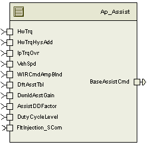

> **Source document:** `Assist/doc/Assist_MDD.docx`
>
> This page was converted automatically from the original document so it can be browsed online. Original format: Word document (`.docx`, 126 paragraphs, 13 tables, 1 embedded figures).

**Author:** Lonnie Newton **Last saved by:** Jared Julien (kzdyfh) **Revision:** 33

---

# Module -- Assist

# High-Level Description

The Assist Function applies an appropriate level of motor torque based on handwheel torque and vehicle speed.

# Figures

## Component Diagram

# Variable Data Dictionary

For details on module input / output variable, refer to the Data Dictionary for the application.  Input / output variable names are listed here for reference.

| Module Inputs (Global Variable Name) | Module Outputs (Global Variable Name) |
| --- | --- |
| HwTrq_HwNm_f32 | BaseAssistCmd_MtrNm_f32 |
| HwTrqHysAdd_HwNm_f32 |  |
| VehSpd_Kph_f32 |  |
| AssistDDFactor_Uls_f32 |  |
| IpTrqOvr_HwNm_f32 |  |
| WIRCmdAmpBlnd_MtrNm_f32 |  |
| DftAsstTbl_Cnt_lgc |  |
| DwnldAsstGain_Uls_f32 |  |
| DutyCycleLevel_Uls_f32 |  |

## Module Internal Variables

This section identifies the name, range and resolutions for module specific data created by this module.  If there are no range restrictions on the variable, the term “FULL” is placed into the table for legal range.

| Variable Name | Resolution | (min) | (max) | Software Segment |
| --- | --- | --- | --- | --- |
| WIRBlend_Uls_D_u2p14 | 2-14 | 0 | 1 | ASSIST_START_SEC_VAR_CLEARED_16 |
| ThermalAssistScl_Uls_D_u2p14 | 2-14 | 0 | 1 | ASSIST_START_SEC_VAR_CLEARED_16 |

### User defined typedef definition/declaration

This section documents any user types uniquely used for the module.

| Typedef Name | Element Name | User Defined Type | (min) | (max) |
| --- | --- | --- | --- | --- |

# Constant Data Dictionary

## Calibration Constants

This section lists the calibrations used by the module.  For details on calibration constants, refer to the Data Dictionary for the application.

| Constant Name |
| --- |
| t2_AsstHwtX0_HwNm_u8p8[][] |
| t2_AsstHwtX1_HwNm_u8p8[][] |
| t2_AsstAsstY0_MtrNm_s4p11[][] |
| t2_AsstAsstY1_MtrNm_s4p11[][] |
| t2_AsstWIRBlndX_MtrNm_u5p11[][] |
| t2_AsstWIRBlendY_Uls_u2p14[][] |
| t_AsstThermSclX_Cnt_u16p0[] |
| t_AsstThermSclY_Uls_u2p14[] |

## Program(fixed) Constants

### Embedded Constants

All embedded constants whose values are provided in Eng units will be evaluated to the equivalent counts by using the FPM_InitFixedPoint_m() macro within the #define statement.

#### Local

| Constant Name | Resolution | Value |
| --- | --- | --- |
| D_WIRBLENDFRAC_ULS_U2P14 | 2-14 | 1 |
| D_ASSTTRQLLMT_MTRNM_F32 | Single precision floating point | -0.1 |

#### Global

This section lists the global constants used by the module.  For details on global constants, refer to the Data Dictionary for the application.

| Constant Name |
| --- |
| BC_ASSIST_FAULTINJECTIONPOINT |
| STD_ON |
| FLTINJ_ASSIST |
| D_MTRTRQCMDHILMT_MTRNM_F32 |
| D_MTRTRQCMDLOLMT_MTRNM_F32 |

### Module specific Lookup Tables Constants

| Constant Name | Resolution | Value | Software Segment |
| --- | --- | --- | --- |
| None |  |  |  |

# Functions/Macros used by the Sub-Modules

## Library Functions / Macros

The library and functions / Macros that are called by the various sub modules are identified below,

FPM_FloatToFixed_m

FPM_FixedToFloat_m

Sign_f32_m

Abs_f32_m

BilinearXMYM_s16_u16XMs16YM_Cnt

BilinearXMYM_u16_u16XMu16YM_Cnt

IntplVarXY_u16_u16Xu16Y_Cnt

TableSize_m

Limit_m

## Data Hiding Functions

<None>

## Global Functions/Macros Defined by this Module

None

## Local Functions/Macros Used by this MDD only

None

# Software Module Implementation

## Runtime Environment (RTE) Initial Values

This section lists the initial values of data written by this module but controlled by the RTE. After RTE initialization, the data in this table will contain these values.

| Data | Value |
| --- | --- |
| HwTrq_HwNm_f32 | 0 |
| HwTrqHysAdd_HwNm_f32 | 0 |
| VehSpd_Kph_f32 | 0 |
| AssistDDFactor_Uls_f32 | 1 |
| IpTrqOvr_HwNm_f32 | 0 |
| WIRCmdAmpBlnd_MtrNm_f32 | 0 |
| DftAsstTbl_Cnt_lgc | FALSE |
| DwnldAsstGain_Uls_f32 | 0 |
| BaseAssistCmd_MtrNm_f32 | 0 |
| Rte_InitValue_DutyCycleLevel_Uls_f32 | 0 |

## Initialization Functions

None

## Periodic Functions

### Per: Assist_Per1

#### Design Rationale

None

#### Program Flow Start

Rte_Call_Assist_Per1_CP0_CheckpointReached()

#### Store Module Inputs to Local copies

*HwTrq_HwNm_T_**f32* = Rte_IRead_Assist_Per1_HwTrq_HwNm_f32()

*VehSpd_Kph_T_u9p7* = FPM_FloatToFixed_m((Rte_Iread_Assist_Per1_VehSpd_Kph_f32()), u9p7_T)

*Hyst**Add**_**Hw**Nm_T_f32* =Rte_Iread_Assist_Per1_HysteresisAdd_HwNm_f32()

*DutyCycleLevel_Cnt_T_**u**16**p**0** **= *FPM_FloatToFixed_m(Rte_IRead_Assist_Per1_DutyCycleLevel_Uls_f32(), u16p0_T)

*AssistDDFactor_Uls_T_f32* = Rte_Iread_Assist_Per1_AssistDDFactor_Uls_f32()

*IpTrqOvr_HwNm_T_**f32* = Rte_Iread_Assist_Per1_IpTrqOvr_HwNm_f32()

*WIRCmdAmpBlnd**_**MtrNm**_T_**u**5**p**11**  *= FPM_FloatToFixed_m((Rte_Iread_Assist_Per1_WIRCmdAmpBlnd_MtrNm_f32()), u5p11_T)

*Dwn**ldAsstGain_Uls**_T_**f32** =** *Rte_Iread_Assist_Per1_ DwnldAsstGain_Uls_f32()

*DftAsstTbl_Cnt_T_lgc** = *Rte_Iread_Assist_Per1_DftAsstTbl_Cnt_lgc ()

Temporary variables:

*SignModTrq_Uls_T_**s**32*

*ModTrq_HwNm_T_u8p8*

*WIR0_MtrNm_T_s4p11*

*WIRBlend_**Uls**_T_u2p14*

*WIR1_MtrNm_T_s4p11*

*WIR0_**MtrNm_T_s6p25*

*WIR1_MtrNm_T_ s6p25*

*A**ssistTrq_MtrNm_T_s6p25*

*AssistTrq_MtrNm_T_f32*

*ThermalAssistScl_Uls_T_**u**2**p1**4*

*ThermalAssistScl_Uls_T_f32*

*BaseAssistCmd_MtrNm_T_f32*

*ModTrq_HwNm_T_f32*

*AbsModTrq_HwNm_T_f32*

#### Base Assist Calculation

#### Store Local copy of outputs into Module Outputs

Rte_Iwrite_Assist_Per1_BaseAssistCmd_MtrNm_f32(BaseAssistCmd_MtrNm_T_f32)

#### Program Flow End

Rte_Call_Assist_Per1_CP1_CheckpointReached()

## Fault Recovery Functions

None

## Shutdown Functions

None

## Interrupt Functions

None.

## Serial Communication Functions

None

# Execution Requirements

## Execution Rates for sub-modules called by the Scheduler

This table serves as reference for the Scheduler design

| Function Name | Calling Frequency | System State(s) in which the function is called |
| --- | --- | --- |
| Assist_Per1 | 2ms | ALL |

## Execution Requirements for Serial Communication Functions

| Function Name | Sub-Module called by (Serial Comm Function Name) |
| --- | --- |
| N/A |  |

# Memory Map Definition Requirements

## Sub Modules (Functions)

This table identifies the software segments for functions identified in this module.

| Name of Sub Module | Software Segment |
| --- | --- |
| Assist_Per1 | RTE_START_SEC_AP_ASSIST_APPL_CODE |

## Local Functions

This table identifies the software segments for local functions identified in this module.

| Name of Sub Module | Software Segment |
| --- | --- |
| None |  |

# Known Issues / Limitations With Design

Range for  HystAdd_HwNm unknown during design of revision 8 of this document.  The assumption is -16 to 16 Nm based on calibration values in the HystAdd FDD document.

INLINE functions in GlobalMacro.h are not unit tested

# Revision Control Log

| Item # | Rev # | Change Description | Date | Author Initials |
| --- | --- | --- | --- | --- |
| 1 | 1.0 | Initial AutoSAR release. | 01/04/11 | L.N. |
| 2 | 2 | Applied drive-dynamics assist scale factor to low-pass assist. | 05/26/11 | YY |
| 3 | 3 | Updates for all pass design and new FDD rev 002 | 06/02/11 | SH |
| 4 | 4 | Updates from Unit testing.  Changed name of BaseAssistCmd ouput and updated diagram in section 5.2.1.4 | 06/07/11 | SH |
| 5 | 5 | Updates to fix always positive assist.  Remove extra( HwTrq-LpTrq) subtraction after low pass filter output(sec5.2.1.5).  Remove unnessesary sign application  of HwTrq to HPAssist_MtrNM_T_f32(sec 5.2.1.6).  Also, apply sign of BaseTrq to BaseAssist_MtrNm calculation instead of HwTrq(sec 5.2.1.4). | 6/14/11 | SH |
| 6 | 6 | Added HPAssist_MtrNm_D_f32 Display variable to meet FDD | 6/16/11 | JJW |
| 7 | 7 | Changed base assist to signed Y table.  Added base assist, Hpgain, and filter blending interface | 07/14/11 | LWW |
| .8 | 8 | Updated to FDD #SF-1 ver 008, Updated to Template EA3, Rev1 | 11/08/11 | M. Story |
| 9 | 9 | Changed Cal names to new standard | 11/29/11 | M. Story |
| 10 | 10 | Anomally correction 3246: Moved sign block into ‘if’ statement to re-apply sign to assist command to allow the assist gain common manufacturing service to control the motor. Error would cause motor to spin in one direction only. | 01/05/12 | KJS |
| 11 | 11 | Changes done as per FaultInjection technique | 01/05/12 | NRAR |
| 12 | 12 | Updated to SF-01 v010 (changed input ThermalAssistScl to DutyCycleLevel) | 06/20/12 | OT |
| 13 | 13 | Changed Thermal Scale Y table to be u2p14 to workaround interpolation library anomaly. | 07/23/12 | LWW |
| 14 | 14 | Changed Thermal Scale X table to be u16p0 to workaround interpolation library anomaly. | 07/23/12 | LWW |
| 15 | 15 | Added checkpoints to Per1 | 09/15/12 | JJW |
| 16 | 16 | Updated to FDD Ver 011 | 10/03/12 | NRAR |
