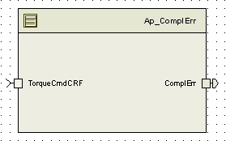

> **Source document:** `ComplErr/doc/Compliance_Error_MDD.docx`
>
> This page was converted automatically from the original document so it can be browsed online. Original format: Word document (`.docx`, 113 paragraphs, 13 tables, 1 embedded figures).

**Author:** Owen Tosh (nzx5jd) **Last saved by:** Patki, Shriram **Revision:** 3

---

# Module – Compliance Error

# High-Level Description

This function calculates the compliance error that can be used to compensate for stiffness in the torque path between the motor position sensor and column axis.

# Figures

## Component Diagram

# Variable Data Dictionary

For details on module input / output variable, refer to the Data Dictionary for the application.  Input / output variable names are listed here for reference.

| Module Inputs | Module Outputs | Module Outputs |
| --- | --- | --- |
| TorqueCmdCRF_MtrNm_f32 | TorqueCmdCRF_MtrNm_f32 | ComplErr_HwDeg_f32 |

## Module Internal Variables

This section identifies the name, range and resolutions for module specific data created by this module.  If there are no range restrictions on the variable, the term “FULL” is placed into the table for legal range.

| Variable Name | Resolution | Legal Range (min) | Legal Range (max) | Software Segment |
| --- | --- | --- | --- | --- |
| - |  |  |  |  |

### User defined typedef definition/declaration

This section documents any user types uniquely used for the module.

| Typedef Name | Element Name | User Defined Type | Legal Range (min) | Legal Range (max) |
| --- | --- | --- | --- | --- |
| - |  |  |  |  |

# Constant Data Dictionary

## Calibration Constants

This section lists the calibrations used by the module.  For details on calibration constants, refer to the Data Dictionary for the application.

| Constant Name |
| --- |
| t_CompErrMtrPosNonLinComplDepTbl_HwDegpMtrNm_u8p8 |
| t_ComplErrMtrPosNonLinComplIndTbl_MtrNm_u5p11 |

## Program (fixed) Constants

### Embedded Constants

All embedded constants whose values are provided in Eng units will be evaluated to the equivalent counts by using the FPM_InitFixedPoint_m() macro within the #define statement.

#### Local

| Constant Name | Resolution | Units | Value |
| --- | --- | --- | --- |
| - |  |  |  |

#### Global

This section lists the global constants used by the module.  For details on global constants, refer to the Data Dictionary for the application.

| Constant Name |
| --- |
| D_ZERO_ULS_F32 |

### Module specific Lookup Tables Constants

| Constant Name | Resolution | Value | Software Segment |
| --- | --- | --- | --- |
| None |  |  |  |

# Functions/Macros used by the Sub-Modules

## Library Functions / Macros

The library and functions / Macros that are called by the various sub modules are identified below,

IntplVarXY_u16_u16Xu16Y_Cnt

FPM_FloatToFixed_m

TableSize_m

Abs_s16_m

FPM_FixedToFloat_m

## Data Hiding Functions

None

## Global Functions/Macros Defined by this Module

None

## Local Functions/Macros Used by this MDD only

None

# Software Module Implementation

## Runtime Environment (RTE) Initial Values

This section lists the initial values of data written by this module but controlled by the RTE. After RTE initialization, the data in this table will contain these values.

| Data | Value |
| --- | --- |

## Initialization Functions

### Init:

#### Design Rationale

None

#### Module Outputs

None

#### Module Internal

## Periodic Functions

### Per: ComplErr_Per1

#### Design Rationale

None

#### Program Flow Start

Rte_Call_ComplErr_Per1_CP0_CheckpointReached

#### Store Module Inputs to Local copies

TrqCmdcrf_MtrNm_T_f32 = Rte_IRead_ComplErr_Per1_TorqueCmdCRF_MtrNm_f32()

#### Compliance Error Flowchart

#### Store Local copy of outputs into Module Outputs

Rte_IWrite_ComplErr_Per1_ComplErr_HwDeg_f32(ComplErr_HwDeg_T_f32)

#### Program Flow End

Rte_Call_ComplErr_Per1_CP1_CheckpointReached

## Fault Recovery Functions

None

## Shutdown Functions

None

## Interrupt Functions

None

## Serial Communication Functions

None

# Execution Requirements

## Execution Rates for sub-modules called by the Scheduler

This table serves as reference for the Scheduler design

| Function Name | Calling Frequency | System State(s) in which the function is called |
| --- | --- | --- |
| ComplErr_Per1 | 2 ms | ALL |

## Execution Requirements for Serial Communication Functions

| Function Name | Sub-Module called by (Serial Comm Function Name) |
| --- | --- |
| None |  |

# Memory Map Definition Requirements

## Sub Modules (Functions)

This table identifies the software segments for functions identified in this module.

| Name of Sub Module | Software Segment |
| --- | --- |
| PwrLmtFuncCr_Per1 | RTE_START_SEC_AP_COMPLERR_APPL_CODE |

## Local Functions

This table identifies the software segments for local functions identified in this module.

| Name of Sub Module | Software Segment |
| --- | --- |
| None |  |

# Known Issues / Limitations with Design

INLINE functions defined in GlobalMacro.h are not unit tested.

# Revision Control Log

| Item # | Rev # | Change Description | Date | Author Initials |
| --- | --- | --- | --- | --- |
| 1 | 1.0 | Initial Version (SF-41 v001) | 22-Aug-13 | SP |
