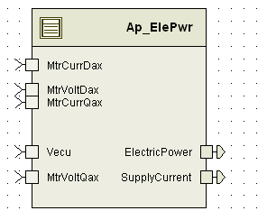

> **Source document:** `ElePwr/doc/Electric_Power_Consumption_MDD.docx`
>
> This page was converted automatically from the original document so it can be browsed online. Original format: Word document (`.docx`, 92 paragraphs, 15 tables, 1 embedded figures).

**Author:** xznxs9 **Last saved by:** Balani, Spandana **Revision:** 35

---

# Module -- Electric Power Consumption

# High-Level Description

This module estimates the instantaneous electric power at the input of the control module and the supply current.

# Figures

## Diagram – Component Diagram

## 

# Variable Data Dictionary

| Module Inputs | Module Outputs |
| --- | --- |
| Vecu_Volt_f32 | ElectricPower_Watt_f32 |
| MtrVoltDax_Volt_f32 | SupplyCurrent_Amp_f32 |
| MtrVoltQax_Volt_f32 |  |
| MtrCurrDax_Amp_f32 |  |
| MtrCurrQax_Amp_f32 |  |

## Module Internal Variables

| Variable Name | Resolution | Legal Range (min) | Legal Range (max) | Software Segment |
| --- | --- | --- | --- | --- |
| ModInPower_Watt_D_f32 | Single Precision Floating Point | -2000 | 2000 | ELEPWR_START_SEC_VAR_CLEARED _32 |
| DropInPower_Watt_D_f32 | Single Precision Floating Point | -200 | 200 | ELEPWR_START_SEC_VAR_CLEARED _32 |

### User defined typedef definition/declaration

| Typedef Name | Element Name | User Defined Type | Legal Range (min) | Legal Range (max) |
| --- | --- | --- | --- | --- |
| None |  |  |  |  |

# Constant Data Dictionary

## Calibration Constants

| Constant Name |
| --- |
| k_CntlrInResist_Ohm_f32 |
| k_PstcPowerLoss_Watt_f32 |

## Program(fixed) Constants

### Embedded Constants

#### Local

| Constant Name | Resolution | Units | Value |
| --- | --- | --- | --- |
| D_SQRT3OVR2_ULS_F32 | Single precision Float | Float32 | 0.866025403784 |
| D_ELECPOWERLOLMT_WATT_F32 | Single precision Float | Watt | (-2000.0) |
| D_ELECPOWERHILMT_WATT_F32 | Single precision Float | Watt | 2000.0 |
| D_SUPPLYCURRENTLOLMT_AMP_F32 | Single precision Float | Amp | (-200.0) |
| D_SUPPLYCURRENTHILMT_AMP_F32 | Single precision Float | Amp | (200.0) |

#### Global

| Constant Name |
| --- |
| D_ZERO_ULS_F32 |

### Module specific Lookup Tables Constants

| Constant Name | Resolution | Value | Software Segment |
| --- | --- | --- | --- |
| None |  |  |  |

# Functions/Macros used by the Sub-Modules

## Library Functions / Macros

The library functions / Macros that are called by the various sub modules are identified below,

## Data Hiding Functions

None

## Local Functions/Macros Used by this MDD only

None

# Software Module Implementation

## Initial Data Values

| Data | Value |
| --- | --- |
| Rte_InitValue_Vecu_Volt_f32 |  |
| Rte_InitValue_MtrVoltDax_Volt_f32 | 0.0 |
| Rte_InitValue_MtrVoltQax_Volt_f32 | 0.0 |
| Rte_InitValue_MtrCurrDax_Amp_f32 | 0.0 |
| Rte_InitValue_MtrCurrQax_Amp_f32 | 0.0 |
| Rte_InitValue_ElectricPower_Watt_f32 | 0.0 |

## Periodic Functions

### Per: ElePwr_Per1

#### Design Rationale

None

#### Program Flow Start

Rte_Call_ElePwr_Per1_CP0_CheckpointReached()

#### Store Module Inputs to Local copies

| Local Copy | Module Input |
| --- | --- |
| Vecu_Volt_f32 | Rte_IRead_ElePwr_Per1_Vecu_Volt_f32() |
| MtrVoltDax_Volt_f32 | Rte_IRead_ElePwr_Per1_ MtrVoltDax_Volt_f32 () |
| MtrVoltQax_Volt_f32 | Rte_IRead_ElePwr_Per1_ MtrVoltQax_Volt_f32 () |
| MtrCurrDax_Amp_f32 | Rte_IRead_ElePwr_Per1_ MtrCurrDax_Amp_f32 |
| MtrCurrQax_Amp_f32 | Rte_IRead_ElePwr_Per1_ MtrCurrQax_Amp_f32 () |

#### Calculate Modulator Input Power

#### Store Local copy of outputs into Module Outputs

| Local Copy | Module Output |
| --- | --- |
| ElecPower_Watt_T_f32 | Rte_IWrite_ElePwr_Per1_ ElectricPower_Watt_f32() |
| SupplyCurrent_Amp_T_f32 | Rte_IWrite_ElePwr_Per1_SupplyCurrent_Amp_f32 () |

#### Program Flow End

## Rte_Call_ElePwr_Per1_CP1_CheckpointReached()

## Fault Recovery Functions

None

## Shutdown Functions

None

## Interrupt Functions

None

## Serial Communication Functions

None

# Execution Requirements

## Execution Rates for sub-modules called by the Scheduler

| Function Name | Calling Frequency | System State(s) in which the function is called |
| --- | --- | --- |
| ElePwr_Per1 | 10 ms | All |

## Execution Requirements for Serial Communication Functions

| Function Name | Sub-Module called by (Serial Comm Function Name) |
| --- | --- |
| None |  |

# Memory Map Definition Requirements

## Sub Modules (Functions)

This table identifies the software segments for functions identified in this module.

| Name of Sub Module | Software Segment |
| --- | --- |
| ElePwr_Per1 | RTE_AP_ELEPWR_APPL_CODE |

## Local Functions

This table identifies the software segments for local functions identified in this module.

| Name of Sub Module | Software Segment |
| --- | --- |
| None |  |

# Known Issues / Limitations With Design

None

# Revision Control Log

| Rev # | Change Description | Date | Author Initials |
| --- | --- | --- | --- |
| 1 | Initial AUTOSAR version (SF08 v001). | 1-Dec-12 | Selva |
| 2 | Name changed  from CmElecPwr to ElePwr | 10-Dec-12 | Selva |
| 3 | Anomaly 6242 Limit Outputs | 02-Apr-14 | SB |
