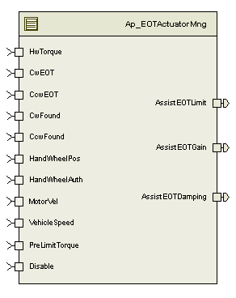

> **Source document:** `EOTActuatorMng/doc/End_of_Travel_Actuator_Management_MDD.docx`
>
> This page was converted automatically from the original document so it can be browsed online. Original format: Word document (`.docx`, 162 paragraphs, 26 tables, 1 embedded figures).

**Author:** Kevin Smith **Last saved by:** Sengottaiyan, Selva **Revision:** 2

---

# Module --

# High-Level Description

The end of travel actuator management limit reduces the level of assist from the motor as the steering system approaches the mechanical end of stop of the system.

# Figures

## Diagram – Component

## 

## Diagram – Function Data Sharing

N/A

### Diagram – Function (_Per1)

Note: The state control block needs to be evaluated  prior to completing the End of Travel (Soft End Stops) block. More information contained within the MDD.

# Variable Data Dictionary

For details on module input / output variable, refer to the Data Dictionary for the application.  Input / output variable names are listed here for reference.

(Note: Full variable names required in table.)

(Note: All global variables including End Of Line data used should be shown here)

| Module Inputs | Module Outputs | Module Outputs |
| --- | --- | --- |
| HwTorque_HwNm_f32 | HwTorque_HwNm_f32 | AssistEOTLimit_MtrNm_f32 |
| CwEOT_HwDeg_f32 | CwEOT_HwDeg_f32 | AssistEOTGain_Uls_f32 |
| CcwEOT_HwDeg_f32 | CcwEOT_HwDeg_f32 | AssistEOTDamping_MtrNm_f32 |
| CwFound_Cnt_lgc | CwFound_Cnt_lgc |  |
| CcwFound_Cnt_lgc | CcwFound_Cnt_lgc |  |
| HandWheelPos_HwDeg_f32 | HandWheelPos_HwDeg_f32 |  |
| HandWheelAuth_Uls_f32 | HandWheelAuth_Uls_f32 |  |
| CRFMotorVel_MtrRadpS_f32 | CRFMotorVel_MtrRadpS_f32 |  |
| VehicleSpeed_Kph_f32 | VehicleSpeed_Kph_f32 |  |
| PreLimitTorque_MtrNm_f32 | PreLimitTorque_MtrNm_f32 |  |
| EOTDisable_Cnt_lgc | EOTDisable_Cnt_lgc |  |

## Module Internal Variables

This section identifies the name, range and resolutions for module specific data created by this module.  If there are no range restrictions on the variable, the term “FULL” is placed into the table for legal range.

| Variable Name | Resolution | Legal Range (min) | Legal Range (max) | Software Segment |
| --- | --- | --- | --- | --- |
| EOTImpactPos_HwDeg_M_f32 | Single Precision Floating Point | see data dictionary | see data dictionary | EOTACTUATORMNG_START_SEC_VAR_CLEARED_32 |
| PrevEOTGain_Uls_M_f32 | Single Precision Floating Point | see data dictionary | see data dictionary | EOTACTUATORMNG_START_SEC_VAR_CLEARED_32 |
| FiltHWTrqSV_HwNm_M_s7p24 | p-24 | see data dictionary | see data dictionary | EOTACTUATORMNG_START_SEC_VAR_CLEARED_32 |
| SESState_Uls_M_enum | Enum (see typedef table) | see data dictionary | see data dictionary | EOTACTUATORMNG_START_SEC_VAR_CLEARED_UNSPECIFIED |
| FiltEOTGainSV_HwNm_M_u1p31 | p-31 | see data dictionary | see data dictionary | EOTACTUATORMNG_START_SEC_VAR_CLEARED_32 |

### User defined typedef definition/declaration

This section documents any user types uniquely used for the module.

| Typedef Name | Element Name | User Defined Type | Legal Range (min) | Legal Range (max) |
| --- | --- | --- | --- | --- |
| typedef enum _sesState {} sesState_T; | DISABLED | Uls | 0 | 0 |
|  | ENTERING | Uls | 1 | 1 |
|  | NORMAL | Uls | 2 | 2 |
|  | EXITING | Uls | 3 | 3 |

## Module Display Variables

This section identifies the name, range and resolutions for display specific data created by this module.  If there are no range restrictions on the variable, the term “FULL” is placed into the table for legal range.

| Variable Name | Resolution | Legal Range (min) | Legal Range (max) | Legal Range (max) | Software Segment | Software Segment |
| --- | --- | --- | --- | --- | --- | --- |
| EOTDet_Cnt_D_lgc | Boolean | see data dictionary | see data dictionary | EOTACTUATORMNG_START_SEC_VAR_CLEARED_BOOLEAN | EOTACTUATORMNG_START_SEC_VAR_CLEARED_BOOLEAN |  |
| EOTImpact_HwDeg_D_f32 | Single Precision Floating Point | see data dictionary | see data dictionary | see data dictionary | EOTACTUATORMNG_START_SEC_VAR_CLEARED_32 | EOTACTUATORMNG_START_SEC_VAR_CLEARED_32 |
| LimitPosition_HwDeg_D_f32 | Single Precision Floating Point | see data dictionary | see data dictionary | see data dictionary | EOTACTUATORMNG_START_SEC_VAR_CLEARED_32 | EOTACTUATORMNG_START_SEC_VAR_CLEARED_32 |
| EOTEnterGain_Uls_D_f32` | Single Precision Floating Point | see data dictionary | see data dictionary | see data dictionary | EOTACTUATORMNG_START_SEC_VAR_CLEARED_32 | EOTACTUATORMNG_START_SEC_VAR_CLEARED_32 |
| EOTExitgain_Uls_D_f32 | Single Precision Floating Point | see data dictionary | see data dictionary | see data dictionary | EOTACTUATORMNG_START_SEC_VAR_CLEARED_32 | EOTACTUATORMNG_START_SEC_VAR_CLEARED_32 |
| EOTGain_Uls_D_f32 | Single Precision Floating Point | see data dictionary | see data dictionary | see data dictionary | EOTACTUATORMNG_START_SEC_VAR_CLEARED_32 | EOTACTUATORMNG_START_SEC_VAR_CLEARED_32 |
| FiltEOTGain_Uls_D_f32 | Single Precision Floating Point | see data dictionary | see data dictionary | see data dictionary | EOTACTUATORMNG_START_SEC_VAR_CLEARED_32 | EOTACTUATORMNG_START_SEC_VAR_CLEARED_32 |
| EOTDamping_MtrNm_D_f32 | Single Precision Floating Point | see data dictionary | see data dictionary | see data dictionary | EOTACTUATORMNG_START_SEC_VAR_CLEARED_32 | EOTACTUATORMNG_START_SEC_VAR_CLEARED_32 |

# Constant Data Dictionary

## Calibration Constants

This section lists the calibrations used by the module.  For details on calibration constants, refer to the Data Dictionary for the application.

| Constant Name |
| --- |
| k_SoftStopEOTEnable_Cnt_lgc |
| k_EOTDefltPosition_HwDeg_u12p4 |
| t_SpdIptTblXTbl_HwDeg_u12p4[2] |
| t_SpdIptTblYTbl_MtrRadpS_u12p4[2] |
| k_SpdIptScale_MtrNmpRadpS_u4p12 |
| k_PosRampStep_HwDeg_u12p4 |
| k_MinRackTrvl_HwDeg_u12p4 |
| k_MaxRackTrvl_HwDeg_u12p4 |
| t2_EOTEnterGainX_HwDeg_u12p4[4][4] |
| t2_EOTEnterGainY_Uls_u1p15[4][4] |
| t_EOTEnterGainVspd_Kph_u9p7[4] |
| k_EOTStateHwTrqLPFKn_Cnt_u16 |
| k_EOTDeltaTrqThrsh_HwNm_u9p7 |
| t_TrqTableX_HwNm_u8p8[2] |
| k_EOTEnterLPFKn_Cnt_u16 |
| k_EOTExitLPFKn_Cnt_u16 |
| t2_EOTPosDepDmpTblX_HwDeg_u12p4[4][2] |
| t2_EOTPosDepDmpTblY_MtrNmpRadpS_u0p16[4][2] |
| t2_EOTExPosDepDmpTblY_MtrNmpRadps_u0p16[4][2] |
| t_EOTDmpVspd_Kph_u9p7[4] |
| k_EOTImpSpdEn_Kph_u9p7 |

## Program(fixed) Constants

### Embedded Constants

All embedded constants whose values are provided in Eng units will be evaluated to the equivalent counts by using the FPM_InitFixedPoint_m() macro within the #define statement.

#### Local

| Constant Name | Resolution | Units | Value |
| --- | --- | --- | --- |
| D_HWPOSAUTHHILMT_ULS_F32 | Single Precision Floating Point | Uls | 1.0 |
| D_ONE_ULS_U16 | uint16 | Uls | 1U |
| D_MINUSONE_ULS_S16 | sint16 | Uls | -1U |
| D_MINUSONE_ULS_F32 | Single Precision Floating Point | Uls | -1.0 |
| D_2MSLPFKN5HZ_CNT_U16 | uint16 | Cnt | 3991 |
| D_SESSTATE_PRI1_ULS_U16 | uint16 | Uls | 0x01 |
| D_SESSTATE_PRI2_ULS_U16 | uint16 | Uls | 0x02 |
| D_SESSTATE_PRI3_ULS_U16 | uint16 | Uls | 0x04 |
| D_SESSTATE_PRI4_ULS_U16 | uint16 | Uls | 0x08 |
| D_EOTDAMPHILMT_MTRNM_F32 | Single Precision Floating Point | MtrNm | 8.8 |
| D_EOTDAMPLOLMT_MTRNM_F32 | Single Precision Floating Point | MtrNm | -8.8 |
| D_EOTGAINHILMT_ULS_F32 | Single Precision Floating Point | Uls | 1.0 |
| D_EOTGAINLOLMT_ULS_F32 | Single Precision Floating Point | Uls | 0.0 |
| D_EOTHILMT_MTRNM_F32 | Single Precision Floating Point | MtrNm | 8.8 |
| D_EOTLOLMT_MTRNM_F32 | Single Precision Floating Point | MtrNm | 0.0 |

#### Global

This section lists the global constants used by the module.  For details on global constants, refer to the Data Dictionary for the application.

| Constant Name |
| --- |
| D_MTRTRQCMDHILMT_MTRNM_F32 |
| D_ZERO_ULS_F32 |

### Module specific Lookup Tables Constants

(This is for lookup tables (arrays) with fixed values, same name as other tables)

| Constant Name | Resolution | Value | Software Segment |
| --- | --- | --- | --- |
| t_TrqTblY_Uls_u2p14 | U2p14_T | 0, 1 | AUTOMATIC |

# Functions/Macros used by the Sub-Modules

## Library Functions / Macros

The library and functions / Macros that are called by the various sub modules are identified below,

Abs_f32_m

S ign_f32_m

Abs_s16_m

FPM_FixedToFloat_m

FPM_FloatToFixed_m

IntplVarXY_u16_u16Xu16Y_Cnt

LPF_SvUpdate_s16InFixKTrunc_m

LPF_OpUpdate_s16InFixKTrunc_m

Max_m

BilinearXMYM_u16_u16XMu16YM_Cnt

## Data Hiding Functions

N/A

## Global Functions/Macros Defined by this Module

N/A

## Local Functions/Macros Used by this MDD only

### EOT Determination

| Function Name | EOTDetermination | Type | Min | Max |
| --- | --- | --- | --- | --- |
| Arguments Passed | CwFound_Cnt_T_lgc | Boolean | FALSE | TRUE |
|  | CcwFound_Cnt_T_lgc | Boolean | FALSE | TRUE |
| Return Value | EOTDet_Cnt_T_lgc | Boolean | FALSE | TRUE |

#### Description

### End of Travel Impact (Original)

| Function Name | EOTOrigImpact | Type | Min | Max |
| --- | --- | --- | --- | --- |
| Arguments Passed | CwEOT_HwDeg_T_f32 | float32 | 0.0 | 1440.11 |
|  | CcwEOT_HwDeg_T_f32 | float32 | -1440.11 | 0.0 |
|  | HandWheelAuth_Uls_T_f32 | float32 | 0.0 | 1.0 |
|  | MotorVel_MtrRadpS_T_f32 | float32 | -1350.0 | 1350.0 |
|  | HandWheelPos_HwDeg_T_f32 | float32 | -1440.11 | 1440.11 |
|  | VehicleSpeed_Kph_T_f32 | float32 | 0 | 511.9921875 |
| Return Value | AssistEOTLimit_MtrNm_T_f32 | float32 | 0 | 8.8 |

#### Description

### End of Travel Impact (Soft Stops) – Determine Limit Position

| Function Name | SES_DetLmtPos | Type | Min | Max |
| --- | --- | --- | --- | --- |
| Arguments Passed | CwEOT_HwDeg_T_f32 | float32 | 0.0 | 1440.11 |
|  | CcwEOT_HwDeg_T_f32 | float32 | -1440.11 | 0.0 |
|  | HandWheelPos_HwDeg_T_f32 | float32 | -1440.11 | 1440.11 |
| Return Value | LimitPos_HwDeg_T_f32 | float32 | -1440.11 | 1440.11 |

#### Description

### End of Travel Impact (Soft Stops) – Calculate Exit Gain Value

| Function Name | SES_CalcExitGain | Type | Min | Max |
| --- | --- | --- | --- | --- |
| Arguments Passed | HwTorque_HwNm_T_f32 | float32 | -10.0 | 10.0 |
|  | PrevEOTGain_Uls_T_f32 | float32 | 0.0 | 1.0 |
|  | HandWheelPos_HwDeg_T_f32 | float32 | -1440.11 | 1440.11 |
|  | * FiltHwTrqPtr_HwNm_T_f32 | float32 | -10.0 | 10.0 |
| Return Value | LimitPos_HwDeg_T_f32 | float32 | -1440.11 | 1440.11 |

#### Description

### End of Travel Impact (Soft Stops) – Calculate Enter Gain Value

| Function Name | SES_CalcEnterGain | Type | Min | Max |
| --- | --- | --- | --- | --- |
| Arguments Passed | HandWheelPos_HwDeg_T_f32 | float32 | -1440.11 | 1440.11 |
|  | LimitPosition_HwDeg_T_f32 | float32 | -1440.11 | 1440.11 |
|  | VehicleSpeed_Kph_T_f32 | float32 | 0.0 | 511.9921875 |
| Return Value | EOTEnterGain_Uls_T_f32 | float32 | 0.0 | 1.0 |

#### Description

### End of Travel Impact (Soft Stops) – Calculate EOT Gain Value

| Function Name | SES_CalcEOTGain | Type | Min | Max |
| --- | --- | --- | --- | --- |
| Arguments Passed | EOTEnterGain_Uls_T_f32 | float32 | 0.0 | 1.0 |
|  | EOTExitGain_Uls_T_f32 | float32 | 0.0 | 1.0 |
| Return Value | EOTGain_Uls_T_f32 | float32 | 0.0 | 1.0 |

#### Description

### End of Travel Impact (Soft Stops) – Low Pass Filter

| Function Name | SES_FiltEOTGain | Type | Min | Max |
| --- | --- | --- | --- | --- |
| Arguments Passed | EOTGain_Uls_T_f32 | float32 | 0.0 | 1.0 |
| Return Value | FiltEOTGain_Uls_T_f32 | float32 | 0.0 | 1.0 |

#### Description

### End of Travel Impact (Soft Stops) – Calculate EOT Damping Value

| Function Name | SES_CalcEOTDamp | Type | Min | Max |
| --- | --- | --- | --- | --- |
| Arguments Passed | CwEOT_HwDeg_T_f32 | float32 | 0.0 | 1440.11 |
|  | CcwEOT_HwDeg_T_f32 | float32 | -1440.11 | 0.0 |
|  | VehicleSpeed_Kph_T_f32 | float32 | 0 | 511.9921875 |
|  | HandWheelPos_HwDeg_T_f32 | float32 | -1440.11 | 1440.11 |
|  | MotorVel_MtrRadpS_T_f32 | float32 | -1118 | 1118 |
| Return Value | EOTDamping_MtrNm_T_f32 | float32 | -20.25 | 20.25 |

#### Description

### End of Travel Impact (Soft Stops) – Soft Stop State Control

| Function Name | SES_StateCtrl | Type | Min | Max |
| --- | --- | --- | --- | --- |
| Arguments Passed | FiltHwTrq_HwNm_T_f32 | float32 | -10.0 | 10.0 |
|  | LimitPosition_HwDeg_T_f32 | float32 | -1440.11 | 1440.11 |
|  | HandWheelPos_HwDeg_T_f32 | float32 | -1440.11 | 1440.11 |
|  | HandWheelAuth_Uls_T_f32 | float32 | 0.0 | 1.0 |
|  | VehicleSpeed_Kph_T_f32 | float32 | 0 | 511.9921875 |
|  | EOTDet_Cnt_T_lgc | Boolean | FALSE | TRUE |
|  | EOTDisable_Cnt_T_lgc | Boolean | FALSE | TRUE |
| Return Value | N/A |  |  |  |

#### Description

# Software Module Implementation

## Runtime Environment (RTE) Initial Values

This section lists the initial values of data written by this module but controlled by the RTE. After RTE initialization, the data in this table will contain these values.

| Data | Value |
| --- | --- |
| Rte_InitValue_AssistEOTDamping_MtrNm_f32 | 0.0F |
| Rte_InitValue_AssistEOTGain_Uls_f32 | 1.0F |
| Rte_InitValue_AssistEOTLimit_MtrNm_f32 | 8.8F |
| Rte_InitValue_CcwEOT_HwDeg_f32 | 0.0F |
| Rte_InitValue_CcwFound_Cnt_lgc | FALSE |
| Rte_InitValue_CwEOT_HwDeg_f32 | 0.0F |
| Rte_InitValue_CwFound_Cnt_lgc | FALSE |
| Rte_InitValue_HandWheelAuth_Uls_f32 | 0.0F |
| Rte_InitValue_HandWheelPos_HwDeg_f32 | 0.0F |
| Rte_InitValue_HwTorque_HwNm_f32 | 0.0F |
| Rte_InitValue_MotorVel_MtrRadpS_f32 | 0.0F |
| Rte_InitValue_PreLimitTorque_MtrNm_f32 | 0.0F |
| Rte_InitValue_VehicleSpeed_Kph_f32 | 0.0F |
| Rte_InitValue_EOTDisable_Cnt_lgc | False |

## Initialization Functions

N/A

## Periodic Functions

### Per: _Per1

#### Design Rationale

N/A

#### Program Flow Start

#### Rte_Call_EOTActuatorMng_Per1_CP0_CheckpointReached()Store Module Inputs to Local copies

| Local Copy | Module Input |
| --- | --- |
| HwTorque_HwNm_T_f32 | Rte_IRead_EOTActuatorMng_Per1_HwTorque_HwNm_f32() |
| CwEOT_HwDeg_T_f32 | Rte_IRead_EOTActuatorMng_Per1_CwEOT_HwDeg_f32() |
| CcwEOT_HwDeg_T_f32 | Rte_IRead_EOTActuatorMng_Per1_CcwEOT_HwDeg_f32() |
| CwFound_Cnt_ T_lgc | Rte_IRead_EOTActuatorMng_Per1_CwFound_Cnt_lgc() |
| CcwFound_Cnt_ T_lgc | Rte_IRead_EOTActuatorMng_Per1_CcwFound_Cnt_lgc() |
| HandWheelPos_HwDeg_T_f32 | Rte_IRead_EOTActuatorMng_Per1_HandWheelPos_HwDeg_f32() |
| HandWheelAuth_Uls_T_f32 | Rte_IRead_EOTActuatorMng_Per1_HandWheelAuth_Uls_f32() |
| MotorVel_MtrRadpS_T_f32 | Rte_IRead_EOTActuatorMng_Per1_MotorVel_MtrRadpS_f32() |
| VehicleSpeed_Kph_T_f32 | Rte_IRead_EOTActuatorMng_Per1_VehicleSpeed_Kph_f32() |
| EOTDisable_Cnt_T_lgc | Rte_IRead_EOTActuatorMng_Per1_EOTDisable_Cnt_lgc() |

#### (Processing of function)………

#### Store Local copy of outputs into Module Outputs

| Local Copy | Module Output |
| --- | --- |
| AssistEOTLimit_MtrNm_T_f32 | Rte_IWrite_EOTActuatorMng_Per1_AssistEOTLimit_MtrNm_f32() |
| AssistEOTGain_Uls_T_f32 | Rte_IWrite_EOTActuatorMng_Per1_AssistEOTGain_Uls_f32() |
| AssistEOTDamping_MtrNm_T_f32 | Rte_IWrite_EOTActuatorMng_Per1_AssistEOTDamping_MtrNm_f32() |

#### Program Flow End

Rte_Call_EOTActuatorMng_Per1_CP1_CheckpointReached()

## Fault Recovery Functions

N/A

## Shutdown Functions

N/A

## Interrupt Functions

N/A

# Execution Requirements

## Execution Sequence of the Module

(Describe in words relevant details about the execution sequence of the different sub modules.)

## Execution Rates for sub-modules called by the Scheduler

This table serves as reference for the Scheduler design

| Function Name | Calling Frequency | System State(s) in which the function is called |
| --- | --- | --- |
| EOTActuatorMng_Per1 | 2ms | ALL |

## Execution Requirements for Serial Communication Functions

| Function Name | Sub-Module called by (Serial Comm Function Name) |
| --- | --- |
| N/A |  |

# Memory Map Definition Requirements

## Sub Modules (Functions)

This table identifies the software segments for functions identified in this module.

| Name of Sub Module | Software Segment |
| --- | --- |
| N/A |  |

## Local Functions

This table identifies the software segments for local functions identified in this module.

| Name of Sub Module | Software Segment |
| --- | --- |
| EOTDetermination | AUTOMATIC |
| EOTOrigImpact | AUTOMATIC |
| SES_DetLmtPos | AUTOMATIC |
| SES_CalcExitGain | AUTOMATIC |
| SES_StateCtrl | AUTOMATIC |
| SES_CalcEnterGain | AUTOMATIC |
| SES_CalcEOTGain | AUTOMATIC |
| SES_FiltEOTGain | AUTOMATIC |
| SES_CalcEOTDamp | AUTOMATIC |

# Filter Analysis / Design

| File | Description |
| --- | --- |
|  | Filter analysis for all the LPF filters called in this MDD. Analysis contains high/low cutoff frequencies with max output. |

# Known Issues / Limitations With Design

- INLINE functions defined in globalmacro.h are not unit tested.

# Revision Control Log

| Item # | Rev # | Change Description | Date | Author Initials |
| --- | --- | --- | --- | --- |
| 1 | 1.0 | Initial Release | 06-Dec-11 | KJS |
| 2 | 2.0 | Added limitation with globalmacro.h known limitations | 06-Dec-11 | KJS |
| 3 | 3 | Changed units designator of k_EOTStateHwTrqLPFKn_Uls_u16 to Cnt | 12-Dec-11 | JJW |
| 4 | 4 | Corrected assist EOT limit macro call. | 14-Dec-11 | KJS |
| 5 | 5 | Updated ranges for CcwEOT and CwEOT. | 22-Dec-11 | KJS |
| 6 | 6 | Anomaly 3003 and 3039 | 17-Mar-12 | M. Story |
| 7 | 7 | Updated incorrect indexing on tables (removed constant and replaced with TableSize macro) | 19-Mar-12 | LWW |
| 8 | 8 | Anomaly 3076 update to FDD fixes | 22-Mar-12 | M. Story |
| 9 | 9 | Changed t_TrqTblY_Uls_u16p0 to t_TrqTblY_Uls_u1p15 anomaly 3146 | 01-May_12 | M. Story |
| 10 | 10 | Changed t_TrqTblY_Uls_u1p15 to t_TrqTblY_Uls_u2p14 anomaly 3146 | 01-May_12 | M. Story |
| 11 | 11 | Changes for anomaly 3330 and update on units for embedded constants | 23-May-12 | LWW |
| 12 | 12 | Updated range on VehicleSpeed and EOTDamping per unit testing finds | 12-Jun-12 | LWW |
| 13 | 13 | Add defeat service per FDD v006 | 13-Sept-12 | BWL |
| 14 | 14 | Added watchdog checkpints | 20-Sept-12 | BWL |
| 15 | 15 | Added Memmap statements | 25 Sep12 | Selva |
| 16 | 16 | Changes in  “End Of Travel Impact(Original)” for anomaly 3938 | 22 Oct 12 | Srikanth |
| 17 | 16.1.1 | MDD/Src mismatch fixes | 13-Feb-13 | VK |
| 18 | 16.1.2 | Version update as file mistakenly got checkedin without showing 16.1.1 changes | 20-Mar-13 | VK |
| 19 | 17 | Anomaly 4269 correction in SES_CalcEnterGain() | 18-Jan-13 | KJS |
| 20 | 18 | Merging v16.12 and v17 of the MDD | 20-Mar-13 | VK |
| 21 | 19 | Increased resolution of t2_EOTPosDepDmpTblY_ and t2_EOTExPosDepDmpTblY per FDD SF18 v7 | 26-Apr-13 | JJW |
| 22 | 20 | Corrected range of MotorVEl input to EOTOrigIMpact() and SES_CalcEOTDamp() | 29-Apr-13 | JJW |
| 23 | 21 | Changes in  “End Of Travel Impact(Original)” for anomaly 5251 | 25-Jul-13 | KMC |
| 24 | 22 | Update range of return value from SES_CalcEOTDamp(); change module variable and display variable ranges to refer to data dictionary | 12-Aug-13 | KMC |
