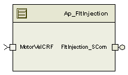

> **Source document:** `FltInjection/doc/Fault_Injection_MDD.docx`
>
> This page was converted automatically from the original document so it can be browsed online. Original format: Word document (`.docx`, 116 paragraphs, 14 tables, 1 embedded figures).

**Author:** Owen Tosh (nzx5jd) **Last saved by:** Owen Tosh (nzx5jd) **Revision:** 15

---

# Module –

# High-Level Description

This module manages the fault injection system.  It receives parameters through CANape-generated XCP signals (which write directly into memory), and creates a fault injection signal at a specified location based on these parameters.

# Figures

## Component Diagram

# Variable Data Dictionary

For details on module input / output variable, refer to the Data Dictionary for the application.  Input / output variable names are listed here for reference.

| Module Inputs | Module Outputs | Module Outputs |
| --- | --- | --- |
| MotorVelCRF_MtrRadpS_f32 | MotorVelCRF_MtrRadpS_f32 |  |

## Module Internal Variables

This section identifies the name, range and resolutions for module specific data created by this module.  If there are no range restrictions on the variable, the term “FULL” is placed into the table for legal range.

| Variable Name | Resolution | Legal Range (min) | Legal Range (max) | Software Segment |
| --- | --- | --- | --- | --- |
| CanapeParameters_M_Str | CanapeParametersType |  |  | FLTINJECTION_START_SEC_VAR_CLEARED_UNSPECIFIED |
| FaultTrigger_Cnt_M_lgc | n/a | FALSE | TRUE | FLTINJECTION_START_SEC_VAR_CLEARED_UNSPECIFIED |
| FaultInjectionLocation_Cnt_M_enum | 1 | 0 | 255 | FLTINJECTION_START_SEC_VAR_CLEARED_UNSPECIFIED |
| PathGain_Uls_M_f32 | Single Precision Float | 0 | 5 | FLTINJECTION_START_SEC_VAR_CLEARED_32 |
| FaultOffset_Uls_M_f32 | Single Precision Float | -15 | 15 | FLTINJECTION_START_SEC_VAR_CLEARED_32 |
| SinewaveAmplitude_Uls_M_f32 | Single Precision Float | 0 | 15 | FLTINJECTION_START_SEC_VAR_CLEARED_32 |
| FaultDuration_mS_M_u32 | 1 | 0 | 10000 | FLTINJECTION_START_SEC_VAR_CLEARED_32 |
| FaultStartTime_mS_M_u32 | 1 | FULL | FULL | FLTINJECTION_START_SEC_VAR_CLEARED_32 |
| SineFactor_kHz_M_f32 | Single Precision Float | 0 | 0.125663706 | FLTINJECTION_START_SEC_VAR_CLEARED_32 |
| PathOffset_Uls_M_f32 | Single Precision Float | -30 | 30 | FLTINJECTION_START_SEC_VAR_CLEARED_32 |

### User defined typedef definition/declaration

This section documents any user types uniquely used for the module.

| Typedef Name | Element Name | User Defined Type | Legal Range (min) | Legal Range (max) |
| --- | --- | --- | --- | --- |
| CanapeParametersType | FaultInjectionLocation_Cnt_enum | FltInjectionLocType | 0 | 255 |
| CanapeParametersType | PathGain_Uls_f32 | float32 | 0 | 5 |
| CanapeParametersType | FaultOffset_Uls_f32 | float32 | -15 | 15 |
| CanapeParametersType | SinewaveFrequency_Hz_f32 | float32 | 0 | 20 |
| CanapeParametersType | SinewaveAmplitude_Uls_f32 | float32 | 0 | 15 |
| CanapeParametersType | VelocityTriggerSetpoint_MtrRadpS_f32 | float32 | 0 | 800 |
| CanapeParametersType | EnableManualTrigger_Cnt_lgc | boolean | FALSE | TRUE |
| CanapeParametersType | FaultDuration_mS_u32 | uint32 | 0 | 10000 |
| CanapeParametersType | AssistDDFactor_Uls_f32 | float32 | 1 | 2 |

# Constant Data Dictionary

## Calibration Constants

This section lists the calibrations used by the module.  For details on calibration constants, refer to the Data Dictionary for the application.

| Constant Name |
| --- |
| None |

## Program(fixed) Constants

### Embedded Constants

All embedded constants whose values are provided in Eng units will be evaluated to the equivalent counts by using the FPM_InitFixedPoint_m() macro within the #define statement.

#### Local

| Constant Name | Resolution | Units | Value |
| --- | --- | --- | --- |
| D_FREQUENCYTOL_KHZ_F32 | Single Precision Float | kHz | 0.0005 |
| D_AMPLITUDETOL_ULS_F32 | Single Precision Float | Unitless | 0.000244140625 |
| D_MTRVELTOL_MTRRADPS_F32 | Single Precision Float | MtrRadpS | 0.03125 |

#### Global

This section lists the global constants used by the module.  For details on global constants, refer to the Data Dictionary for the application.

| Constant Name |
| --- |
| D_ZERO_ULS_F32 |
| D_ONE_ULS_F32 |
| D_ZERO_CNT_U32 |
| D_2PI_ULS_F32 |
| D_SFINVMILLI_ULS_F32 |
| BC_FLTINJECTION_ENABLEFAULTINJECTION |
| STD_ON |

### Module specific Lookup Tables Constants

| Constant Name | Resolution | Value | Software Segment |
| --- | --- | --- | --- |
| None |  |  |  |

# Functions/Macros used by the Sub-Modules

## Library Functions / Macros

The library and functions / Macros that are called by the various sub modules are identified below,

Abs_f32_m

sinf

## Data Hiding Functions

None

## Global Functions/Macros Defined by this Module

None

## Local Functions/Macros Used by this MDD only

None

# Software Module Implementation

## Runtime Environment (RTE) Initial Values

This section lists the initial values of data written by this module but controlled by the RTE. After RTE initialization, the data in this table will contain these values.

| Data | Value |
| --- | --- |
| Rte_InitValue_MotorVelCRF_MtrRadpS_f32 | 0 |

## Initialization Functions

None

## Periodic Functions

### Per: _Per1

#### Design Rationale

None

#### Program Flow Start

N/A

#### Store Module Inputs to Local copies

MotorVelCRF_MtrRadpS_T_f32 = Rte_IRead_FltInjection_Per1_MotorVelCRF_MtrRadpS_f32()

AbsMotorVelCRF_MtrRadpS_T_f32 = Abs_f32_m(MotorVelCRF_MtrRadpS_T_f32)

#### Check If Active, Generate Waveform

#### Check for Armed and Enabled

#### Store Local copy of outputs into Module Outputs

None

#### Program Flow End

N/A

## Fault Recovery Functions

None

## Shutdown Functions

None

## Interrupt Functions

None

## Serial Communication Functions

### SCom: _SCom_FltInjection

|  |  | Type | Min | Max | UTP Tol. |
| --- | --- | --- | --- | --- | --- |
| Arguments Passed | SignalPath_Uls_f32 | Float * | -8.8 | 8.8 |  |
|  | LocationKey_Cnt_enum | FltInjectionLocType | 0 | 255 |  |
| Return Value | None |  |  |  |  |

#### Design Rationale

This SCom function implements the “Fault Injection Waveform Generation” section of DF-01.

#### Program Flow Start

N/A

#### Store Module Inputs to Local copies

None

#### Apply Generated Waveform

#### Store Local copy of outputs into Module Outputs

None

#### Program Flow End

N/A

# Execution Requirements

## Execution Rates for sub-modules called by the Scheduler

This table serves as reference for the Scheduler design

| Function Name | Calling Frequency | System State(s) in which the function is called |
| --- | --- | --- |
| FltInjection_Per1 | 2 ms | ALL |

## Execution Requirements for Serial Communication Functions

| Function Name | Sub-Module called by (Serial Comm Function Name) |
| --- | --- |
| FltInjection_SCom_FltInjection |  |

# Memory Map Definition Requirements

## Sub Modules (Functions)

This table identifies the software segments for functions identified in this module.

| Name of Sub Module | Software Segment |
| --- | --- |
| FltInjection_Per1 | RTE_START_SEC_AP_FLTINJECTION_APPL_CODE |
| FltInjection_SCom_FltInjection | RTE_START_SEC_AP_FLTINJECTION_APPL_CODE |

## Local Functions

This table identifies the software segments for local functions identified in this module.

| Name of Sub Module | Software Segment |
| --- | --- |
| None |  |

# Known Issues / Limitations With Design

INLINE functions defined in GlobalMacro.h are not unit tested.

# Revision Control Log

| Item # | Rev # | Change Description | Date | Author Initials |
| --- | --- | --- | --- | --- |
| 1 | 1.0 | Initial Version | 01-May-12 | OT |
