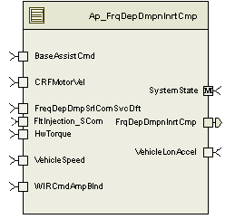

> **Source document:** `FrqDepDmpnInrtCmp/doc/Frequency_Dependant_Damping_And_Inertia_Compenstation_MDD.docx`
>
> This page was converted automatically from the original document so it can be browsed online. Original format: Word document (`.docx`, 148 paragraphs, 22 tables, 1 embedded figures).

**Author:** Kevin Smith **Last saved by:** Balani, Spandana **Revision:** 66

---

# Module -- Frequency Dependant Damping and Inertia Compensation

# High-Level Description

This MDD describes the methods to provide compensation that is dependent on filter of motor velocity which will compensate for motor inertia at low frequencies and provide damping acting at higher frequencies.

# Figures

## Diagram – Component

**
**

## Diagram – Function Data Sharing

N/A

### Diagram – FrqDepDmpnInrtCmp_Per1

# Variable Data Dictionary

For details on module input / output variable, refer to the Data Dictionary for the application.  Input / output variable names are listed here for reference.

(Note: Full variable names required in table.)

(Note: All global variables including End Of Line data used should be shown here)

| Module Inputs | Module Outputs | Module Outputs |
| --- | --- | --- |
| HwTorque_HwNm_f32 | HwTorque_HwNm_f32 | FrqDepDmpnInrtCmp_MtrNm_f32 |
| CRFMotorVel_MtrRadpS_f32 | CRFMotorVel_MtrRadpS_f32 |  |
| BaseAssistCmd_MtrNm_f32 | BaseAssistCmd_MtrNm_f32 |  |
| VehicleSpeed_Kph_f32 | VehicleSpeed_Kph_f32 |  |
| WIRCmdAmpBlnd_MtrNm_f32 | WIRCmdAmpBlnd_MtrNm_f32 |  |
| FreqDepDmpSrlComSvcDft_Cnt_lgc | FreqDepDmpSrlComSvcDft_Cnt_lgc |  |
| VehicleLonAccel_KphpS_T_f32 | VehicleLonAccel_KphpS_T_f32 |  |

## Module Internal Variables

This section identifies the name, range and resolutions for module specific data created by this module.  If there are no range restrictions on the variable, the term “FULL” is placed into the table for legal range.

| Variable Name | Resolution | Legal Range (min) | Legal Range (max) | Software Segment |
| --- | --- | --- | --- | --- |
| PrevTbarAng_HwDeg_M_f32 | Single Precision Floating Point |  |  | FRQDEPDMPNINRTCMP_START_SEC_VAR_CLEARED_32 |
| Prev1SclDrvVel_RadpS_M_f32 | Single Precision Floating Point | -12917.3 | 12917.3 | FRQDEPDMPNINRTCMP_START_SEC_VAR_CLEARED_32 |
| Prev2SclDrvVel_RadpS_M_f32 | Single Precision Floating Point | -12917.3 | 12917.3 | FRQDEPDMPNINRTCMP_START_SEC_VAR_CLEARED_32 |
| Prev1PreAttnComp_MtrNm_M_f32 | Single Precision Floating Point | -8.8 | 8.8 | FRQDEPDMPNINRTCMP_START_SEC_VAR_CLEARED_32 |
| Prev2PreAttnComp_MtrNm_M_f32 | Single Precision Floating Point | -8.8 | 8.8 | FRQDEPDMPNINRTCMP_START_SEC_VAR_CLEARED_32 |
| TbarVelFiltSv_M_str | N/A | N/A | N/A | FRQDEPDMPNINRTCMP_START_SEC_VAR_CLEARED_UNSPECIFIED |
| TbarVelFiltSv_M_str.K_ULS_F32 | Single Precision Floating Point | 0.001255848 | 0.715390457 |  |
| TbarVelFiltSv_M_str.SV_ULS_F32 | Single Precision Floating Point | -6.6667 | 6.6667 | FRQDEPDMPNINRTCMP_START_SEC_VAR_CLEARED_32 |
| PreDecelGain_Uls_M_f32 | Single Precision Floating Point | 1 | FULL | FRQDEPDMPNINRTCMP_START_SEC_VAR_CLEARED_32 |

### Module Display Variables

This section identifies the name, range and resolutions for data test points defined by the FDD. If there are no range restrictions on the variable, the term “FULL” is placed into the table for legal range.

| Variable Name | Resolution | Legal Range (min) | Legal Range (max) | Software Segment |
| --- | --- | --- | --- | --- |
| ADDCoef_MtrNmSpRad_D_f32 | Single Precision Floating Point | FULL | FULL | FRQDEPDMPNINRTCMP_START_SEC_VAR_CLEARED_UNSPECIFIED |
| DriverVelocity_MtrRadpS_D_f32 | Single Precision Floating Point | FULL | FULL | FRQDEPDMPNINRTCMP_START_SEC_VAR_CLEARED_UNSPECIFIED |
| FDDAttenOut_MtrNm_D_f32 | Single Precision Floating Point | FULL | FULL | FRQDEPDMPNINRTCMP_START_SEC_VAR_CLEARED_UNSPECIFIED |
| InertiaCompCalc_MtrNm_D_f32 | Single Precision Floating Point | FULL | FULL | FRQDEPDMPNINRTCMP_START_SEC_VAR_CLEARED_UNSPECIFIED |
| FiltFreqLUBlnd_RadpS_D_f32 | Single Precision Floating Point | FULL | FULL | FRQDEPDMPNINRTCMP_START_SEC_VAR_CLEARED_UNSPECIFIED |
| RawDecelGain_Uls_D_f32 | Single Precision Floating Point | FULL | FULL | FRQDEPDMPNINRTCMP_START_SEC_VAR_CLEARED_32 |
| TbarVelFiltVal_HwDegpSec_D_f32 | Single Precision Floating Point | FULL | FULL | FRQDEPDMPNINRTCMP_START_SEC_VAR_CLEARED_32 |

### User defined typedef definition/declaration

This section documents any user types uniquely used for the module.

| Typedef Name | Element Name | User Defined Type | Legal Range (min) | Legal Range (max) |
| --- | --- | --- | --- | --- |
| typedef struct filterCoef_T | b0_Uls_f32 | Float32 | FULL | FULL |
|  | b1_Uls_f32 | Float32 | FULL | FULL |
|  | b2_Uls_f32 | Float32 | FULL | FULL |
|  | a0_Uls_f32 | Float32 | FULL | FULL |
|  | a1_Uls_f32 | Float32 | FULL | FULL |
|  | a2_Uls_f32 | Float32 | FULL | FULL |

# Constant Data Dictionary

## Calibration Constants

This section lists the calibrations used by the module.  For details on calibration constants, refer to the Data Dictionary for the application.

| Constant Name |
| --- |
| k_InrtCmp_MtrInertia_KgmSq_f32 |
| t_InrtCmp_ScaleFactorTblY_Uls_u9p7[12] |
| k_InrtCmp_TBarVelLPFKn_Hz_f32 |
| t_InrtCmp_TBarVel_ScaleFactorTblY_Uls_u9p7[12] |
| k_InrtCmp_MtrVel_ScaleFactor_Uls_f32 |
| t_FDD_ADDStaticTblY_MtrNmpRadpS_um1p17[10] |
| t2_FDD_ADDRollingTblYM_MtrNmpRadpS_um1p17[2][10] |
| t_FDD_BlendTblY_Uls_u8p8[6] |
| t2_FDD_FreqTblYM_Hz_u12p4[2][12] |
| t_FDD_AttenTblX_MtrRadpS_u12p4[2] |
| t_FDD_AttenTblY_Uls_u8p8[2] |
| t_WIRBlndTblX_MtrNm_u8p8[5] |
| t_RIAstWIRBlndTblY_Uls_u2p14[5] |
| t_DmpFiltKpWIRBlndY_Uls_u2p14[5] |
| t_DmpDecelGainSlewY_UlspS_u13p3[6] |
| t_DmpDecelGainSlewX_MtrRadpS_u11p5[6] |
| k_DmpGainOnThresh_KphpS_f32 |
| k_DmpDecelGain_Uls_f32 |
| k_DmpDecelGainFSlew_UlspS_f32 |
| k_DmpGainOffThresh_KphpS_f32 |
| t_CmnVehSpd_Kph_u9p7[12] |
| t_FddADDCoefTblX_MtrNm_u4p12[10] |
| k_CmnTbarStiff_NmpDeg_f32 |
| k_CmnSysKinRatio_MtrDegpHwDeg_f32 |

## Program(fixed) Constants

### Embedded Constants

All embedded constants whose values are provided in Eng units will be evaluated to the equivalent counts by using the FPM_InitFixedPoint_m() macro within the #define statement.

#### Local

| Constant Name | Resolution | Units | Value |
| --- | --- | --- | --- |
| D_FDDADDCOEFTBLSIZE_ULS_U8 | uint8 | Uls | 24U |
| D_FLOATEIGHT_ULS_F32 | Float32 | Uls | 8.0F |
| D_FLOATFOUR_ULS_F32 | Float32 | Uls | 4.0F |
| D_FLOATTWO_ULS_F32 | Float32 | Uls | 2.0F |
| D_ATTENTBLMAXINPUT_MTRRADPS_F32 | Float32 | MtrRadpS | 4095.9375 |
| D_ATTENTBLMININPUT_MTRRADPS_F32 | Float32 | MtrRadpS | 0.0 |

#### Global

This section lists the global constants used by the module.  For details on global constants, refer to the Data Dictionary for the application.

| Constant Name |
| --- |
| D_ONE_ULS_F32 |
| D_PIOVR180_ULS_F32 |
| D_2MS_SEC_F32 |
| D_2PI_ULS_F32 |
| D_MTRTRQCMDHILMT_MTRNM_F32 |
| BC_FREQDEPDAMPING_FAULTINJECTIONPOINT |
| FLTINJ_INERTIACOMP |

### Module specific Lookup Tables Constants

(This is for lookup tables (arrays) with fixed values, same name as other tables)

| Constant Name | Resolution | Value | Software Segment |
| --- | --- | --- | --- |

# Functions/Macros used by the Sub-Modules

## Library Functions / Macros

The library and functions / Macros that are called by the various sub modules are identified below,

Abs_f32_m

FPM_FloatToFixed_m

TableSize_m

FPM_FixedToFloat_m

LPF_SvUpdate_s16InFixKTrunc_m

Limit_m

FPM_FloatToFixedWithRound_m

## Data Hiding Functions

IntplVarXY_u16_u16Xu16Y_Cnt

## Global Functions/Macros Defined by this Module

N/A

## Local Functions/Macros Used by this MDD only

### Calculate Driver Velocity

| Function Name | DriverVelCalc | Type | Min | Max |
| --- | --- | --- | --- | --- |
| Arguments Passed | HwTroque_HwNm_T_f32 | float32 | -10 | 10 |
|  | CRFMotorVel_MtrRadpS_T_f32 | float32 | -1118 | 1118 |
|  | VehicleSpeed_Kph_T_f32 | float32 | 0 | 512 |
| Return Value | ScaledDriverVel_MtrRadpS_T_f32 | float32 | -7226.652 | 7226.652 |

#### Description

### Calculate Gain

| Function Name | DecelGain | Type | Min | Max |
| --- | --- | --- | --- | --- |
| Arguments Passed | VehicleLonAccel_KphpS_T_f32 | float32 | -10 | 10 |
|  | CRFMotorVel_MtrRadpS_T_f32 | float32 | -1118 | 1118 |
| Return Value | DecelGain_Uls_T_f32 | float32 | 1 | FULL |

#### Description

### Calculate ADD Coefficient

| Function Name | ADDCoefCalc | Type | Min | Max |
| --- | --- | --- | --- | --- |
| Arguments Passed | BaseAssistCmd_MtrNm_T_f32 | float32 | -8.8 | 8.8 |
|  | WIRCmdAmpBlnd_MtrNm_T_f32 | float32 | 0 | 8.8 |
|  | VehicleSpeed_Kph_T_f32 | float32 | 0 | 512 |
| Return Value | ADDCoefCalc_MtrNmSpRad_T_f32 | float32 | 0.0 | 0.041306 |

#### Description

### Calculate Filter Coefficients

| Function Name | FilterCoefCalc | FilterCoefCalc | Type | Min | Max |
| --- | --- | --- | --- | --- | --- |
| Arguments Passed | ADDCoef_MtrNmSpRad_T_f32 | ADDCoef_MtrNmSpRad_T_f32 | float32 | 0.0 | 0.041306 |
|  | WIRCmdAmpBlnd_MtrNm_T_f32 | WIRCmdAmpBlnd_MtrNm_T_f32 | float32 | 0 | 8.8 |
|  | VehicleSpeed_Kph_T_f32 | VehicleSpeed_Kph_T_f32 | float32 | 0 | 512 |
| Return Value | *FilterCoefStr | b0_Uls_f32 | float32 |  |  |
|  |  | b1_Uls_f32 | float32 | 0.0 | 0.330448 |
|  |  | b2_Uls_f32 | float32 |  |  |
|  |  | a0_Uls_f32 | float32 | 0.5525885 | 3.9498924 |
|  |  | a1_Uls_f32 | float32 | -7.9996842 | -4.8417266 |
|  |  | a2_Uls_f32 | float32 | 4.0504234 | 10.6056849 |

#### Description

### Generate Command

| Function Name | GenFddIcCmd | GenFddIcCmd | Type | Min | Max |
| --- | --- | --- | --- | --- | --- |
| Arguments Passed | ScaledDriverVel_MtrRadpS_T_f32 | ScaledDriverVel_MtrRadpS_T_f32 | float32 | -7226.652 | 7226.652 |
|  | *FilterCoefStr | b0_Uls_f32 | float32 |  |  |
|  | *FilterCoefStr | b1_Uls_f32 | float32 | 0.0 | 0.330448 |
|  | *FilterCoefStr | b2_Uls_f32 | float32 |  |  |
|  | *FilterCoefStr | a0_Uls_f32 | float32 | 0.5525885 | 3.9498924 |
|  | *FilterCoefStr | a1_Uls_f32 | float32 | -7.9996842 | -4.8417266 |
|  | *FilterCoefStr | a2_Uls_f32 | float32 | 4.0504234 | 10.6056849 |
| Return Value | Compenstation_MtrNm_T_f32 | Compenstation_MtrNm_T_f32 | Float | -8.8 | 8.8 |

#### Description

# Software Module Implementation

## Runtime Environment (RTE) Initial Values

This section lists the initial values of data written by this module but controlled by the RTE. After RTE initialization, the data in this table will contain these values.

| Data | Value |
| --- | --- |
| Rte_InitValue_BaseAssistCmd_MtrNm_f32 | 0.0F |
| Rte_InitValue_CRFMotorVel_MtrRadpS_f32 | 0.0F |
| Rte_InitValue_FreqDepDmpSrlComSvcDft_Cnt_lgc | FALSE |
| Rte_InitValue_FrqDepDmpnInrtCmp_MtrNm_f32 | 0.0F |
| Rte_InitValue_HwTorque_HwNm_f32 | 0.0F |
| Rte_InitValue_VehicleSpeed_Kph_f32 | 0.0F |
| Rte_InitValue_WIRCmdAmpBlnd_MtrNm_f32 | 0.0F |
| Rte_InitValue_BaseAssistCmd_MtrNm_f32 | 0.0F |
| Rte_InitValue_CRFMotorVel_MtrRadpS_f32 | 0.0F |
| Rte_ InitValue_VehicleLonAccel_KphpS_f32 | 0.0F |

## Initialization Functions

### FrqDepDmpnInrtCmp_Init

## Periodic Functions

### Per: _Per1

#### Design Rationale

This periodic handles all location function calls to calculate the inertia and frequency dependant damping compensation.

#### Program Flow Start

Rte_Call_FrqDepDmpnInrtCmp_Per1_CP0_CheckpointReached()

#### Store Module Inputs to Local copies

| Data | Value |
| --- | --- |
| HwTorque_HwNm_T_f32 | Rte_IRead_FrqDepDmpnInrtCmp_Per1_HwTorque_HwNm_f32() |
| CRFMotorVel_MtrRadpS_T_f32 | Rte_IRead_FrqDepDmpnInrtCmp_Per1_CRFMotorVel_MtrRadpS_f32() |
| BaseAssistCmd_MtrNm_T_f32 | Rte_IRead_FrqDepDmpnInrtCmp_Per1_BaseAssistCmd_MtrNm_f32() |
| VehicleSpeed_Kph_T_f32 | Rte_IRead_FrqDepDmpnInrtCmp_Per1_VehicleSpeed_Kph_f32() |
| WIRCmdAmpBlnd_MtrNm_T_f32 | Rte_IRead_FrqDepDmpnInrtCmp_Per1_WIRCmdAmpBlnd_MtrNm_f32() |
| FDDDefSrvFlg_Cnt_T_lgc | Rte_IRead_FrqDepDmpnInrtCmp_Per1_FreqDepDmpSrlComSvcDft_Cnt_lgc() |
| VehicleLonAccel_KphpS_T_f32 | Rte_IRead_FrqDepDmpnInrtCmp_Per1_VehicleLonAccel_KphpS_f32() |

#### (Processing of function)………

#### Store Local copy of outputs into Module Outputs

| Data | Value |
| --- | --- |
| FrqDepDmpnInrtCmp_MtrNm_T_f32 | Rte_IWrite_FrqDepDmpnInrtCmp_Per1_FrqDepDmpnInrtCmp_MtrNm_f32() |

#### Program Flow End

Rte_Call_FrqDepDmpnInrtCmp_Per1_CP1_CheckpointReached();

## Fault Recovery Functions

N/A

## Shutdown Functions

N/A

## Interrupt Functions

N/A

## Serial Communication Functions

N/A

# Execution Requirements

## Execution Sequence of the Module

(Describe in words relevant details about the execution sequence of the different sub modules.)

## Execution Rates for sub-modules called by the Scheduler

This table serves as reference for the Scheduler design

| Function Name | Calling Frequency | System State(s) in which the function is called |
| --- | --- | --- |
| FrqDepDmpnInrtCmp_Per1 | 2ms | WarmInit, Operate ,Off |
| FrqDepDmpnInrtCmp_Init | Once at startup | On Init |

## Execution Requirements for Serial Communication Functions

| Function Name | Sub-Module called by (Serial Comm Function Name) |
| --- | --- |
| None |  |

# Memory Map Definition Requirements

## Sub Modules (Functions)

This table identifies the software segments for functions identified in this module.

| Name of Sub Module | Software Segment |
| --- | --- |
| FrqDepDmpnInrtCmp_Per1 | RTE_START_SEC_AP_FRQDEPDMPNINRTCMP_APPL_CODE |
| FrqDepDmpnInrtCmp_Init | RTE_START_SEC_AP_FRQDEPDMPNINRTCMP_APPL_CODE |

## Local Functions

This table identifies the software segments for local functions identified in this module.

| Name of Sub Module | Software Segment |
| --- | --- |
| DriverVelCalc | AUTOMATIC |
| ADDCoefCalc | AUTOMATIC |
| FilterCoefCalc | AUTOMATIC |
| GenFddIcCmd | AUTOMATIC |

# Filter Analysis

| File | Description |
| --- | --- |
|  | Filter analysis for all the LPF filters called in this MDD. Analysis contains high/low cutoff frequencies with max output. |

# Known Issues / Limitations With Design

- INLINE functions defined in globalmacro.h are not unit tested

# Revision Control Log

| Item # | Rev # | Change Description | Date | Author Initials |
| --- | --- | --- | --- | --- |
| 1 | 1.0 | Initial Release | 23-Nov-11 | KJS |
| 2 | 2.0 | Corrections made after initial compile of the component, also updated service defeat input for clarity | 29-Nov-11 | KJS |
| 3 | 3.0 | Corrections made to range of module variable PrevTbar, and overflow condition in GenFDDIcCmd function. | 21-Dec-11 | KJS |
| 4 | 4.0 | Updated attenuation table limits for unsigned value | 21-Dec-11 | KJS |
| 5 | 5.0 | Corrected anomaly 2787 | 10-Jan-12 | KJS |
| 6 | 6.0 | Corrected anomaly 2799, changes to section 5.4.1.1 | 13-Jan-12 | KJS |
| 7 | 7.0 | Updated diagrams for anomaly correction 2855, filter analysis in section 9 and UTP known issue comment in section 10. | 21-Jan-12 | KJS |
| 8 | 8.0 | Updated ranges on filter coefficients | 08-Feb-12 | KJS |
| 9 | 9.0 | Fixed Anom 3616 | 09-Aug-12 | NRAR |
| 10 | 10.0 | UTP fixes as per mismatch with SRC | 28-Aug-12 | NRAR |
| 11 | 11 | Check   Points added | 20-sep-2012 | SSK |
| 12 | 12 | Updated to version 5 FDD SF-14 | 7-Feb-13, | Selva |
| 13 | 13 | Change in the calibration names | 8-Feb-12 | Selva |
| 14 | 14 | Fixed anomaly 4786 | 12-Apr-2013 | SP |
| 15 | 15 | Interpolation input signal resolution corrections, anomaly 4775 | 12-Apr-2013 | JJW |
| 16 | 17 | A6259 fix - Initialized the module level variable used for previous value of DecelGain to 1. | 27-Aug-14 | SB |
