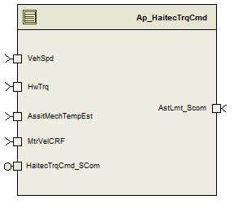

> **Source document:** `HaitecTrqCmd/doc/HaitecTrqCmd_MDD.docx`
>
> This page was converted automatically from the original document so it can be browsed online. Original format: Word document (`.docx`, 119 paragraphs, 7 tables, 1 embedded figures).

**Author:** Thundathil, Jayakrishnan **Last saved by:** Thundathil, Jayakrishnan **Revision:** 37

---

**For**

**Haitec**** ****T****o****rq****ue ****C****om****m****an****d**

**Sep 08, 2015**

**Prepared For:**

**Software Engineering**

**Nexteer**** Automotive****,**

**Saginaw, MI, USA**

**Prepared By: **

**SEPG****,**

**Nexteer**** Automotive****,**

**Saginaw, MI, USA****Change**** History**

| Description | Author | Version | Date | Approved By |
| --- | --- | --- | --- | --- |
| Initial Version | Jayakrishnan T | 1.0 | 08-SEP-2015 | SEPG |

**Table of Contents**

# Introduction

## Purpose

MDD for Haitec Torque Command component.

# HaitecTrqCmd & High-Level Description

This component provides a motor torque command from diagnostic service that is manipulated by a damping curve based on motor velocity. This is intended to help provide system stability when the part is being operated via torque over CAN messages on a test stand or bench.

# Design details of software module

None

## Graphical representation of <MDD Name>

*         *

## Data Flow Diagram

### Module level DFD

None

### Sub-Module level DFD

None

## Component diagram

None

## Variable Data Dictionary

### User defined ‘typedef’ definition/declaration

None

### Variable definition for enumerated types

None

## Constant Data Dictionary

### Program Constants

#### Local Constants

| Constant Name | Resolution | Units | Value |
| --- | --- | --- | --- |
| D_VEHSPDTHD_KPH_F32 | 1 | KPH | 0.001F |

#### Global Constants

None

### Module Specific Lookup Tables

None

## Software Module Implementation

### Sub-Module Functions

#### Initialization sub-module {_Init()}

Refer to FDD

#### Periodic sub-module {_Per()}

Refer to FDD

#### Non Periodic sub-module {_NONPer()}

None

### Interrupt Service Routines

None

### _SCOMM () Functions

| Function Name | HaitecTrqCmd_SCom_StartCtrl | Type | Min | Max |
| --- | --- | --- | --- | --- |
| Arguments Passed | Param_ManTrqCmd_MtrNm_f32 | Float32 | -8.8f | 8.8f |
| Arguments Passed | Param_DefeatHwTrq_Cnt_lgc | boolean | FALSE | TRUE |
| Arguments Passed | Param_DefeatTemp_Cnt_lgc | boolean | FALSE | TRUE |
| Return Value | None |  |  |  |

| Function Name | HaitecTrqCmd_SCom_StopCtrl | Type | Min | Max |
| --- | --- | --- | --- | --- |
| Arguments Passed | None |  |  |  |
| Return Value | None |  |  |  |

### Module Internal (Local) Functions

None

### Transition Functions

None

# Known Limitations with Design

None

# UNIT TEST CONSIDERATION

None

#### Abbreviations and Acronyms

| Abbreviation or Acronym | Description |
| --- | --- |

#### Glossary

**Note**: Terms and definitions from the source “Nexteer Automotive” take precedence over all other definitions of the same term.  Terms and definitions from the source “Nexteer Automotive” are formulated from multiple sources, including the following:

- ISO 9000

- ISO/IEC 12207

- ISO/IEC 15504

- Automotive SPICE® Process Reference Model (PRM)

- Automotive SPICE® Process Assessment Model (PAM)

- ISO/IEC 15288

- ISO 26262

- IEEE Standards

- SWEBOK

- PMBOK

- Existing Nexteer Automotive documentation

| Term | Definition | Source |
| --- | --- | --- |
| MDD | Module Design Document |  |
| DFD | Data Flow Diagram |  |

#### References

| Ref. # | Title | Version |
| --- | --- | --- |
| 1 | AUTOSAR Specification of Memory Mapping (Link:AUTOSAR_SWS_MemoryMapping.pdf) | v1.3.0 R4.0 Rev 2 |
| 2 | MDD Guideline | EA3 01.04.00 |
| 3 | Software Naming Conventions.doc | 1.0 |
| 4 | Software Design and Coding Standards.doc | 2.0 |
| 5 | FDD -  CF015A_HaitecTrqCmd | V_0.0.1 |
