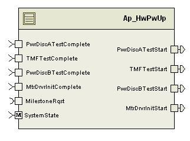

> **Source document:** `HwPwUp/doc/Hardware_Power_Up_MDD.docx`
>
> This page was converted automatically from the original document so it can be browsed online. Original format: Word document (`.docx`, 132 paragraphs, 13 tables, 1 embedded figures).

**Author:** Owen Tosh (nzx5jd) **Last saved by:** Sengottaiyan, Selva **Revision:** 9

---

# Module – Hardware Power Up Sequence

# High-Level Description

This module controls the startup initialization sequence for several modules that would otherwise conflict with one another.  It uses a series of boolean inputs and outputs to control these modules.

# Figures

## Component Diagram

# Variable Data Dictionary

For details on module input / output variable, refer to the Data Dictionary for the application.  Input / output variable names are listed here for reference.

| Module Inputs | Module Outputs | Module Outputs |
| --- | --- | --- |
| PwrDiscATestComplete_Cnt_lgc | PwrDiscATestComplete_Cnt_lgc | PwrDiscATestStart_Cnt_lgc |
| TMFTestComplete_Cnt_lgc | TMFTestComplete_Cnt_lgc | TMFTestStart_Cnt_lgc |
| PwrDiscBTestComplete_Cnt_lgc | PwrDiscBTestComplete_Cnt_lgc | PwrDiscBTestStart_Cnt_lgc |
| MtrDrvrInitComplete_Cnt_lgc | MtrDrvrInitComplete_Cnt_lgc | MtrDrvrInitStart_Cnt_lgc |

# Module Internal Variables

This section identifies the name, range and resolutions for module specific data created by this module.  If there are no range restrictions on the variable, the term “FULL” is placed into the table for legal range.

| Variable Name | Resolution | Legal Range (min) | Legal Range (max) | Software Segment |
| --- | --- | --- | --- | --- |
| PowerUpState_Cnt_M_enum | 1 | 0 | 6 | HWPWUP_START_SEC_VAR_CLEARED_UNSPECIFIED |
| PwrDiscATestStart_Cnt_M_lgc | boolean | FALSE | TRUE | HWPWUP_START_SEC_VAR_CLEARED_UNSPECIFIED |
| TMFTestStart_Cnt_M_lgc | boolean | FALSE | TRUE | HWPWUP_START_SEC_VAR_CLEARED_UNSPECIFIED |
| PwrDiscBTestStart_Cnt_M_lgc | boolean | FALSE | TRUE | HWPWUP_START_SEC_VAR_CLEARED_UNSPECIFIED |
| MtrDrvrInitStart_Cnt_M_lgc | boolean | FALSE | TRUE | HWPWUP_START_SEC_VAR_CLEARED_UNSPECIFIED |

### User defined typedef definition/declaration

This section documents any user types uniquely used for the module.

| Typedef Name | Element Name | User Defined Type | Legal Range (min) | Legal Range (max) |
| --- | --- | --- | --- | --- |
| PowerUpSequenceType | PWRUP_PWRDISCSTEPA = 0 PWRUP_TMFINIT = 1 PWRUP_PWRDISCSTEPB = 2 PWRUP_MTRDRIVERINIT = 3 PWRUP_WARMINITCOMPLETE = 4 PWRUP_RUN = 5 PWRUP_DISABLE = 6 | uint8 | 0 | 6 |

# Constant Data Dictionary

## Calibration Constants

This section lists the calibrations used by the module.  For details on calibration constants, refer to the Data Dictionary for the application.

| Constant Name |
| --- |
| none |

## Program(fixed) Constants

### Embedded Constants

All embedded constants whose values are provided in Eng units will be evaluated to the equivalent counts by using the FPM_InitFixedPoint_m() macro within the #define statement.

#### Local

| Constant Name | Resolution | Units | Value |
| --- | --- | --- | --- |
| D_PWRDISCSTEPAMASK_CNT_U16 | 1 | Counts | 0x0001 |
| D_PWRDISCSTEPBMASK_CNT_U16 | 1 | Counts | 0x0004 |
| D_PGMSPECMASK_CNT_U16 | 1 | Counts | configurable |

#### Global

This section lists the global constants used by the module.  For details on global constants, refer to the Data Dictionary for the application.

| Constant Name |
| --- |
| None |

### Module specific Lookup Tables Constants

| Constant Name | Resolution | Value | Software Segment |
| --- | --- | --- | --- |
| None |  |  |  |

# Functions/Macros used by the Sub-Modules

## Library Functions / Macros

The library and functions / Macros that are called by the various sub modules are identified below,

None

## Data Hiding Functions

Rte_Call_MilestoneRqst_WarmInitMilestoneComplete

Rte_Call_MilestoneRqst_WarmInitMilestoneNotComplete

## Global Functions/Macros Defined by this Module

None

# Software Module Implementation

## Runtime Environment (RTE) Initial Values

This section lists the initial values of data written by this module but controlled by the RTE. After RTE initialization, the data in this table will contain these values.

| Data | Value |
| --- | --- |
| Rte_InitValue_MtrDrvrInitComplete_Cnt_lgc | FALSE |
| Rte_InitValue_MtrDrvrInitStart_Cnt_lgc | FALSE |
| Rte_InitValue_PwrDiscATestComplete_Cnt_lgc | FALSE |
| Rte_InitValue_PwrDiscATestStart_Cnt_lgc | FALSE |
| Rte_InitValue_PwrDiscBTestComplete_Cnt_lgc | FALSE |
| Rte_InitValue_PwrDiscBTestStart_Cnt_lgc | FALSE |
| Rte_InitValue_TMFTestComplete_Cnt_lgc | FALSE |
| Rte_InitValue_TMFTestStart_Cnt_lgc | FALSE |

## Initialization Functions

None

## Periodic Functions

### Per: _Per1

#### Design Rationale

None

#### Program Flow Start

Rte_Call_HwPwUp_Per1_CP0_CheckpointReached()

#### Store Module Inputs to Local copies

PwrDiscATestComplete_Cnt_T_lgc = Rte_IRead_HwPwUp_Per1_PwrDiscATestComplete_Cnt_lgc()

TMFTestComplete_Cnt_T_lgc = Rte_IRead_HwPwUp_Per1_TMFTestComplete_Cnt_lgc()

PwrDiscBTestComplete_Cnt_T_lgc = Rte_IRead_HwPwUp_Per1_PwrDiscBTestComplete_Cnt_lgc()

MtrDrvrInitComplete_Cnt_T_lgc = Rte_IRead_HwPwUp_Per1_MtrDrvrInitComplete_Cnt_lgc()

#### Process State Machine

#### Store Local copy of outputs into Module Outputs

Rte_IWrite_HwPwUp_Per1_PwrDiscATestStart_Cnt_lgc(PwrDiscATestStart_Cnt_M_lgc)

Rte_IWrite_HwPwUp_Per1_TMFTestStart_Cnt_lgc(TMFTestStart_Cnt_M_lgc)

Rte_IWrite_HwPwUp_Per1_PwrDiscBTestStart_Cnt_lgc(PwrDiscBTestStart_Cnt_M_lgc)

Rte_IWrite_HwPwUp_Per1_MtrDrvrInitStart_Cnt_lgc(MtrDrvrInitStart_Cnt_M_lgc)

#### Program Flow End

Rte_Call_HwPwUp_Per1_CP1_CheckpointReached()

## Fault Recovery Functions

None

## Shutdown Functions

None

## Interrupt Functions

None

## Serial Communication Functions

None

## Transition Functions

### Trns: _Trns1

#### Design Rationale

None

#### Program Flow Start

N/A

#### Store Module Inputs to Local copies

None

#### Reset State Machine and Outputs

#### Store Local copy of outputs into Module Outputs

None

#### Program Flow End

N/A

### Trns: _Trns2

#### Design Rationale

None

#### Program Flow Start

N/A

#### Store Module Inputs to Local copies

None

#### Set Power Up State

#### Store Local copy of outputs into Module Outputs

None

#### Program Flow End

N/A

# Execution Requirements

## Execution Rates for sub-modules called by the Scheduler

This table serves as reference for the Scheduler design

| Function Name | Calling Frequency | System State(s) in which the function is called |
| --- | --- | --- |
| HwPwUp_Per1 | 2 ms | ALL |
| HwPwUp_Trns1 | On Event | On Entering WARMINIT, On Leaving DISABLE |
| HwPwUp_Trns2 | On Event | On Entering DISABLE |

## Execution Requirements for Serial Communication Functions

| Function Name | Sub-Module called by (Serial Comm Function Name) |
| --- | --- |
| None |  |

# Memory Map Definition Requirements

## Sub Modules (Functions)

This table identifies the software segments for functions identified in this module.

| Name of Sub Module | Software Segment |
| --- | --- |
| HwPwUp_Per1 | RTE_START_SEC_AP_HWPWUP_APPL_CODE |
| HwPwUp_Trns1 | RTE_START_SEC_AP_HWPWUP_APPL_CODE |
| HwPwUp_Trns2 | RTE_START_SEC_AP_HWPWUP_APPL_CODE |

## Local Functions

This table identifies the software segments for local functions identified in this module.

| Name of Sub Module | Software Segment |
| --- | --- |
| None |  |

# Known Issues / Limitations With Design

None

# Revision Control Log

| Item # | Rev # | Change Description | Date | Author Initials |
| --- | --- | --- | --- | --- |
| 1 | 1.0 | Initial Version (FDD 13B v001) | 11-Sep-12 | OT |
| 2 | 2.0 | UTP Updates | 17-Sep-12 | OT |
| 3 | 3.0 | Added checkpoints and memmap software segment is updated for static variables | 29-Sep-12 | Selva |
| 4 | 4.0 | Anomaly 3912 – fixed writing outputs in all branches | 24-Oct-12 | OT |
| 5 | 5.0 | Changed k_PgmSpecMask_Cnt_u16 to D_PGMSPECMASK_CNT_U16 (configurable) | 08-Nov-12 | JJW |
| 6 | 6.0 | Updated to FDD V003 | 14-Mar-13 | SP |
