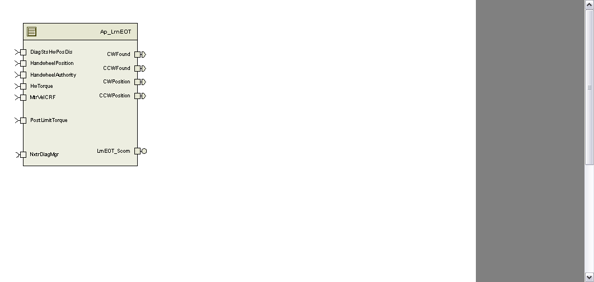

> **Source document:** `LrnEOT/doc/LearnEOT.docx`
>
> This page was converted automatically from the original document so it can be browsed online. Original format: Word document (`.docx`, 126 paragraphs, 13 tables, 1 embedded figures).

**Author:** User **Last saved by:** Balani, Spandana **Revision:** 15

---

# Module -- LrnEOT

# High-Level Description

LrnEOT uses vehicle operational information to learn the appropriate end of travel positions for a given system.

# Figures

## Component Diagram

# Module Inputs and Outputs

For details on module input / output variable, refer to the Data Dictionary for the application.  Input / output variable names are listed here for reference.

| Module Inputs (Global Variable Name) | Module Outputs (Global Variable Name) |
| --- | --- |
| MtrVelCRF_MtrRadpS_f32 | CWPosition_HwDeg_f32 |
| HandwheelPosition_HwDeg_f32 | CCWPosition_HwDeg_f32 |
| HandwheelAuthority_Uls_f32 | CWFound_Cnt_lgc |
| HwTorque_HwNm_f32 | CCWFound_Cnt_lgc |
| DiagStsHwPosDis_Cnt_lgc |  |

## Module Internal Variables

This section identifies the name, range and resolutions for module specific data created by this module.  If there are no range restrictions on the variable, the term “FULL” is placed into the table for legal range.

| Variable Name | Resolution | (min) | (max) | Software Segment |
| --- | --- | --- | --- | --- |
| LrnEOT_CcwEOTTimer_mS_M_u32 | 1 | 0 | Full | LRNEOT_START_SEC_VAR_32 |
| LrnEOT_CwEOTTimer_mS_M_u32 | 1 | 0 | Full | LRNEOT_START_SEC_VAR_32 |
| LrnEOT_ResetLimitReq_Cnt_M_lgc | N/A | N/A | N/A | LRNEOT_START_SEC_VAR_ BOOLEAN |

### User defined typedef definition/declaration

This section documents any user types uniquely used for the module.

| Typedef Name | Element Name | Storage Type |
| --- | --- | --- |

# Constant Data Dictionary

## Calibration Constants

This section lists the calibrations used by the module.  For details on calibration constants, refer to the Data Dictionary for the application.

| Constant Name |
| --- |
| k_MinRackTrvl_HwDeg_f32 |
| k_MaxRackTrvl_HwDeg_f32 |
| k_AuthorityStartLrn_Uls_f32 |
| k_HwTrqEOTLrn_HwNm_f32 |
| k_MtrVelEOTLrn_MtrRadpS_f32 |
| k_EOTLrnTimer_mS_u16 |
| k_MtrTrqEOTLrn_MtrNm_f32 |
| k_MinResetAuthority_Uls_f32 |

## Program(fixed) Constants

### Embedded Constants

All embedded constants whose values are provided in Eng units will be evaluated to the equivalent counts by using the FPM_InitFixedPoint_m() macro within the #define statement.

#### Local

| Constant Name | Resolution | Value |
| --- | --- | --- |
| D_CCWEOTPOSITIONLOLIM_HWDEG_F32 | Single precision Float | (-1440.11) |
| D_CCWEOTPOSITIONHILIM_HWDEG_F32 | Single precision Float | (-360.0) |
| D_CWEOTPOSITIONLOLIM_HWDEG_F32 | Single precision Float | 360.0 |
| D_CWEOTPOSITIONHILIM_HWDEG_F32 | Single precision Float | 1440.11 |

#### Global

This section lists the global constants used by the module.  For details on global constants, refer to the Data Dictionary for the application.

| Constant Name |
| --- |
| D_ZERO_ULS_F32 |
| D_FALSE_CNT_LGC |

### Module specific Lookup Tables Constants

| Constant Name | Resolution | Value | Software Segment |
| --- | --- | --- | --- |
| None |  |  |  |

# Functions/Macros used by the Sub-Modules

## Library Functions / Macros

The library functions / Macros that are called by the various sub modules are identified below,

Abs_f32_m()

Max_m()

Min_m()

Limit_m()

## Data Hiding Functions

The data hiding functions / macros used in this module are identified below,

Rte_Call_LearnedEOTData_SetRamBlockStatus()

Rte_Call_LearnedEOTData_WriteBlock()

## Local Functions/Macros Used by this MDD only

The local functions/macros in this module are identified below:

ResetEOT()

# Software Module Implementation

## Initialization Functions

### Init: LrnEOT_Init()

#### Design Rationale

None

#### Initialize End-of-Travel

#### Module Outputs

None

#### Module Internal

Rte_IWrite_LrnEOT_Init1_CCWFound_Cnt_lgc(Rte_Pim_LearnedEOT()->CCWEOTFound_Cnt_lgc)

Rte_IWrite_LrnEOT_Init1_CCWPosition_HwDeg_f32(Rte_Pim_LearnedEOT()->CCWEOTPosition_HwDeg_f32)

Rte_IWrite_LrnEOT_Init1_CWFound_Cnt_lgc(Rte_Pim_LearnedEOT()->CWEOTFound_Cnt_lgc)

Rte_IWrite_LrnEOT_Init1_CWPosition_HwDeg_f32(Rte_Pim_LearnedEOT()->CWEOTPosition_HwDeg_f32)

## Periodic Functions

### Per: LrnEOT_Per1

#### Design Rationale

None

#### Program Flow Start

Rte_Call_LrnEOT_Per1_CP0_CheckpointReached

#### Store Module Inputs to Local copies

Local Variables:

*DiagStsHwPosDis_Cnt_T_lgc* = Rte_IRead_LrnEOT_Per1_DiagStsHwPosDis_Cnt_lgc()

*HandwheelAuthority_Uls_T_f32* = Rte_IRead_LrnEOT_Per1_HandwheelAuthority_Uls_f32()

*HandwheelPosition_HwDeg_T_f32* = Rte_IRead_LrnEOT_Per1_HandwheelPosition_HwDeg_f32()

*HwTorque_MtrNm_T_f32* = Rte_IRead_LrnEOT_Per1_HwTorque_HwNm_f32()

*MtrVel_MtrRadpS_T_f32* = Rte_IRead_LrnEOT_Per1_MtrVelCRF_MtrRadpS_f32()

#### Reset EOT Limits

#### Learn End of Travel Limits

#### EOT Learn Complete Indication

#### Store Local copy of outputs into Module Outputs

Rte_IWrite_LrnEOT_Per1_CCWFound_Cnt_lgc(Rte_Pim_LearnedEOT()->CCWEOTFound_Cnt_lgc)

Rte_IWrite_LrnEOT_Per1_CCWPosition_HwDeg_f32(CWWEOTPosition_HwDeg_T_f32)

Rte_IWrite_LrnEOT_Per1_CWFound_Cnt_lgc(Rte_Pim_LearnedEOT()->CWEOTFound_Cnt_lgc)

Rte_IWrite_LrnEOT_Per1_CWPosition_HwDeg_f32(CWEOTPosition_HwDeg_T_f32)

#### Program Flow End

Rte_Call_LrnEOT_Per1_CP1_CheckpointReached

## Fault Recovery Functions

None

## Shutdown Functions

None

## Interrupt Functions

None

## Serial Communication Functions

### LrnEOT_Scom_ResetEOT

LrnEOT_ResetLimitReq_Cnt_M_lgc = True

## Local Function/Macro Definitions

### Reset End of Travel

| Function Name | ResetEOT | Type | Min | Max |
| --- | --- | --- | --- | --- |
| Arguments Passed |  |  |  |  |
| Return Value |  |  |  |  |

#### Description

# Execution Requirements

## Execution Rates for sub-modules called by the Scheduler

This table serves as reference for the Scheduler design

| Function Name | Calling Frequency | in which the function is called |
| --- | --- | --- |
| LrnEOT_Init () | On Event | On Init |
| LrnEOT_Per1() | 10mS | ALL |

## Execution Requirements for Serial Communication Functions

| Function Name | Sub-Module called by (Serial Comm Function Name) |
| --- | --- |
| LrnEOT_Scom_ResetEOT |  |

# Memory Map Definition Requirements

## Sub Modules (Functions)

This table identifies the software segments for functions identified in this module.

| Name of Sub Module | Software Segment |
| --- | --- |
| LrnEOT_Per1 | RTE_START_SEC_AP_LRNEOT_APPL_CODE |
| LrnEOT_Scom_ResetEOT | RTE_START_SEC_AP_LRNEOT_APPL_CODE |

## Local Functions

This table identifies the software segments for local functions identified in this module.

| Name of Sub Module | Software Segment |
| --- | --- |
| ResetEOT |  |

# Known Issues / Limitations With Design

Inline functions in GlobalMacro.h are not unit tested.

# Revision Control Log

| Item # | Rev # | Change Description | Date | Author Initials |
| --- | --- | --- | --- | --- |
| 1 | 1.0 | Initial release | 13Feb12 | M. Story |
| 2 | 2.0 | Updated ResetEOT function to use WriteBlock API, fixed anomaly 3206 | 26-Apr-12 | VK |
| 3 | 3 | Correction of anomaly 3259, QAC updates | 29-May-12 | LWW |
| 4 | 4 | Updated to SF-11 v002 | 20-Jun-12 | OT |
| 5 | 5 | UTP Fix – calibration name | 27-Jun-12 | OT |
| 6 | 6 | Moved RackCentering function to new Ap_LnRkCr component – FDD SF-39 | 18-Aug-12 | BDO |
| 7 | 7 | Check points flow updated | 23- Sep -12 | Selva |
| 8 | 8 | Changed Per1 trigger rate from 4ms to 10ms. | 22-Oct-12 | BWL |
| 9 | 9 | Updated to SF 11 v006 | 24-Apr-14 | SB |
