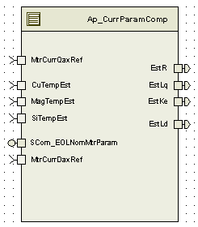

> **Source document:** `MtrCtrl_CM/doc/CurrParamComp_MDD.docx`
>
> This page was converted automatically from the original document so it can be browsed online. Original format: Word document (`.docx`, 177 paragraphs, 13 tables, 1 embedded figures).

**Author:** Lucas Wendling / Owen Tosh **Last saved by:** Sengottaiyan, Selva **Revision:** 19

---

# Module  -- Parameter Compensation

# High-Level Description

# Figures

## Diagram – Function Data Sharing

None

### Diagram – Function (Name)

None

# Variable Data Dictionary

For details on module input / output variable, refer to the Data Dictionary for the application.  Input / output variable names are listed here for reference.

| Module Inputs | Module Outputs | Module Outputs |
| --- | --- | --- |
| MtrCurrDaxRef _Amp_f32 | MtrCurrDaxRef _Amp_f32 | EstKe_VpRadpS_f32 |
| MtrCurrQaxRef_ Amp_f32 | MtrCurrQaxRef_ Amp_f32 | EstR_Ohm_f32 |
| CuTempEst_DegC_f32 | CuTempEst_DegC_f32 | EstLq_Henry_f32 |
| MagTempEst_DegC_f32 | MagTempEst_DegC_f32 | EstLd_Henry_f32 |
| SiTempEst_DegC_f32 | SiTempEst_DegC_f32 |  |
| FastDataAccessBufIndex_Cnt_M_u16 | FastDataAccessBufIndex_Cnt_M_u16 |  |

## Module Internal Variables

This section identifies the name, range and resolutions for module specific data created by this module.  If there are no range restrictions on the variable, the term “FULL” is placed into the table for legal range.

| Variable Name | Resolution | Legal Range (min) | Legal Range (max) | Software Segment |
| --- | --- | --- | --- | --- |
| EstKeFF_VpRadpS_M_f32 | single precision float | 0.025 | 0.075 | CURRPARAMCOMP_START_SEC_VAR_CLEARED_32 |
| EstRFF_Ohm_M_f32 | single precision float | 0.005 | 0.12565 | CURRPARAMCOMP_START_SEC_VAR_CLEARED_32 |
| KeSatSclFac_Uls_D_f32 | single precision float | 0 | 1 | CURRPARAMCOMP_START_SEC_VAR_CLEARED_32 |
| LqSatSclFac_Uls_D_f32 | single precision float | 0 | 2 | CURRPARAMCOMP_START_SEC_VAR_CLEARED_32 |
| LdSatSclFac_Uls_D_f32 | single precision float | 0 | 2 | CURRPARAMCOMP_START_SEC_VAR_CLEARED_32 |
| EstRfetFF_Ohm_D_f32 | single precision float | 0.005 | 0.12565 | CURRPARAMCOMP_START_SEC_VAR_CLEARED_32 |
| EstRmtrFF_Ohm_D_f32 | single precision float | 0.005 | 0.12565 | CURRPARAMCOMP_START_SEC_VAR_CLEARED_32 |
| PreLmtEstKe_VpRadpS_D_f32 | single precision float | 0.25 | 0.075 | CURRPARAMCOMP_START_SEC_VAR_CLEARED_32 |
| PreLmtEstLq_Henry_D_f32 | single precision float | 0.00003 | 0.00041 | CURRPARAMCOMP_START_SEC_VAR_CLEARED_32 |
| PreLmtEstLd_Henry_D_f32 | single precision float | 0.00003 | 0.00041 | CURRPARAMCOMP_START_SEC_VAR_CLEARED_32 |

### User defined typedef definition/declaration

This section documents any user types uniquely used for the module.

# Constant Data Dictionary

## Calibration Constants

This section lists the calibrations used by the module.  For details on calibration constants, refer to the Data Dictionary for the application.

| Constant Name |
| --- |
| t_KeSatTblX_Amp_u9p7 |
| t_KeSatTblY_Uls_u2p14 |
| t_KeSatTblX_Amp_u12p4 |
| t_CurrParamCompDaxRef_Amp_u9p7 |
| t_CurrParamCompQaxRef_Amp_u9p7 |
| t_CurrParamLqSatSclFac_Uls_u2p14 |
| k_MinKeRngLmt_VpRadpS_f32 |
| k_MaxKeRngLmt_VpRadpS_f32 |
| k_MinRRngLmt_Ohm_f32 |
| k_MaxRRngLmt_Ohm_f32 |
| k_MinLqRngLmt_Henry_f32 |
| k_MaxLqRngLmt_Henry_f32 |
| k_MinLdRngLmt_Henry_f32 |
| k_MaxLdRngLmt_Henry_f32 |
| k_NomTemp_DegC_f32 |
| k_MagThrC_VpRadpSpDegC_f32 |
| k_SiThermCoeff_OhmpDegC_f32 |
| k_NomRfet_Ohm_f32 |
| k_CuThermCoeff_OhmpDegC_f32 |
| k_NomLq_Henry_f32 |
| k_NomLd_Henry_f32 |

## Program(fixed) Constants

### Embedded Constants

All embedded constants whose values are provided in Eng units will be evaluated to the equivalent counts by using the FPM_InitFixedPoint_m() macro within the #define statement.

#### Local

| Constant Name | Resolution | Units | Value |
| --- | --- | --- | --- |
| D_SQRT3OVR2_ULS_F32 | single precision float | Unitless | 0.866025403784 |

#### Global

This section lists the global constants used by the module.  For details on global constants, refer to the Data Dictionary for the application.

| Constant Name |
| --- |

### Module specific Lookup Tables Constants

(This is for lookup tables (arrays) with fixed values, same name as other tables)

| Constant Name | Resolution | Value | Software Segment |
| --- | --- | --- | --- |
| None |  |  |  |

# Functions/Macros used by the Sub-Modules

## Library Functions / Macros

The library and functions / Macros that are called by the various sub modules are identified below,

FPM_InitFixedPoint_m

Abs_f32_m

Limit_m

FPM_FloatToFixed_m

TableSize_m

FPM_FixedToFloat_m

IntplVarXY_u16_u16Xu16Y_Cnt

BilinearXYM_u16_u16Xu16YM_Cnt

## Data Hiding Functions

<None>

## Global Functions/Macros Defined by this Module

None

## Local Functions/Macros Used by this MDD only

### Local Function #1

| Function Name | None | Type | Min | Max | UTP Tol. |
| --- | --- | --- | --- | --- | --- |
| Arguments Passed |  |  |  |  |  |
| Return Value |  |  |  |  |  |

#### Description

# Software Module Implementation

## Runtime Environment (RTE) Initial Values

This section lists the initial values of data written by this module but controlled by the RTE. After RTE initialization, the data in this table will contain these values.

| Data | Value |
| --- | --- |
| Rte_IWrite_CurrParamComp_Init_EstR_Ohm_f32 | Rte_Pim_EOLNomMtrParam()->NomRmtr_Ohm_f32 |
| Rte_IWrite_CurrParamComp_Init_EstLd_Henry_f32 | k_NomLd_Henry_f32 |
| Rte_IWrite_CurrParamComp_Init_EstLq_Henry_f32 | k_NomLq_Henry_f32 |
| Rte_IWrite_CurrParamComp_Init_EstKe_VpRadpS_f32 | Rte_Pim_EOLNomMtrParam()->NomKe_VpRadpS_f32 |

## Initialization Functions

### Init: ParamComp_Init1

#### Design Rationale

#### Module Outputs

Rte_IWrite_CurrParamComp_Init_EstR_Ohm_f32()

Rte_IWrite_CurrParamComp_Init_EstLd_Henry_f32(k_NomLd_Henry_f32)

Rte_IWrite_CurrParamComp_Init_EstLq_Henry_f32(k_NomLq_Henry_f32)

Rte_IWrite_CurrParamComp_Init_EstKe_VpRadpS_f32(NomKe_VpRadpS_T_f32) MtrEstKe_VpRadpS_M_f32[0] = NomKe_VpRadpS_T_f32

#### Module Internal

## Periodic Functions

### Per: ParamComp_Per1

#### Design Rationale

FastDataAccessBufIndex  allows  the buffer synchronization between data calculated on slower periodic loop time(2 milli seconds)  and are  read by faster periodic run time (ie 0.125ms)

#### Program Flow Start

Rte_Call_CurrParamComp_Per1_CP0_CheckpointReached()

#### Store Module Inputs to Local copies

IqRef_Amp_T_f32=Rte_IRead_CurrParamComp_Per1_MtrCurrQaxRef_Amp_f32()

IdRef_Amp_T_f32=Rte_IRead_CurrParamComp_Per1_MtrCurrDaxRef_Amp_f32()

#### Processing

#### Store Local copy of outputs into Module Outputs

MtrEstKe_VpRadpS_M_f32[(ActFaseDataAccBufIndex_Cnt_M_u16&1)^1]=EstKe_VpRadpS_T_f32

ActFaseDataAccBufIndex_Cnt_M_u16= (ActFaseDataAccBufIndex_Cnt_M_u16& 1)^1

Rte_IWrite_CurrParamComp_Per1_EstKe_VpRadpS_f32(EstKe_VpRadpS_T_f32)

Rte_IWrite_CurrParamComp_Per1_EstR_Ohm_f32(EstR_Ohm_T_f32)

Rte_IWrite_CurrParamComp_Per1_EstLq_Henry_f32(EstLq_Henry_T_f32)

Rte_IWrite_CurrParamComp_Per1_EstLd_Henry_f32(EstLd_Henry_T_f32)

#### Program Flow End

Rte_Call_CurrParamComp_Per1_CP1_CheckpointReached()

### Per: ParamComp_Per2

#### Design Rationale

None

#### Program Flow Start

Rte_Call_CurrParamComp_Per2_CP0_CheckpointReached()

#### Store Module Inputs to Local copies

NomKe_VpRadpS_T_f32 = Rte_Pim_EOLNomMtrParam()->NomKe_VpRadpS_f32

NomRmtr_Ohm_T_f32 = Rte_Pim_EOLNomMtrParam()->NomRmtr_Ohm_f32

CuTempEst_DegC_T_f32 = Rte_IRead_CurrParamComp_Per2_CuTempEst_DegC_f32()

MagTempEst_DegC_T_f32 = Rte_IRead_CurrParamComp_Per2_MagTempEst_DegC_f32()

SiTempEst_DegC_T_f32 = Rte_IRead_CurrParamComp_Per2_SiTempEst_DegC_f32()

#### Processing

#### Store Local copy of outputs into Module Outputs

None

#### Program Flow End

Rte_Call_CurrParamComp_Per2_CP1_CheckpointReached()

## Fault Recovery Functions

None

## Shutdown Functions

None

## Interrupt Functions

None

## Serial Communication Functions

### SComm: SCom_EOLNomMtrParam_Get

#### Design Rationale

None

#### Program Flow Start

None

#### Store Module Inputs to Local copies

None

#### Processing

#### Store Local copy of outputs into Module Outputs

None

#### Program Flow End

None

### SComm: SCom_EOLNomMtrParam_Set

#### Design Rationale

None

#### Program Flow Start

None

#### Store Module Inputs to Local copies

None

#### Processing

#### Store Local copy of outputs into Module Outputs

None

#### Program Flow End

None

# Execution Requirements

## Execution Sequence of the Module

(Describe in words relevant details about the execution sequence of the different sub modules.)

## Execution Rates for sub-modules called by the Scheduler

This table serves as reference for the Scheduler design

| Function Name | Calling Frequency | System State(s) in which the function is called |
| --- | --- | --- |
| ParamComp_Per1 | 2 ms | ALL |
| ParamComp_Per2 | 100 ms | ALL |

## Execution Requirements for Serial Communication Functions

| Function Name | Sub-Module called by (Serial Comm Function Name) |
| --- | --- |
| SCom_EOLNomMtrParam_Get | EPS_DiagSrvc |
| SCom_EOLNomMtrParam_Set | EPS_DiagSrvc |

# Memory Map Definition Requirements

## Sub Modules (Functions)

This table identifies the software segments for functions identified in this module.

| Name of Sub Module | Software Segment |
| --- | --- |
| ParamComp_Per1 | RTE_AP_CURRPARAMCOMP_APPL_CODE |
| ParamComp_Per2 | RTE_AP_CURRPARAMCOMP_APPL_CODE |
| SCom_EOLNomMtrParam_Get | RTE_AP_CURRPARAMCOMP_APPL_CODE |
| SCom_EOLNomMtrParam_Set | RTE_AP_CURRPARAMCOMP_APPL_CODE |

## Local Functions

This table identifies the software segments for local functions identified in this module.

| Name of Sub Module | Software Segment |
| --- | --- |

# Known Issues / Limitations With Design

(Item #1)

# Revision Control Log

| Item # | Rev # | Change Description | Date | Author Initials |
| --- | --- | --- | --- | --- |
| 1 | 1.0 | Initial Version | 25-May-12 | SK |
| 2 | 2.0 | Added checkpoints and memmap statements | 20-Nov-12 | Selva |
| 3 | 3.0 |  | 11-Jan-13 | Selva |
| 4 | 4.0 | Updated to version 8 of the Sf99 Mtrlcntrl | 21-Mar-13 | Selva |
| 5 | 5.0 | Updated to version 10 FDD SF99 B. Divide by zero fixed | 21-Oct-13 | Selva |
