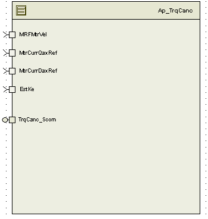

> **Source document:** `MtrCtrl_CM/doc/TrqCanc_MDD.docx`
>
> This page was converted automatically from the original document so it can be browsed online. Original format: Word document (`.docx`, 236 paragraphs, 16 tables, 1 embedded figures).

**Author:** KPIT **Last saved by:** Sengottaiyan, Selva **Revision:** 9

---

# Module -- TrqCanc

# High-Level Description

# Figures

## Component Diagram

### 

# Variable Data Dictionary

For details on module input / output variable, refer to the Data Dictionary for the application.  Input / output variable names are listed here for reference.

| Module Inputs | Module Outputs | Module Outputs |
| --- | --- | --- |
| EstKe_VpRadpS_f32 | EstKe_VpRadpS_f32 |  |
| MRFMtrVel_MtrRadpS_f32 | MRFMtrVel_MtrRadpS_f32 |  |
| MtrCurrDaxRef_Amp_f32 | MtrCurrDaxRef_Amp_f32 |  |
| MtrCurrQaxRef_Amp_f32 | MtrCurrQaxRef_Amp_f32 |  |
| ElecPosDelayComp_Rad_f32 | ElecPosDelayComp_Rad_f32 | MtrCurrQaxRpl_Amp_T_f32 |
| MtrElecPol_Cnt_s8 | MtrElecPol_Cnt_s8 | MtrCurrQaxCog_Amp_f32 |
| MtrPosElec_Rev_u0p16 | MtrPosElec_Rev_u0p16 |  |
| EstKe_VpRadpS_f32 | EstKe_VpRadpS_f32 |  |
| MtrCurrQax12Mag_Amp_f32 | MtrCurrQax12Mag_Amp_f32 |  |
| MtrCurrQax6Mag_Amp_f32 | MtrCurrQax6Mag_Amp_f32 |  |
| MtrCurrQax12Ph_Rad_f32 | MtrCurrQax12Ph_Rad_f32 |  |
| MtrCurrQax6Ph_Rad_f32 | MtrCurrQax6Ph_Rad_f32 |  |
| MtrCurrQax18Ph_Rad_f32 | MtrCurrQax18Ph_Rad_f32 |  |
| MtrCurrQax18Mag_Amp_f32 | MtrCurrQax18Mag_Amp_f32 |  |
| ActWriteAccBufIndex_Cnt_T_u16 | ActWriteAccBufIndex_Cnt_T_u16 |  |
| ReadBuffer_Cnt_M_u16 | ReadBuffer_Cnt_M_u16 |  |

## Module Internal Variables

This section identifies the name, range and resolutions for module specific data created by this module.  If there are no range restrictions on the variable, the term “FULL” is placed into the table for legal range.

| Variable Name | Resolution | Legal Range (min) | Legal Range (max) | Software Segment |
| --- | --- | --- | --- | --- |
| CogginTrqCancIndex_D_Cnt_u16 | 1 | 0 | 511 | TRQCANC_VAR_CLEARED_16 |
| CoggingTrqCanc_MtrNm_D_f32 | Single precision float | -1 | 1 | TRQCANC_VAR_CLEARED_32 |
| MtrCurrQax6thMag_Amp_D_f32 | Single precision float | -220 | 220 | TRQCANC_VAR_CLEARED_32 |
| MtrTrqRip6thPhs_Rad_D_f32 | Single precision float | -2*pi | 2*pi | TRQCANC_VAR_CLEARED_32 |
| MtrCurrQax18thMag_Amp_D_f32 | Single precision float | -220 | 220 | TRQCANC_VAR_CLEARED_32 |
| MtrTrqRip18thPhs_Rad_D_f32 | Single precision float | -2*pi | 2*pi | TRQCANC_VAR_CLEARED_32 |
| MtrCurrQax12thMag_Amp_D_f32 | Single precision float | -220 | 220 | TRQCANC_VAR_CLEARED_32 |
| MtrTrqRip12thPhs_Rad_D_f32 | Single precision float | -2*pi | 2*pi | TRQCANC_VAR_CLEARED_32 |
| MtrCurrQax6thMagFinal_Amp_D_f32 | Single precision float | -220 | 220 | TRQCANC_VAR_CLEARED_32 |
| MtrTrqRip6thPhsFinal_Rev_D_f32 | Single precision float | 0 | 1 | TRQCANC_VAR_CLEARED_32 |
| MtrCurrQax18thMagFinal_Amp_D_f32 | Single precision float | -220 | 220 | TRQCANC_VAR_CLEARED_32 |
| MtrTrqRip18thPhsFinal_Rev_D_f32 | Single precision float | 0 | 1 | TRQCANC_VAR_CLEARED_32 |
| MtrCurrQax12thMagFinal_Amp_D_f32 | Single precision float | -220 | 220 | TRQCANC_VAR_CLEARED_32 |
| MtrTrqRip12thPhsFinal_Rad_D_f32 | Single precision float | -2*pi | 2*pi | TRQCANC_VAR_CLEARED_32 |
| CoggingTrqMtrPosElec_Rad_D_f32 | Single precision float | -2*pi | 2*pi | TRQCANC_VAR_CLEARED_32 |
| MtrCurrQax12Mag_Amp_M_ f32 | Single precision float | -220 | 220 | TRQCANC_VAR_CLEARED_32 |
| MtrCurrQax12Ph_Rad _M_ f32 | Single precision float | -2*pi | 2*pi | TRQCANC_VAR_CLEARED_32 |
| MtrCurrQax6Mag_Amp_ M_ f32 | Single precision float | -220 | 220 | TRQCANC_VAR_CLEARED_32 |
| MtrCurrQax6Ph_Rad_ M_ f32 | Single precision float | -2*pi | 2*pi | TRQCANC_VAR_CLEARED_32 |
| MtrCurrQax18Mag_Amp_ M_ f32 | Single precision float | -220 | 220 | TRQCANC_VAR_CLEARED_32 |
| MtrCurrQax18Ph_Rad_ M_ f32 | Single precision float | -2*pi | 2*pi | TRQCANC_VAR_CLEARED_32 |
| TrqCanc_MtrCurrQaxRpl6X_Amp_M_s6p9[][] | 2^-9 | FULL | FULL | TRQCANC_VAR_CLEARED_16 |
| TrqCanc_MtrCurrQaxRpl6Y_Amp_M_s6p9[][] | 2^-9 | FULL | FULL | TRQCANC_VAR_CLEARED_16 |
| TrqCanc_MtrCurrQaxRpl12X_Amp_M_s6p9[][] | 2^-9 | FULL | FULL | TRQCANC_VAR_CLEARED_16 |
| TrqCanc_MtrCurrQaxRpl12Y_Amp_M_s6p9[][] | 2^-9 | FULL | FULL | TRQCANC_VAR_CLEARED_16 |
| TrqCanc_MtrCurrQaxRpl18X_Amp_M_s6p9[][] | 2^-9 | FULL | FULL | TRQCANC_VAR_CLEARED_16 |
| TrqCanc_MtrCurrQaxRpl18Y_Amp_M_s6p9[][] | 2^-9 | FULL | FULL | TRQCANC_VAR_CLEARED_16 |
| TrqCanc_CorrecNomKe_VpRadpS_M_f32 | Single precision float | .025 | 0.075 | TRQCANC_VAR_CLEARED_32 |

### User defined typedef definition/declaration

This section documents any user types uniquely used for the module.

| Typedef Name | Element Name | User Defined Type | Legal Range (min) | Legal Range (max) |
| --- | --- | --- | --- | --- |
| CoggingM_Amp_Str | CoggingMX_Amp_s6p9 | sint16 | FULL | FULL |
|  | CoggingMY_Amp_s6p9 | sint16 | FULL | FULL |
| CogTrqCalPtr | Rte_Pim_CogTrqCal()[512] | Uint16 | -1 | 1 |
| CogTrqCalRplCompPtr | Rte_Pim_CogTrqRplComp()[9] | Uint16 | -1 | 1 |

# Constant Data Dictionary

## Calibration Constants

This section lists the calibrations used by the module.  For details on calibration constants, refer to the Data Dictionary for the application.

| Constant Name |
| --- |
| k_Harmonic6thElec_Uls_f32 |
| k_Harmonic12thElec_Uls_f32 |
| k_Harmonic18thElec_Uls_f32 |
| t_MtrCurrQaxRpl_Amp_u9p7[] |
| t_MtrCurrDaxRpl_Amp_u9p7[] |
| t2_MtrCurrQaxRpl6X_Amp_s6p9[] |
| t2_MtrCurrQaxRpl6Y_Amp_s6p9[] |
| t2_MtrCurrQaxRpl12X_Amp_s6p9[] |
| t2_MtrCurrQaxRpl12Y_Amp_s6p9[] |
| t2_MtrCurrQaxRpl18X_Amp_s6p9[] |
| t2_MtrCurrQaxRpl18Y_Amp_s6p9[] |
| t_MtrVelX_MtrRadpS_T_u14p2[10] |
| t_MtrTrqCancPIMagRP_Uls_u6p10[10] |
| t_MtrTrqCancPIPhRP_Rev_u0p16[10] |
| t_MtrCurrQaxRplPIY_Amp_u9p7[] |
| t2_MtrTrqCancPIMagRP_Uls_u6p10[] |
| t2_MtrTrqCancPIPhRP_Rev_u0p16[] |

## Program(fixed) Constants

### Embedded Constants

All embedded constants whose values are provided in Eng units will be evaluated to the equivalent counts by using the FPM_InitFixedPoint_m() macro within the #define statement.

#### Local

| Constant Name | Resolution | Units | Value |
| --- | --- | --- | --- |
| D_SQRT3OVR2_ULS_F32 | Single precision float | Unit less | 0.866025403784 |
| D_6HARMONICNO_F32 | Single precision float | Unit less | 6 |
| D_12HARMONICNO_F32 | Single precision float | Unit less | 12 |
| D_COGGINGTBLRES_F32 | Single precision float | Counts | 81.48733 |
| D_MAXTBLVALUE_CNT_u16 | 1 | Counts | 511 |
| D_SCALERADTOCNTS_ULS_F32 | Single precision float | Unit less | 10430.3783505 |
| D_30DEGREES_CNT_U16 | 1 | Counts | 5461 |
| D_DEG2RAD_ULS_F32 | Singles precision float | Unit less | 0.0174532925199 |
| D_REVWITHROUND_ULS_F32 | Singles precision float | Unit less | 65536.5 |
| D_ONEHALF_ULS_F32 | Singles precision float | Unit less | 0.5 |
| D_POSITIVEONE_CNT_S8 | 1 | Counts | 1 |
| D_COGTRQ_LOOPLMT | 1 | Unit less | 128 |
| D_DAXRPLTBLSZ_CNT_U8 | 1 | Counts | TableSize_m(t_MtrCurrDaxRpl_Amp_u9p7) |
| D_QAXRPLTBLSZ_CNT_U8 | 1 | Counts | TableSize_m(t_MtrCurrQaxRpl_Amp_u9p7) |
| D_COGTRQRPL_LOOPLMT | 1 | Counts | 3U |
| D_NOOFHARMONIC_CNT_U8 | 1 | Counts | 9U |

#### Global

This section lists the global constants used by the module.  For details on global constants, refer to the Data Dictionary for the application.

| Constant Name |
| --- |
| D_2PI_ULS_F32 |
| D_ONE_ULS_F32 |
| D_ZERO_ULS_F32 |

### Module specific Lookup Tables Constants

(This is for lookup tables (arrays) with fixed values, same name as other tables)

| Constant Name | Resolution | Value | Software Segment |
| --- | --- | --- | --- |
| t_SinTbl_Cnt_u16 | Uint16 |  | TRQCANC_START_SEC_CONST_16 |

# Functions/Macros used by the Sub-Modules

## Library Functions / Macros

The library and functions / Macros that are called by the various sub modules are identified below,

Abs_s16_m

FPM_FloatToFixed_m

TableSize_m

FPM_FixedToFloat_m

IntplVarXY_u16_u16Xu16Y_Cnt

BilinearXYM_s16_u16Xs16YM_Cnt

sqrtf

atan2f

sinf

- Rte_Pim_CogTrqCal

Rte_Pim_CogTrqRplComp

## Data Hiding Functions

MtrCntrl_Read_MtrElecPol_Cnt_s8

MtrCntrl_Read_MtrPosElec_Rev_u0p16

MtrCntrl_Read_ReadFwdPthAccessBfr_Cnt_u16

## Global Functions/Macros Defined by this Module

None

## Local Functions/Macros Used by this MDD only

# Software Module Implementation

## Runtime Environment (RTE) Initial Values

This section lists the initial values of data written by this module but controlled by the RTE. After RTE initialization, the data in this table will contain these values.

| Data | Value |
| --- | --- |
| EstKe_VpRadpS_f32 | Rte_IRead_TrqCanc_Init_EstKe_VpRadpS_f32 |

## Initialization Functions

### Per:  TrqCanc_Init

#### Design Rationale

Update the lookup table for ripple’s

#### Processing

## Periodic Functions

### Per:  TrqCanc_Per1

#### Design Rationale

FastDataAccessBufIndex  allows  the buffer synchronization between data calculated on slower periodic loop time(2 milli seconds)  and are  read by faster periodic run time (ie 0.125ms)

#### Program Flow Start

Rte_Call_TrqCanc_Per1_CP0_CheckpointReached()

#### Store Module Inputs to Local copies

MRFMtrVel_MtrRadpS_T_f32=Rte_IRead_TrqCanc_Per1_MRFMtrVel_MtrRadpS_f32

DaxRef_Amp_T_f32=Rte_IRead_TrqCanc_Per1_MtrCurrDaxRef_Amp_f32

QaxRef_Amp_T_f32 =Rte_IRead_TrqCanc_Per1_MtrCurrQaxRef_Amp_f32

WriteAccessBufIndex_Cnt_T_u16= (FastDataAccessBufIndex_Cnt_M_u16&1)^1;

#### Store Local copy of outputs into Module Outputs

#### Program Flow End

Rte_Call_TrqCanc_Per1_CP1_CheckpointReached()

## Periodic Functions

### Per:  TrqCogCancRefPer1

#### Design Rationale

FastDataAccessBufIndex  allows  the buffer synchronization between data calculated on slower periodic loop time(2 milli seconds)  and are  read by faster periodic run time. SlowDataAccessBufIndex  allows  the buffer synchronization between data calculated on faster periodic loop time(125 micro seconds)  and are  read by slower periodic run time (ie 2ms)

#### Program Flow Start

N/A

#### Store Module Inputs to Local copies

DataAccessBfr_Cnt_T_u16 =FastDataAccessBufIndex_Cnt_M_u16

MtrCntrl_Read_MtrElecPol_Cnt_s8(&MtrElecPol_Cnt_T_s8)

MtrCntrl_Read_MtrPosElec_Rev_u0p16(&MtrPosElec_Rev_T_u0p16)

MtrPosComputDelay_Rad_T_f32=MtrPosComputationDelay_Rad_M_f32[DataAccessBfr_Cnt_T_u16]

EstKe_VpRadpS_T_f32= MtrEstKe_VpRadpS_M_f32[DataAccessBfr_Cnt_T_u16]

MtrCurrQax6Mag_Amp_T_f32 =MtrCurrQax6Mag_Amp_M_f32[DataAccessBfr_Cnt_T_u16] MtrCurrQax12Mag_Amp_T_f32=MtrCurrQax12Mag_Amp_M_f32[DataAccessBfr_Cnt_T_u16]  MtrCurrQax6Ph_Rad_T_f32  =MtrCurrQax6Ph_Rad_M_f32[DataAccessBfr_Cnt_T_u16] MtrCurrQax12Ph_Rad_T_f32 =MtrCurrQax12Ph_Rad_M_f32[DataAccessBfr_Cnt_T_u16]

MtrCurrQax18Mag_Amp_T_f32=MtrCurrQax18Mag_Amp_M_f32[DataAccessBfr_Cnt_T_u16]  MtrCurrQax18Ph_Rad_T_f32  =MtrCurrQax18Ph_Rad_M_f32[DataAccessBfr_Cnt_T_u16]

#### Store Local copy of outputs into Module Outputs

None

#### Program Flow End

None

## Fault Recovery Functions

None

## Shutdown Functions

None

## Interrupt Functions

None

## Serial Communication Functions

### SComm: TrqCanc_Scom_ReadCogTrqCal

#### Design Rationale

#ifdef RTE_PTR2ARRAYBASETYPE_PASSING

FUNC(void, RTE_AP_TRQCANC_APPL_CODE) TrqCanc_Scom_ReadCogTrqCal(P2VAR(UInt16, AUTOMATIC, RTE_AP_TRQCANC_APPL_VAR) CogTrqCalPtr, UInt16 ID)

#else

FUNC(void, RTE_AP_TRQCANC_APPL_CODE) TrqCanc_Scom_ReadCogTrqCal(P2VAR(CoggingCancTrq, AUTOMATIC, RTE_AP_TRQCANC_APPL_VAR) CogTrqCalPtr, UInt16 ID)

#endif

#### Program Flow Start

None

#### Store Module Inputs to Local copies

None

#### Processing

#### Store Local copy of outputs into Module Outputs

None

**Program Flow End**

None

### SComm: TrqCanc_Scom_SetCogTrqCal

#### Design Rationale

| Function Name | CoggingTrqTableUpdate | Type | Min | Max | UTP Tol. |
| --- | --- | --- | --- | --- | --- |
| Arguments Passed | *CogTrqCalPtr | Sint16 | -1 | 1 |  |
|  | ID | Unit16 | 0 | 4 |  |
| Return Value | None |  |  |  |  |

#### #ifdef RTE_PTR2ARRAYBASETYPE_PASSING

#### FUNC(void, RTE_AP_TRQCANC_APPL_CODE) TrqCanc_Scom_SetCogTrqCal(P2CONST(UInt16, AUTOMATIC, RTE_AP_TRQCANC_APPL_DATA) CogTrqCalPtr, UInt16 ID)

#### #else

#### FUNC(void, RTE_AP_TRQCANC_APPL_CODE) TrqCanc_Scom_SetCogTrqCal(P2CONST(CoggingCancTrq, AUTOMATIC, RTE_AP_TRQCANC_APPL_DATA) CogTrqCalPtr, UInt16 ID)

#endif

#### Program Flow Start

None

#### Store Module Inputs to Local copies

None

#### Processing

#### Store Local copy of outputs into Module Outputs

None

#### Program Flow End

None

## Local Function/Macro Definitions

### CoggingTrqTableUpdate#1

| Function Name | CoggingTrqTableUpdate | Type | Min | Max | UTP Tol. |
| --- | --- | --- | --- | --- | --- |
| Arguments Passed | N/A | N/A | - | - |  |
| Return Value | N/A | N/A | N/A | N/A |  |

#### Description

### SinLookup #2

| Function Name | SinLookup | Type | Min | Max | UTP Tol. |
| --- | --- | --- | --- | --- | --- |
| Arguments Passed | Theta_Rad_T_f32 | Float32 | --2*pi | 2*pi |  |
| Return Value | Result_Uls_T_f32 | Float32 | -1 | 1 |  |

#### Description

# Execution Requirements

## Execution Sequence of the Module

(Describe in words relevant details about the execution sequence of the different sub modules.)

## Execution Rates for sub-modules called by the Scheduler

This table serves as reference for the Scheduler design

| Function Name | Calling Frequency | System State(s) in which the function is called |
| --- | --- | --- |
| TrqCanc_Per1 | 2ms | ALL |
| TrqCogCancRefPer1 | 125us | ALL |
| TrqCanc_Init | Init | At Startup |

## Execution Requirements for Serial Communication Functions

| Function Name | Sub-Module called by (Serial Comm Function Name) |
| --- | --- |
| TrqCanc_Scom_ReadCogTrqCal | EPS_DiagSrvc |
| TrqCanc_Scom_SetCogTrqCal | EPS_DiagSrvc |

# Memory Map Definition Requirements

## Sub Modules (Functions)

This table identifies the software segments for functions identified in this module.

| Name of Sub Module | Software Segment |
| --- | --- |
| TrqCanc_Per1 | RTE_START_SEC_AP_TRQCANC_APPL_CODE |
| TrqCanc_Init | RTE_START_SEC_AP_TRQCANC_APPL_CODE |

## Local Functions

This table identifies the software segments for local functions identified in this module.

| Name of Sub Module | Software Segment |
| --- | --- |
| CoggingTrqTableUpdate | RTE_START_SEC_AP_TRQCANC_APPL_CODE |
| SinLookup | RTE_START_SEC_AP_TRQCANC_APPL_CODE |

# Known Issues / Limitations With Design

Note for UNIT  TEST:

Rte_Pim_CogTrqCal  and CogTrqRplComp is declared as unit16 with size of 521  with 512 values are used in the look up and 9 values are used in the harmonic table compensation.

Eventhough the values are read as uint16 it will be used as sint16 ( s5p10 preciously) with the range of -1 to 1 .

# Revision Control Log

| Rev # | Change Description | Date | Author Initials |
| --- | --- | --- | --- |
| 1.0 | Initial version (v8 FDD SF99B) | 23-Mar-13 | Selva |
| 2 | Updated to version 9 FDD SF99B | 5-June-13 | Selva |
| 3 | Updated to version 10 FDD SF99B | 21-Oct-13 | Selva |
| 4 | Updated to version 10 FDD SF99B | 23-Oct-13 | Selva |
