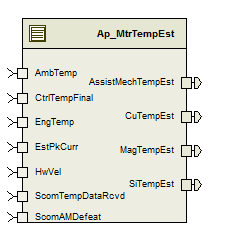

> **Source document:** `MtrTempEst/doc/Motor_Temperature_Estimation_MDD.docx`
>
> This page was converted automatically from the original document so it can be browsed online. Original format: Word document (`.docx`, 199 paragraphs, 16 tables, 1 embedded figures).

**Author:** kzshz2 **Last saved by:** Kema, Vishal **Revision:** 49

---

# Module – Motor Temperature Estimation

# High-Level Description

This module details out the estimation functions (first order lead lag filters) used to estimate the controller Silicon, motor magnet and the motor copper winding temperatures based on the measured substrate temperature and the variation in ambient temperature.  The variation in ambient temperature is added as a correction term to the outputs of the lead lag filters and is separate for Si, Magnet and Cu.  The correction term representing the variation of temperature above ambient is based off the measured motor current representing the Q-and D axes and uses a first order low pass filter structure.

# Figures

## Diagram – Function Data Sharing

This diagram shows all data that is shared between functions within the module.

### Diagram – None

This diagram describes the functional characteristics and data flow of a given function.

# Variable Data Dictionary

For details on module input / output variable, refer to the Data Dictionary for the application.  Input / output variable names are listed here for reference.

(Note: Full variable names required in table.)

(Note: All global variables including End Of Line data used should be shown here)

| Module Inputs (Global Variable Name) | Module Outputs (Global Variable Name) |
| --- | --- |
| CtrlTempFinal_DegC_f32 | CuTempEst_DegC_f32 |
| EstPkCurr_AmpSq_f32 | MagTempEst_DegC_f32 |
| EngTemp_DegC_f32 | SiTempEst_DegC_f32 |
| AmbTemp_DegC_f32 | AssistMechTempEst_DegC_f32 |
| HwVel_HwRadpS_f32 |  |
| ScomTempDataRcvd_Cnt_lgc |  |
| ScomAMDefeat_Cnt_lgc |  |

## Module Internal Variables

This section identifies the name, range and resolutions for module specific data created by this module.  If there are no range restrictions on the variable, the term “FULL” is placed into the table for legal range.

| Variable Name | Resolution | Legal Range (min) | Legal Range (max) | Software Segment |
| --- | --- | --- | --- | --- |
| MtrTempEst_CuCorr_DegC_D_f32 | Single Precision Floating Point | See data dictionary | See data dictionary | MTRTEMPEST_START_SEC_VAR_CLEARED_32 |
| MtrTempEst_CuLLFiltSV_DegC_M_f32 | Single Precision Floating Point | See data dictionary | See data dictionary | MTRTEMPEST_START_SEC_VAR_CLEARED_32 |
| MtrTempEst_CuAmbLPFiltSV_Watts_M_str | N/A | See data dictionary | See data dictionary | MTRTEMPEST_START_SEC_VAR_CLEARED_UNSPECIFIED |
| MtrTempEst_CuAmbLPFiltSV_Watts_M_str .K_Uls_f32 | Single Precision Floating Point | See data dictionary | See data dictionary |  |
| MtrTempEst_CuAmbLPFiltSV_Watts_M_str .SV_Uls_f32 | Single Precision Floating Point | See data dictionary | See data dictionary |  |
| MtrTempEst_MagCorr_DegC_D_f32 | Single Precision Floating Point | See data dictionary | See data dictionary | MTRTEMPEST_START_SEC_VAR_CLEARED_32 |
| MtrTempEst_MagLLFiltSV_DegC_M_f32 | Single Precision Floating Point | See data dictionary | See data dictionary | MTRTEMPEST_START_SEC_VAR_CLEARED_32 |
| MtrTempEst_MagAmbLPFiltSV_Watts_M_ str | N/A | See data dictionary | See data dictionary | MTRTEMPEST_START_SEC_VAR_CLEARED_UNSPECIFIED |
| MtrTempEst_MagAmbLPFiltSV_Watts_M_ str .K_Uls_f32 | Single Precision Floating Point | See data dictionary | See data dictionary |  |
| MtrTempEst_CuAmbLPFiltSV_Watts_M_str .SV_Uls_f32 | Single Precision Floating Point | See data dictionary | See data dictionary |  |
| MtrTempEst_SiCorr_DegC_D_f32 | Single Precision Floating Point | See data dictionary | See data dictionary | MTRTEMPEST_START_SEC_VAR_CLEARED_32 |
| MtrTempEst_SiLLFiltSV_DegC_M_f32 | Single Precision Floating Point | See data dictionary | See data dictionary | MTRTEMPEST_START_SEC_VAR_CLEARED_32 |
| MtrTempEst_SiAmbLPFiltSV_Watts_M_ str | N/A | See data dictionary | See data dictionary | MTRTEMPEST_START_SEC_VAR_CLEARED_UNSPECIFIED |
| MtrTempEst_SiAmbLPFiltSV_Watts_M_ str .K_Uls_f32 | Single Precision Floating Point | See data dictionary | See data dictionary |  |
| MtrTempEst_SiAmbLPFiltSV_Watts_M_ str .SV_Uls_f32 | Single Precision Floating Point | See data dictionary | See data dictionary |  |
| MtrTempEst_AsstMechLPFiltSV_Watts_M_str. | N/A | See data dictionary | See data dictionary | MTRTEMPEST_START_SEC_VAR_CLEARED_UNSPECIFIED |
| MtrTempEst_AsstMechLPFiltSV_Watts_M_str.K_Uls_f32 | Single Precision Floating Point | See data dictionary | See data dictionary |  |
| MtrTempEst_AsstMechLPFiltSV_Watts_M_str.SV_Uls_f32 | Single Precision Floating Point | See data dictionary | See data dictionary |  |
| MtrTempEst_AmCorr_DegC_D_f32 | Single Precision Floating Point | See data dictionary | See data dictionary | MTRTEMPEST_START_SEC_VAR_CLEARED_32 |
| MtrTempEst_AMTempEst_DegC_M_f32 | Single Precision Floating Point | See data dictionary | See data dictionary | MTRTEMPEST_START_SEC_VAR_CLEARED_32 |
| MtrTempEst_AssMechFiltSV_DegC_M_f32 | Single Precision Floating Point | See data dictionary | See data dictionary | MTRTEMPEST_START_SEC_VAR_CLEARED_32 |
| MtrTempEst_AmbPwr_Watts_D_f32 | Single Precision Floating Point | See data dictionary | See data dictionary | MTRTEMPEST_START_SEC_VAR_CLEARED_32 |
| MtrTempEst_ScaledAmbTemp_DegC_D_f32 | Single Precision Floating Point | See data dictionary | See data dictionary | MTRTEMPEST_START_SEC_VAR_CLEARED_32 |
| MtrTempEst_ScaledEngTemp_DegC_D_f32 | Single Precision Floating Point | See data dictionary | See data dictionary | MTRTEMPEST_START_SEC_VAR_CLEARED_32 |
| MtrTempEst_EstMech_Watts_D_f32 | Single Precision Floating Point | See data dictionary | See data dictionary | MTRTEMPEST_START_SEC_VAR_CLEARED_32 |
| MtrTempEst_AssMechInitComp_Cnt_M_lgc | 1 | See data dictionary | See data dictionary | MTRTEMPEST_START_SEC_VAR_CLEARED_BOOLEAN |
| MtrTempEst_PrevScomTempDataRcvd_Cnt_M_lgc | 1 | See data dictionary | See data dictionary | MTRTEMPEST_START_SEC_VAR_CLEARED_BOOLEAN |
| MtrTempEst_AssistMechSlew_DegC_M_f32 | Single Precision Floating Point | See data dictionary | See data dictionary | MTRTEMPEST_START_SEC_VAR_CLEARED_32 |
| MtrTempEst_AssistMechFilt_DegC_D_f32 | Single Precision Floating Point | See data dictionary | See data dictionary | MTRTEMPEST_START_SEC_VAR_CLEARED_32 |

### Unit testing considerations

Due to the lead/lag filter implementation in this module, absolute ranges are difficult to determine without pre-defined knowledge on the combination of coefficient values (A1, B0, B1).  Because of this the “Filter Design and Analysis 1GP1-B” worksheet (attached to this MDD) was used to calculate combinations of coefficient values to be used in unit test.  For unit test purposes, the four sets of lead/lag filter coefficient calibrations (k_MagLLFiltKxx_Uls_f32, k_SiLLFiltKxx_Uls_f32,  k_CuLLFiltKxx_Uls_f32, k_AMLLFiltCoefxx_Uls_f32) should be tested using the combinations of coefficient values in the table below, as well as the default values of the filter coefficient calibrations as given in the data dictionary.  The ranges given throughout this module were taken as the worst case results of all of the given filter coefficient sets.

| Fz | 0.0045 | 0.0045 | 0.00003 | 0.00003 |
| --- | --- | --- | --- | --- |
| Fp | 0.0045 | 0.00003 | 0.0045 | 0.00003 |
| B0 | 1 | 0.0066760330 | 149.78955 | 1 |
| B1 | -0.99717656 | -0.0066571836 | -149.78673 | -0.99998115 |
| A1 | 0.99717656 | 0.99998115 | 0.99717656 | 0.99998115 |

## User defined typedef definition/declaration

This section documents any user types uniquely used for the module.

| Typedef Name | Element Name | User Defined Type | Legal Range (min) | Legal Range (max) |
| --- | --- | --- | --- | --- |
| None |  |  |  |  |

# Constant Data Dictionary

## Calibration Constants

This section lists the calibrations used by the module.  For details on calibration constants, refer to the Data Dictionary for the application.

| Constant Name |
| --- |
| k_SiAmbLPFKn_Hz_f32 |
| k_SiAmbMult_DegCpWatt_f32 |
| k_SiLLFiltKB0_Uls_f32 |
| k_SiLLFiltKB1_Uls_f32 |
| k_SiLLFiltKA1_Uls_f32 |
| k_MagAmbLPFKn_Hz_f32 |
| k_MagAmbMult_DegCpWatt_f32 |
| k_MagLLFiltKB0_Uls_f32 |
| k_MagLLFiltKB1_Uls_f32 |
| k_MagLLFiltKA1_Uls_f32 |
| k_CuAmbLPFKn_Hz_f32 |
| k_CuLLFiltKB0_Uls_f32 |
| k_CuLLFiltKB1_Uls_f32 |
| k_CuLLFiltKA1_Uls_f32 |
| k_AmbPwrMult_WtspAmpSq_f32 |
| k_CuAmbMult_DegCpWatt_f32 |
| k_TrimTempSi_DegC_f32 |
| k_TrimTempCu_DegC_f32 |
| k_TrimTempMag_DegC_f32 |
| k_TrimTempAM_DegC_f32 |
| k_EngTempScl_Uls_f32 |
| k_AmbTempScl_Uls_f32 |
| k_AMLLFiltCoefB0_Uls_f32 |
| k_AMLLFiltCoefB1_Uls_f32 |
| k_AMLLFiltPoleA1_Uls_f32 |
| k_AMAmbLPFKn_Hz_f32 |
| k_AMAmbMult_DegCpWatt_f32 |
| k_AMDampScl_NmpRadpS_f32 |
| k_AMCorrLmt_DegC_f32 |
| k_AssistMechSlew_DegCpS_f32 |
| k_SiCorrLmt_DegC_f32 |
| k_MagCorrLmt_DegC_f32 |
| k_CuCorrLmt_DegC_f32 |
| k_AMDefaultTemp_DegC_f32 |
| k_WtAvgTempDFt_Cnt_lgc |

## Program(fixed) Constants

### Embedded Constants

All embedded constants whose values are provided in Eng units will be evaluated to the equivalent counts by using the FPM_InitFixedPoint_m() macro within the #define statement.

#### Local

| Constant Name | Resolution | Value |
| --- | --- | --- |
| D_MAGTEMPESTLOLMT_DEGC_F32 | Single Precision Floating Point | -50.0 |
| D_SITEMPESTLOLMT_DEGC_F32 | Single Precision Floating Point | -50.0 |
| D_MAGTEMPESTHILMT_DEGC_F32 | Single Precision Floating Point | 150.0 |
| D_SITEMPESTHILMT_DEGC_F32 | Single Precision Floating Point | 200.0 |
| D_CUTEMPESTLOLMT_DEGC_F32 | Single Precision Floating Point | -50.0 |
| D_CUTEMPESTHILMT_DEGC_F32 | Single Precision Floating Point | 300.0 |
| D_AMTEMPESTLOLMT_DEGC_F32 | Single Precision Floating Point | -50.0 |
| D_AMTEMPESTHILMT_DEGC_F32 | Single Precision Floating Point | 150.0 |
| D_LOOPSPERSEC_CNT_F32 | Single Precision Floating Point | 10.0 |

#### Global

This section lists the global constants used by the module.  For details on global constants, refer to the Data Dictionary for the application.

| Constant Name |
| --- |
| None |

### Module specific Lookup Tables Constants

(This is for lookup tables (arrays) with fixed values, same name as other tables)

| Constant Name | Resolution | Value | Software Segment |
| --- | --- | --- | --- |
| None |  |  |  |

# Functions/Macros used by the Sub-Modules

## Library Functions / Macros

The library functions / Macros that are called by the various sub modules are identified below,

LPF_KUpdate_f32_m ()

LPF_OpUpdate_f32_m ()

Limit_m()

## Data Hiding Functions

The data hiding functions / macros used in this module are identified below,

None

## Local Functions/Macros Used by this MDD only

(Note if they are defined in another source file, then reference the appropriate header file)

The local functions/macros in this module are identified below,

LeadLagFilt()

LeadLagFiltInit (CtrlTempFinal_DegC_T_f32, AmbTemp_DegC_T_f32, EngTemp_DegC_T_f32)

AssMechFiltInit(AmbTemp_DegC_T_f32, EngTemp_DegC_T_f32)

# Software Module Implementation

## Initialization Functions

### Init: MtrTempEst_Init1

#### Design Rationale

Initialization of Lead Lag Filter State Variables and Temperature Estimate outputs.

LPF_KUpdate_f32 is used to initialize the LPF filter instead of the full LPF_Init_f32 macro as an optimization since the required initial state of the filter is 0, which is the initialized value of the RAM, so there is no need to explicitly initialize the state variables in this init function.

#### Module Outputs

CtrlTempFinal_DegC_T_f32 = Rte_IRead_MtrTempEst_Init1_CtrlTempFinal_DegC_f32()

AmbTemp _DegC_T_f32 = Rte_IRead_MtrTempEst_Init1_ AmbTemp_DegC_f32()

EngTemp _DegC_T_f32 = Rte_IRead_MtrTempEst_Init1_ EngTemp_DegC_f32()

ScaledEngTemp_DegC_T_f32 = EngTemp_DegC_T_f32 * k_EngTempScl_Uls_f32

ScaledAmbTemp_DegC_T_f32 = AmbTemp_DegC_T_f32 * k_AmbTempScl_Uls_f32

AMTempEst_DegC_T_f32 = ScaledAmbTemp_DegC_T_f32 + ScaledEngTemp_DegC_T_f32

SiTempEst_DegC_T_f32 = Limit_m(CtrlTempFinal_DegC_T_f32, D_SITEMPESTLOLMT_DEGC_F32, D_SITEMPESTHILMT_DEGC_F32)

MagTempEst_DegC_T_f32 = Limit_m(CtrlTempFinal_DegC_T_f32, D_MAGTEMPESTLOLMT_DEGC_F32, D_MAGTEMPESTHILMT_DEGC_F32)

CuTempEst_DegC_T_f32 = Limit_m(CtrlTempFinal_DegC_T_f32, D_CUTEMPESTLOLMT_DEGC_F32, D_CUTEMPESTHILMT_DEGC_F32)

MtrTempEst_AMTempEst_DegC_M_f32 = Limit_m(AMTempEst_DegC_T_f32, D_AMTEMPESTLOLMT_DEGC_F32, D_AMTEMPESTHILMT_DEGC_F32)

Rte_IWrite_MtrTempEst_Init1_AssistMechTempEst_DegC_f32 (MtrTempEst_AMTempEst_DegC_M_f32)

Rte_Iwrite_MtrTempEst_Init1_SiTempEst_DegC_f32(SiTempEst_DegC_T_f32)

Rte_Iwrite_MtrTempEst_Init1_MagTempEst_DegC_f32(MagTempEst_DegC_T_f32)

Rte_Iwrite_MtrTempEst_Init1_CuTempEst_DegC_f32(CuTempEst_DegC_T_f32)

#### Rte_Iwrite_MtrTempEst_Init1_CuTempEst_DegC_f32(CuTempEst_DegC_T_f32);Module Internal

LeadLagFiltInit (CtrlTempFinal_DegC_T_f32, AmbTemp_DegC_T_f32, EngTemp_DegC_T_f32)

LPF_Kupdate_f32_m(k_SiAmbLPFKn_Hz_f32, D_100MS_SEC_F32, &MtrTempEst_SiAmbLPFiltSV_Watts_M_str);

LPF_Kupdate_f32_m(k_MagAmbLPFKn_Hz_f32, D_100MS_SEC_F32, & MtrTempEst_MagAmbLPFiltSV_Watts_M_str);

LPF_Kupdate_f32_m(k_CuAmbLPFKn_Hz_f32, D_100MS_SEC_F32, & MtrTempEst_CuAmbLPFiltSV_Watts_M_str);

LPF_Kupdate_f32_m(k_AMAmbLPFKn_Hz_f32, D_100MS_SEC_F32, & MtrTempEst_AsstMechLPFiltSV_Watts_M_str);

MtrTempEst_AssMechInitComp_Cnt_M_lgc = False

MtrTempEst_AssistMechSlew_DegC_M_f32 = (k_AssistMechSlew_DegCpS_f32 / D_LOOPSPERSEC_CNT_F32);

## Periodic Functions

### Per: MtrTempEst_Per1

#### Design Rationale

#### Program Flow Start

#### Rte_Call_MtrTempEst_Per1_CP0_CheckpointReached()Store Module Inputs to Local copies

CtrlTempFinal_DegC_T_f32 = Rte_Iread_MtrTempEst_Per1_CtrlTempFinal_DegC_f32()

EngTemp_DegC_T_f32 = Rte_Iread_MtrTempEst_Per1_EngTemp_DegC_f32()

AmbTemp_DegC_T_f32 = Rte_Iread_MtrTempEst_Per1_AmbTemp_DegC_f32()

HwVel_HwRadpS_T_f32 = Rte_Iread_MtrTempEst_Per1_HwVel_HwRadpS_f32()

ScomTempDataRcvd_Cnt_T_lgc  = Rte_Iread_MtrTempEst_Per1_ScomTempDataRcvd_Cnt_lgc ()

EstPkCurr_AmpSq_T_f32 = Rte_Iread_MtrTempEst_Per2_EstPkCurr_AmpSq_f32()

AMTempEstDisable_Cnt_T_lgc = Rte_Iread_MtrTempEst_Per1_ScomAMDefeat_Cnt_lgc()

#### Calculate Ambient Power in Watts

#### Silicon, Magnet, and Copper Ambient Low Pass Filter

#### Generate Ambient Correction Terms and Limit

#### Calculate Temperature Estimation

#### Reset Filter

#### Assist Mech Temperature Estimation

#### Store Local copy of outputs into Module Outputs

MtrTempEst_PrevScomTempDataRcvd_Cnt_M_lgc = ScomTempDataRcvd_Cnt_T_lgc

Rte_Iwrite_MtrTempEst_Per1_ AssistMechTempEst_DegC_f32 (MtrTempEst_AMTempEst_DegC_M_f32)

Rte_Iwrite_MtrTempEst_Per1_SiTempEst_DegC_f32(SiTempEst_DegC_T_f32)

Rte_Iwrite_MtrTempEst_Per1_MagTempEst_DegC_f32(MagTempEst_DegC_T_f32)

Rte_Iwrite_MtrTempEst_Per1_CuTempEst_DegC_f32(CuTempEst_DegC_T_f32)

#### Program Flow End

Rte_Call_MtrTempEst_Per1_CP1_CheckpointReached()

## Fault Recovery Functions

None

## Shutdown Functions

None

## Interrupt Functions

None

## Serial Communication Functions

None

## Local Function/Macro Definitions

If these are numerous and defined in a separate source file then reference the source file only.

### LeadLagFiltInit

| Function Name | LeadLagFiltInit | Type | Min | Max |
| --- | --- | --- | --- | --- |
| Arguments Passed | CtrlTempFinal_DegC_T_f32 | Single Precision Floating Point | -50 | 150 |
|  | AmbTemp_DegC_T_f32 | Single Precision Floating Point | -40 | 87.5 |
|  | EngTemp_DegC_T_f32 | Single Precision Floating Point | -40 | 215 |
| Return Value | None |  |  |  |

See unit testing notes in section 3.1.1 for range considerations of lead/lag filter.

#### Description

### AssMechFiltInit

| Function Name | AssMechFiltInit | Type | Min | Max |
| --- | --- | --- | --- | --- |
| Arguments Passed | AmbTemp_DegC_T_f32 | Single Precision Floating Point | -40 | 87.5 |
|  | EngTemp_DegC_T_f32 | Single Precision Floating Point | -40 | 215 |
| Return Value | None |  |  |  |

See unit testing notes in section 3.1.1 for range considerations of lead/lag filter.

#### Description

### Lead Lag Filter

| Function Name | LeadLagFilt | Type | Min | Max |
| --- | --- | --- | --- | --- |
| Arguments Passed | InputTemp_DegC_T_f32 | Single Precision Floating Point | -100.0 | 322.5 |
|  | FiltSVPtr_DegC_T_f32 | Single Precision Floating Point* | Address | Address |
|  | LLFiltKB0_Uls_T_f32 (see section 3.1.1) | Single Precision Floating Point | -150 | 150 |
|  | LLFiltKB1_Uls_T_f32 (see section 3.1.1) | Single Precision Floating Point | -150 | 150 |
|  | LLFiltKA1_Uls_T_f32 (see section 3.1.1) | Single Precision Floating Point | -150 | 150 |
| Return Value | FiltOutput_DegC_T_f32 | Single Precision Floating Point | -62983.530 | 63206.030 |

See unit testing notes in section 3.1.1 for range considerations of lead/lag filter.

#### Lead Lag Filter Structure 1GP1-B (For Reference Only)

#### Description

# Execution Requirements

## Execution Sequence of the Module

(Describe in words relevant details about the execution sequence of the different sub modules.)

## Execution Rates for sub-modules called by the Scheduler

This table serves as reference for the Scheduler design

| Function Name | Task List | Calling Frequency | System State(s) in which the function is called |
| --- | --- | --- | --- |
| MtrTempEst_Init1() |  | Once | START UP |
| MtrTempEst_Per1() |  | 100ms | WARM INIT, OPERATE, DISABLE |

## Execution Requirements for Serial Communication Functions

| Function Name | Sub-Module called by (Serial Comm Function Name) |
| --- | --- |
| N/A |  |

# Memory Map Definition Requirements

## Sub Modules (Functions)

This table identifies the software segments for functions identified in this module.

| Name of Sub Module | Software Segment |
| --- | --- |
| MtrTempEst_Init1 () |  |
| MtrTempEst_Per1() |  |

## Local Functions

This table identifies the software segments for local functions identified in this module.

| Name of Sub Module | Software Segment |
| --- | --- |
| LeadLagFilt() |  |
| LeadLagFiltInit() |  |
| AssMechFiltInit() |  |

# Known Issues / Limitations With Design

None

# Revision Control Log

| Item # | Rev # | Change Description | Date | Author Initials |
| --- | --- | --- | --- | --- |
| 1 | 1.0 | Initial AutoSAR version. | 17Feb11 | L.N. |
| 2 | 2.0 | Update to FDD #FS6 001 | 03Dec11 | M. Story |
| 3 | 3.0 | Corrected periodic timings and removed incorrect input | 03Jan12 | M. Story |
| 4 | 4.0 | Corrected issues found in UTP. | 04Jan12 | M. Story |
| 5 | 5.0 | Corrected the initialization of SumCurr_AmpSq_M_f32 | 11Jan12 | M. Story |
| 6 | 6.0 | Anomaly 4920 changed input to use EstPkCurr_AmpSq_f32 | 20Feb12 | M. Story |
| 7 | 7.0 | FDD changes to version 003 | 24Feb12 | M. Story |
| 8 | 8.0 | Added AssistMechFilt_DegC_D_f32 display variable | 09MAR12 | M. Story |
| 9 | 9.0 | Updated component to SF-6 Revision 4 | 16MAY12 | KJS |
| 10 | 10 | Corrected filter K init to specify 100ms execution rate Removed unused FPM Filter constants | 22MAY12 | JJW |
| 11 | 11 | Updated floating-point filter structures to include range and resolution | 12Jun12 | KJS |
| 12 | 12 | Check points flow updated | 23- Sep -12 | Selva |
| 13 | 13 | Updated to SF06 Ver 005 | 22-Oct-12 | NRAR |
| 14 | 14 | Updated to SF06 Ver 006 | 12-Apr-13 | Selva |
| 15 | 15 | Updated temperature estimate limits per FDD data dictionary change (CR9607) , updated module and display variable names per naming conventions, updated input and cal names per FDD. | 30-Aug-13 | KMC |
| 16 | 16 | Updated ranges of arguments and return value of LeadLagFilt function and added unit testing notes Section 3.1.1. | 30-Sep-13 | KMC |
| 17 | 17 | Added output limiting in initialization to fix anomaly 5761; corrected implementation of slew rate limit on AssistMechTempEst to fix anomaly 5569. | 13-Nov-13 | KMC |
