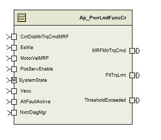

> **Source document:** `PwrLmtFuncCr/doc/Power_Limit_Function_CM_MDD.docx`
>
> This page was converted automatically from the original document so it can be browsed online. Original format: Word document (`.docx`, 167 paragraphs, 13 tables, 1 embedded figures).

**Author:** Owen Tosh (nzx5jd) **Last saved by:** Kaur, Lovepreet **Revision:** 62

---

# Module – Power Limit Function (Current Mode)

# High-Level Description

This module determines an appropriate limit for the system motor torque command based on reasonable output power and system temperature.  It also determines to what degree the system command is being limited.

# Figures

## Component Diagram

# Variable Data Dictionary

For details on module input / output variable, refer to the Data Dictionary for the application.  Input / output variable names are listed here for reference.

| Module Inputs | Module Outputs | Module Outputs |
| --- | --- | --- |
| EstKe_VpRadpS_f32 | EstKe_VpRadpS_f32 | MRFMtrTrqCmd_MtrNm_f32 |
| MotorVelMRF_MtrRadpS_f32 | MotorVelMRF_MtrRadpS_f32 | FltTrqLmt_Uls_f32 |
| PosServEnable_Cnt_lgc | PosServEnable_Cnt_lgc | ThresholdExceeded_Cnt_lgc |
| Vecu_Volt_f32 | Vecu_Volt_f32 |  |
| CntDisMtrTrqCmdMRF_MtrNm_f32 | CntDisMtrTrqCmdMRF_MtrNm_f32 |  |
| AltFaultActive_Cnt_lgc | AltFaultActive_Cnt_lgc |  |

NOTE that the PosServEnable_Cnt_lgc input is included because it is listed in the FDD as an input to the component.  However, per an FDD note, it is intended for use with functionality that is to be added in some later revision.  The input is currently not used.

## Module Internal Variables

This section identifies the name, range and resolutions for module specific data created by this module.  If there are no range restrictions on the variable, the term “FULL” is placed into the table for legal range.

| Variable Name | Resolution | Legal Range (min) | Legal Range (max) | Software Segment |
| --- | --- | --- | --- | --- |
| PwrLmtFuncCr_ SpdAdj_MtrRadpS_M_f32 | Single Precision Float | See Data Dictionary | See Data Dictionary | PWRLMTFUNCCR_START_SEC_VAR_CLEARED_32 |
| PwrLmtFuncCr_ VoltageRecoveryTimer_mS_M_u32 | 1 | See Data Dictionary | See Data Dictionary | PWRLMTFUNCCR_START_SEC_VAR_CLEARED_32 |
| PwrLmtFuncCr_ ThresholdExceeded_Cnt_M_lgc | N/A | See Data Dictionary | See Data Dictionary | PWRLMTFUNCCR_START_SEC_VAR_CLEARED_BOOLEAN |
| PwrLmtFuncCr_ TrqLmtKSV_M_str | LPF32KSV_Str | See Data Dictionary | See Data Dictionary | PWRLMTFUNCCR_START_SEC_VAR_CLEARED_UNSPECIFIED |
| PwrLmtFuncCr_ TrqLmtKSV_M_str.SV_Uls_f32 | Single Precision Float | See Data Dictionary | See Data Dictionary |  |
| PwrLmtFuncCr_ TrqLmtKSV_M_str.K_Uls_f32 | Single Precision Float | See Data Dictionary | See Data Dictionary |  |
| PwrLmtFuncCr_ MtrVelKSV_M_str | LPF32KSV_Str | See Data Dictionary | See Data Dictionary | PWRLMTFUNCCR_START_SEC_VAR_CLEARED_UNSPECIFIED |
| PwrLmtFuncCr_ MtrVelKSV_M_str.SV_Uls_f32 | Single Precision Float | See Data Dictionary | See Data Dictionary |  |
| PwrLmtFuncCr_ MtrVelKSV_M_str.K_Uls_f32 | Single Precision Float | See Data Dictionary | See Data Dictionary |  |
| PwrLmtFuncCr_ MtrEnvSpd_MtrRadpS_M_f32 | Single Precision Float | See Data Dictionary | See Data Dictionary | PWRLMTFUNCCR_START_SEC_VAR_CLEARED_32 |
| PwrLmtFuncCr_ MinStdOpLmt_MtrNm_M_f32 | Single Precision Float | See Data Dictionary | See Data Dictionary | PWRLMTFUNCCR_START_SEC_VAR_CLEARED_32 |
| PwrLmtFuncCr_ TrqEnvLmt1_MtrNm_M_f32 | Single Precision Float | See Data Dictionary | See Data Dictionary | PWRLMTFUNCCR_START_SEC_VAR_CLEARED_32 |
| PwrLmtFuncCr_ TrqEnvLmt4_MtrNm_D_f32 | Single Precision Float | See Data Dictionary | See Data Dictionary | PWRLMTFUNCCR_START_SEC_VAR_CLEARED_32 |
| PwrLmtFuncCr_ TrqLmt4_MtrNm_D_f32 | Single Precision Float | See Data Dictionary | See Data Dictionary | PWRLMTFUNCCR_START_SEC_VAR_CLEARED_32 |
| PwrLmtFuncCr_ OPVelOffset_MtrRadpS_D_f32 | Single Precision Float | See Data Dictionary | See Data Dictionary | PWRLMTFUNCCR_START_SEC_VAR_CLEARED_32 |
| PwrLmtFuncCr_ TrqLmt1_MtrNm_D_f32 | Single Precision Float | See Data Dictionary | See Data Dictionary | PWRLMTFUNCCR_START_SEC_VAR_CLEARED_32 |
| PwrLmtFuncCr_ TLimitMaxCurr_MtrNm_D_f32 | Single Precision Float | See Data Dictionary | See Data Dictionary | PWRLMTFUNCCR_START_SEC_VAR_CLEARED_32 |
| PwrLmtFuncCr_ MinStdOpLmt_MtrNm_D_f32 | Single Precision Float | See Data Dictionary | See Data Dictionary | PWRLMTFUNCCR_START_SEC_VAR_CLEARED_32 |
| PwrLmtFuncCr_ LimitDifference_MtrNm_D_f32 | Single Precision Float | See Data Dictionary | See Data Dictionary | PWRLMTFUNCCR_START_SEC_VAR_CLEARED_32 |
| PwrLmtFuncCr_TrqLmt_Uls_D_f32 | Single Precision Float | See Data Dictionary | See Data Dictionary | PWRLMTFUNCCR_START_SEC_VAR_CLEARED_32 |
| PwrLmtFuncCr_ MtrVelFilt_MtrRadpS_D_f32 | Single Precision Float | See Data Dictionary | See Data Dictionary | PWRLMTFUNCCR_START_SEC_VAR_CLEARED_32 |
| PwrLmtFuncCr_ VecuSlewAdj_Volt_M_f32 | Single Precision Float | See Data Dictionary | See Data Dictionary | PWRLMTFUNCCR_START_SEC_VAR_CLEARED_32 |

### User defined typedef definition/declaration

This section documents any user types uniquely used for the module.

| Typedef Name | Element Name | User Defined Type | Legal Range (min) | Legal Range (max) |
| --- | --- | --- | --- | --- |

# Constant Data Dictionary

## Calibration Constants

This section lists the calibrations used by the module.  For details on calibration constants, refer to the Data Dictionary for the application.

| Constant Name |
| --- |
| t_DLVTblX_Volt_u5p11[] |
| t_DLVTblY_MtrRadpS_u11p5[] |
| t_MtrEnvTblX_MtrRadpS_s11p4[] |
| t_MtrEnvTblY_MtrNm_u5p11 |
| k_KeStdTemp_VpRadpS_f32 |
| t_StdOpMtrEnvTblX_MtrRadpS_u11p5[] |
| t_StdOpMtrEnvTblY_MtrNm_u4p12[] |
| k_SpdAdjSlewInc_MtrRadpS_f32 |
| k_SpdAdjSlewDec_MtrRadpS_f32 |
| k_SpdAdjSlewEnable_Cnt_lgc |
| k_AsstReducLPFKn_Hz_f32 |
| k_PwrLmtMtrVelLPFKn_Hz_f32 |
| k_FiltAsstReducTh_Uls_f32 |
| k_LowVltAstRecTime_mS_u16 |
| k_LowVltAstRecTh_Volt_f32 |
| k_PwrLmtVecuAltFltAdj_Volt_f32 |
| k_PwrLmtVecuAdjSlew_VoltspL_f32 |

## Program(fixed) Constants

### Embedded Constants

All embedded constants whose values are provided in Eng units will be evaluated to the equivalent counts by using the FPM_InitFixedPoint_m() macro within the #define statement.

#### Local

| Constant Name | Resolution | Units | Value |
| --- | --- | --- | --- |
| D_10MS_SEC_F32 | Single Precision Floating Point | Sec | 0.010 |
| D_FLTTRQLMTLOLMT_F32 | Single Precision Floating Point | Unitless | 0.0 |
| D_FLTTRQLMTHILMT_F32 | Single Precision Floating Point | Unitless | 1.0 |

#### Global

This section lists the global constants used by the module.  For details on global constants, refer to the Data Dictionary for the application.

| Constant Name |
| --- |
| D_2MS_SEC_F32 |
| D_ZERO_ULS_F32 |
| FLT_EPSILON |
| D_TESTNOTCOMPLETETHISOPCYCLEBIT_CNT_B8 |
| D_MTRTRQCMDLOLMT_MTRNM_F32 |
| D_MTRTRQCMDHILMT_MTRNM_F32 |
| D_VECUMIN_VOLTS_F32 |
| D_FALSE_CNT_LGC |

### Module specific Lookup Tables Constants

| Constant Name | Resolution | Value | Software Segment |
| --- | --- | --- | --- |
| None |  |  |  |

# Functions/Macros used by the Sub-Modules

## Library Functions / Macros

The library and functions / Macros that are called by the various sub modules are identified below,

LPF_KUpdate_f32_m

LPF_OpUpdate_f32_m

Abs_f32_m

Abs_s16_m

FPM_FixedToFloat_m

FPM_FloatToFixed_m

IntplVarXY_u16_u16Xu16Y_Cnt

TableSize_m

Limit_m

Min_m

Max_m

IntplVarXY_u16_s16Xu16Y_Cnt

Sign_f32_m

## Data Hiding Functions

None

## Global Functions/Macros Defined by this Module

None

## Local Functions/Macros Used by this MDD only

None

# Software Module Implementation

## Runtime Environment (RTE) Initial Values

This section lists the initial values of data written by this module but controlled by the RTE. After RTE initialization, the data in this table will contain these values.

| Data | Value |
| --- | --- |
| Rte_InitValue _CntDisMtrTrqCmdMRF_MtrNm_f32 | 0 |
| Rte_InitValue_EstKe_VpRadpS_f32 | 0 |
| Rte_InitValue_MtrVel_MtrRadpS_f32 | 0 |
| Rte_InitValue_PosServEnable_Cnt_lgc | FALSE |
| Rte_InitValue_FltTrqLmt_Uls_f32 | 0 |
| Rte_InitValue_MRFMtrTrqCmd_MtrNm_f32 | 0 |
| Rte_InitValue_ThresholdExceeded_Cnt_lgc | FALSE |
| Rte_InitValue_Vecu_Volt_f32 | 5 |
| Rte_InitValue_AltFaultActive_Cnt_lgc | FALSE |

## Initialization Functions

### Init: PwrLmtFuncCr_Init1

#### Design Rationale

None

#### Module Outputs

None

#### Module Internal

## Periodic Functions

### Per: PwrLmtFuncCr_Per1

#### Design Rationale

#### Program Flow Start

Rte_Call_PwrLmtFuncCr_Per1_CP0_CheckpointReached

#### Store Module Inputs to Local copies

EstKe_VpRadpS_T_f32 = Rte_IRead_PwrLmtFuncCr_Per1_EstKe_VpRadpS_f32()

MotorVelMRF_MtrRadpS_T_f32 = Rte_IRead_PwrLmtFuncCr_Per1_MotorVelMRF_MtrRadpS_f32()Vecu_Volt_T_f32 = Rte_IRead_PwrLmtFuncCr_Per1_Vecu_Volt_f32()

CntDisMtrCmdMRF_MtrNm_T_f32 = Rte_IRead_PwrLmtFuncCr_Per1_CntDisMtrTrqCmdMRF_MtrNm_f32()

AltFaultActive_Cnt_T_lgc = Rte_IRead_PwrLmtFuncCr_Per1_AltFaultActive_Cnt_lgc()

#### Filter Motor Velocity

MtrVelFilt_MtrRadpS_T_f32 = LPF_OpUpdate_f32_m(MotorVelMRF_MtrRadpS_T_f32, & PwrLmtFuncCr_ MtrVelKSV_M_str)

#### Nexteer Power Limit

#### Output Velocity

#### Store Local copy of outputs into Module Outputs

PwrLmtFuncCr_OPVelOffset_MtrRadpS_D_f32 = OPVelOffset_MtrRadpS_T_f32

PwrLmtFuncCr_TrqEnvLmt_MtrRadpS_D_f32 = TrqEnvLmt_MtrRadpS_T_f32

PwrLmtFuncCr_TLimitMaxCurr_MtrNm_D_f32 = TLimitMaxCurr_MtrNm_T_f32

PwrLmtFuncCr_MinStdOpLmt_MtrNm_D_f32 = PwrLmtFuncCr_ MinStdOpLmt_MtrNm_M_f32

PwrLmtFuncCr_ SpdAdj_MtrRadpS_M_f32 = SpdAdj_MtrRadpS_T_f32

PwrLmtFuncCr_ TrqEnvLmt1_MtrNm_M_f32 =TrqEnvLmt1_MtrNm_T_f32;

PwrLmtFuncCr_TrqLmt1_MtrNm_D_f32 = TrqLmt1_MtrNm_T_f32;

PwrLmtFuncCr_TrqEnvLmt4_MtrNm_D_f32 = TrqEnvLmt4_MtrNm_T_f32;

PwrLmtFuncCr_TrqLmt4_MtrNm_D_f32 = TrqLmt4_MtrNm_T_f32;

PwrLmtFuncCr_MtrVelFilt_MtrRadpS_D_f32 = MtrVelFilt_MtrRadpS_T_f32;

PwrLmtFuncCr_ VecuSlewAdj_Volt_M_f32 = PwrLmtVecu1SlewAdj_Volt_T_f32

Rte_IWrite_PwrLmtFuncCr_Per1_MRFMtrTrqCmd_MtrNm_f32 (MRFMtrTrq_MtrNm_T_f32)

#### Program Flow End

Rte_Call_PwrLmtFuncCr_Per1_CP1_CheckpointReached

### Per: PwrLmtFuncCr_Per2

#### Design Rationale

None

#### Program Flow Start

Rte_Call_PwrLmtFuncCr_Per2_CP0_CheckpointReached

#### Store Module Inputs to Local copies

CntDisMtrCmdMRF_MtrNm_T_f32 = Rte_IRead_PwrLmtFuncCr_Per2_CntDisMtrTrqCmdMRF_MtrNm_f32();

Vecu_Volt_T_f32 = Rte_IRead_PwrLmtFuncCr_Per2_Vecu_Volt_f32();

MinStdOpLmt_MtrNm_T_f32 = PwrLmtFuncCr_ MinStdOpLmt_MtrNm_M_f32

TrqEnvLmt1_MtrNm_T_f32 = PwrLmtFuncCr_ TrqEnvLmt1_MtrNm_M_f32

MtrEnvSpd_MtrRadpS_T_f32 = PwrLmtFuncCr_ MtrEnvSpd_MtrRadpS_M_f32

#### Power Limit Status

#### Assist Limit Condition

#### Store Local copy of outputs into Module Outputs

PwrLmtFuncCr_LimitDifference_MtrNm_D_f32 = LimitDifference_MtrNm_T_f32

PwrLmtFuncCr_TrqLmt_Uls_D_f32 = TrqLmt_Uls_T_f32

Rte_IWrite_PwrLmtFuncCr_Per2_FltTrqLmt_Uls_f32(FltTrqLmt_Uls_T_f32)

Rte_IWrite_PwrLmtFuncCr_Per2_ThresholdExceeded_Cnt_lgc(PwrLmtFuncCr_ ThresholdExceeded_Cnt_M_lgc)

#### Program Flow End

Rte_Call_PwrLmtFuncCr_Per2_CP1_CheckpointReached

## Fault Recovery Functions

None

## Shutdown Functions

None

## Interrupt Functions

None

## Serial Communication Functions

None

# Execution Requirements

## Execution Rates for sub-modules called by the Scheduler

This table serves as reference for the Scheduler design

| Function Name | Calling Frequency | System State(s) in which the function is called |
| --- | --- | --- |
| PwrLmtFuncCr_Init1 | On Event | On Init |
| PwrLmtFuncCr_Per1 | 2 ms | OPERATE |
| PwrLmtFuncCr_Per2 | 2 ms | OPERATE |

## Execution Requirements for Serial Communication Functions

| Function Name | Sub-Module called by (Serial Comm Function Name) |
| --- | --- |
| None |  |

# Memory Map Definition Requirements

## Sub Modules (Functions)

This table identifies the software segments for functions identified in this module.

| Name of Sub Module | Software Segment |
| --- | --- |
| PwrLmtFuncCr_Init1 | RTE_START_SEC_AP_PWRLMTFUNCCR_APPL_CODE |
| PwrLmtFuncCr_Per1 | RTE_START_SEC_AP_PWRLMTFUNCCR_APPL_CODE |
| PwrLmtFuncCr_Per2 | RTE_START_SEC_AP_PWRLMTFUNCCR_APPL_CODE |

## Local Functions

This table identifies the software segments for local functions identified in this module.

| Name of Sub Module | Software Segment |
| --- | --- |
| None |  |

# Known Issues / Limitations With Design

INLINE functions defined in GlobalMacro.h are not unit tested.

# Revision Control Log

| Item # | Rev # | Change Description | Date | Author Initials |
| --- | --- | --- | --- | --- |
| 1 | 1.0 | Initial Version (SF-19B v000B) | 7-Aug-12 | OT |
| 2 | 2.0 | Added checkpoints and memmap software segment is updated for static variables | 23-Sep-12 | Selva |
| 3 | 3.0 | Updated to version 2 to FDD 19 B | 23-Jan-13 | Selva |
| 4 | 4.0 | Apply limit else in Power Limit function corrected | 28-Jan-13 | Selva |
| 5 | 5.0 | Created local copies to module level variables in per2 | 29-Jan-13 | Selva |
| 6 | 6 | Added Low Pass Filter to Motor Velocity | 04-Feb-13 | LN |
| 7 | 7.0 | Updated to FDD ver 004 (Fixes the anomaly 4686) | 13-Apr-13 | SP |
| 8 | 8.0 | Updated to FDD ver 006 | 21-May-13 | SP |
| 9 | 9.0 | Anomaly 5271 Fix, removed division from Power Limit function slew rate min/max values | 23-Jul-13 | VT |
| 10 | 10.0 | Update for FDD version 007 – Mapped Threshold_Exceeded signal to NTC 0x0B2 (Reduced Assist due to Low Voltage) and update to TrqEnvLmt1_MtrNm calculation. Added output limiting, divide by zero protection, and overflow protection.  Also updated input, output, and module and display variable names per FDD and naming conventions. | 27-Aug-13 | KMC |
| 11 | 11.0 | Removed unnecessary divide by zero protection (that was added in version 10).  Type casting update for QAC. | 11-Sep-13 | KMC |
| 12 | 12.0 | Corrected array index in flowchart in section 6.3.1.5.  Added note about unused input PosServEnable_Cnt_lgc per FDD ver 008. | 2-Oct-13 | KMC |
