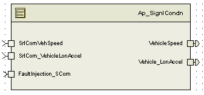

> **Source document:** `SgnlCond/doc/SignalConditioning_MDD.docx`
>
> This page was converted automatically from the original document so it can be browsed online. Original format: Word document (`.docx`, 80 paragraphs, 12 tables, 1 embedded figures).

**Author:** Steve Horwath **Last saved by:** Balani, Spandana **Revision:** 24

---

# Module – Signal Conditioning

# High-Level Description

This function conditions a signal received from SER prior to its distribution to other functions. Typical conditioning methods may include filters, slew rates, gain values or limits.

# Figures

## Diagram – Function Data Sharing

# Variable Data Dictionary

For details on module input / output variable, refer to the Data Dictionary for the application.  Input / output variable names are listed here for reference.

(Note: Full variable names required in table.)

(Note: All global variables including End Of Line data used should be shown here)

| Module Inputs (Global Variable Name) | Module Outputs (Global Variable Name) |
| --- | --- |
| SrlComVehSpd_Kph_f32 |  |
| SrlCom_VehicleLonAccel_KphpS_f32 | Vehicle_LonAccel_KphpS_f32 |

## Module Internal Variables

This section identifies the name, range and resolutions for module specific data created by this module.  If there are no range restrictions on the variable, the term “FULL” is placed into the table for legal range.

| Variable Name | Resolution | (min) | (max) | Software Segment |
| --- | --- | --- | --- | --- |
| SignlCondn_CurrSrlComVehSpd_Kph_M_f32 | Single precision floating point | See DataDictionary | See DataDictionary | SIGNLCONDN_START_SEC_VAR_NOINIT_32 |
| SignlCondn_CurrSrlComVehLonAccel_KphpS_M_f32 | Single precision floating point | See DataDictionary | See DataDictionary | SIGNLCONDN_START_SEC_VAR_NOINIT_32 |

### User defined typedef definition/declaration

This section documents any user types uniquely used for the module.

| Typedef Name | Element Name | User Defined Type | (min) | (max) |
| --- | --- | --- | --- | --- |

# Constant Data Dictionary

## Calibration Constants

This section lists the calibrations used by the module.  For details on calibration constants, refer to the Data Dictionary for the application.

| Constant Name |
| --- |
| k_VehSpdSlewRate_KphpSec_f32 |
| k_VehAccelSlewRate_KphpSecSq_f32 |

## Program(fixed) Constants

### Embedded Constants

All embedded constants whose values are provided in Eng units will be evaluated to the equivalent counts by using the FPM_InitFixedPoint_m() macro within the #define statement.

#### Local

| Constant Name | Resolution | Value |
| --- | --- | --- |
| D_VEHLONACCELGAIN_KPHPS_F32 | N/A | 3.6 |
| D_VEHSPDLOLMT_KPH_F32 | Single precision Float | 0.0 |
| D_VEHSPDHILMT_KPH_F32 | Single precision Float | 511.0 |
| D_VEHLONACCELLOLMT_KPHPS_F32 | Single precision Float | (-50.0) |
| D_VEHLONACCELHILMT_KPHPS_F32 | Single precision Float | 50.0 |

#### Global

This section lists the global constants used by the module.  For details on global constants, refer to the Data Dictionary for the application.

| Constant Name |
| --- |
| D_2MS_SEC_F32 |
| BC_SIGNLCONDN_FAULTINJECTIONPOINT |
| FLTINJ_SRLCOMVEHSPD_SGNLCOND |
| FLTINJ_SRLCOMVEHLONACCEL_SGNLCOND |

### Module specific Lookup Tables Constants

(This is for lookup tables (arrays) with fixed values, same name as other tables)

| Constant Name | Resolution | Value | Software Segment |
| --- | --- | --- | --- |
| None |  |  |  |

## Lookup Table Definitions

# Software Module Implementation

## Initialization Functions

None

## Periodic Functions

### Per: SignlCondn _Per1

#### Design Rationale

NOTE: For “starttime” calculations there is tendency for underflow and this is expected in s/w design. So for unittesting, VBA model should be implemented

such that it handles underflow and behaves like source code design.

#### Program Flow Start

#### Rte_Call_SignlCondn_Per1_CP0_CheckpointReached()Store Module Inputs to Local copies

SrlComVehSpd_Kph_T_f32 = Rte_IRead_SignlCondn_Per1_SrlComVehSpeed_Kph_f32

SrlComVehLonAccel_KphpS_T_f32 = Rte_IRead_SignlCondn_Per1_SrlCom_VehicleLonAccel_KphpS_f32()

#### Signal Conditioning

#### Store Local copy of outputs into Module Outputs

Rte_Iwrite_SignlCondn_Per1_VehicleSpeed_Kph_f32 (SignlCondn_CurrSrlComVehSpd_Kph_M_f32)

Rte_IWrite_SignlCondn_Per1_Vehicle_LonAccel_KphpS_f32(SignlCondn_CurrSrlComVehLonAccel_KphpS_M_f32)

#### Program Flow End

Rte_Call_SignlCondn_Per1_CP1_CheckpointReached()

## Fault Recovery Functions

None

## Shutdown Functions

None

## Interrupt Functions

None

## Serial Communication Functions

# Requirements

## Execution Sequence of the Module

## Execution Rates for sub-modules called by the Scheduler

This table serves as reference for the Scheduler design

| Function Name | Calling Frequency | in which the function is called |
| --- | --- | --- |
| SignlCondn_Per1 | 2 ms | ALL States |

## Execution Requirements for Serial Communication Functions

| Function Name | Sub-Module called by (Serial Comm Function Name) |
| --- | --- |
| None |  |

# Memory Map Definition Requirements

## Sub Modules (Functions)

This table identifies the software segments for functions identified in this module.

| Name of Sub Module | Software Segment |
| --- | --- |
| SignlCondn_Per1 |  |

## Local Functions

This table identifies the software segments for local functions identified in this module.

| Name of Sub Module | Software Segment |
| --- | --- |

# Known Issues / Limitations With Design

INLINE functions defined in globalmacro.h are not unit tested

# Revision Control Log

| Item # | Rev # | Change Description | Date | Author Initials |
| --- | --- | --- | --- | --- |
| 1 | 1.0 | Initial release | 14-May-12 | NRAR |
| 2 | 2.0 | Updated as per FDDVer002, FaultInjectionPoint added to SrlComVehSpeed signal | 20-Aug-12 | NRAR |
| 3 | 3.0 | Corrected Fault Injection function call | 05-Sep-12 | NRAR |
| 4 | 4.0 | Added checkpoints and memmap software segment is updated for static variables | 25-Sep-12 | Selva |
| 5 | 5.0 | Updated to SF-33 ver 003 | 23-May-13 | SP |
| 6 | 6.0 | Anomaly 6343 – Limit Outputs | 02-Apr-14 | SB |
| 7 | 7.0 | Changed naming for module internal variables | 09-May-14 | SB |
