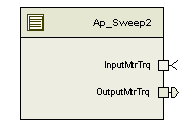

> **Source document:** `Sweep/doc/Sweep2_MDD.docx`
>
> This page was converted automatically from the original document so it can be browsed online. Original format: Word document (`.docx`, 80 paragraphs, 13 tables, 1 embedded figures).

**Author:** Vishal Kema **Last saved by:** Vishal Kema **Revision:** 48

---

# Module – Sweep2

# High-Level Description

# Figures

## Component Diagram

# Variable Data Dictionary

| Module Inputs | Module Outputs | Module Outputs |
| --- | --- | --- |
| InputMtrTrq_MtrNm_f32 | InputMtrTrq_MtrNm_f32 | OutputMtrTrq_MtrNm_f32 |

## Module Internal Variables

| Variable Name | Datatype | Resolution | Legal Range (min) | Legal Range (max) | Software Segment {Data Type} |
| --- | --- | --- | --- | --- | --- |
| SweepModeEn_Cnt_M_lgc | Boolean | N/A | FALSE | TRUE |  |
| SweepConfig_Cnt_M_u16 | Uint16 | 1 | 0 | FULL |  |

### User defined typedef definition/declaration

| Typedef Name | Element Name | User Defined Type | Legal Range (min) | Legal Range (max) |
| --- | --- | --- | --- | --- |

# Constant Data Dictionary

## Calibration Constants

| Constant Name |
| --- |

## Program(fixed) Constants

### Embedded Constants

#### Local

| Constant Name | Resolution | Units | Value |
| --- | --- | --- | --- |
| D_SWEEPMTRTRQ_CNT_U16 | 1 | Uint16 | 1 |

#### Global

| Constant Name |
| --- |
| D_FALSE_CNT_LGC |
| D_ZERO_ULS_F32 |

### Module specific Lookup Tables Constants

| Constant Name | Resolution | Value | Software Segment |
| --- | --- | --- | --- |

# Functions/Macros used by the Sub-Modules

## Library Functions / Macros

The library and functions / Macros that are called by the various sub modules are identified below,

## Data Hiding Functions

<None>

## Global Functions/Macros Defined by this Module

none

## Local Functions/Macros Used by this MDD only

none

# Software Module Implementation

## Runtime Environment (RTE) Initial Values

| Data | Value |
| --- | --- |
| InputMtrTrq_MtrNm_f32 | 0 |

## Initialization Functions

None

## Periodic Functions

#### Design Rationale

None

#### Store Module Inputs to Local copies Fault Recovery Functions

See below

#### Description

#### Store Local copy of outputs into Module Outputs

See above

## Shutdown Functions

None

## Interrupt Functions

None

## Fault Recovery Functions

None

## Shutdown Functions

None

## Interrupt Functions

None

## Serial Communication Functions

None

# Execution Requirements

## Execution Sequence of the Module

## Execution Rates for sub-modules called by the Scheduler

This table serves as reference for the Scheduler design

| Function Name | Calling Frequency | System State(s) in which the function is called |
| --- | --- | --- |
| Sweep2_Per1 | 2ms | RTE_AP_SWEEP2_APPL_CODE |

## Execution Requirements for Serial Communication Functions

| Function Name | Sub-Module called by (Serial Comm Function Name) |
| --- | --- |

# Memory Map Definition Requirements

## Sub Modules (Functions)

This table identifies the software segments for functions identified in this module.

| Name of Sub Module | Software Segment |
| --- | --- |

## Global and Local Functions

This table identifies the software segments for local functions identified in this module.

| Name of Sub Module | Software Segment |
| --- | --- |
| Sweep2_Per1 | RTE_AP_SWEEP2_APPL_CODE |

# Known Issues / Limitations With Design

(Item #1)

# Revision Control Log

| Rev # | Change Description | Date | Author Initials |
| --- | --- | --- | --- |
| 1 | Initial MDD version | 25-Mar-13 | VK |
