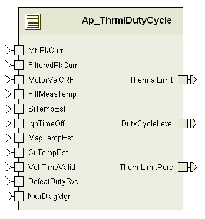

> **Source document:** `ThrmDutyCycle/doc/Thermal_Duty_Cycle_MDD.docx`
>
> This page was converted automatically from the original document so it can be browsed online. Original format: Word document (`.docx`, 177 paragraphs, 14 tables, 1 embedded figures).

**Author:** Owen Tosh (nzx5jd) **Last saved by:** Smith, Kevin **Revision:** 26

---

# Module – Thermal Duty Cycle

# High-Level Description

This module computes a duty cycle limit based on system temperatures.  It also outputs a unity scalar value to scale the assist command and a value representing the percentage of reduction.

# Figures

## Component Diagram

# Variable Data Dictionary

For details on module input / output variable, refer to the Data Dictionary for the application.  Input / output variable names are listed here for reference.

| Module Inputs | Module Outputs | Module Outputs |
| --- | --- | --- |
| MtrPkCurr_AmpSq_f32 | MtrPkCurr_AmpSq_f32 | ThermalLimit_MtrNm_f32 |
| FilteredPkCurr_AmpSq_f32 | FilteredPkCurr_AmpSq_f32 | DutyCycleLevel_Uls_f32 |
| MotorVelCRF_MtrRadpS_f32 | MotorVelCRF_MtrRadpS_f32 | ThermLimitPerc_Uls_f32 |
| FiltMeasTemp_DegC_f32 | FiltMeasTemp_DegC_f32 |  |
| SiTempEst_DegC_f32 | SiTempEst_DegC_f32 |  |
| MagTempEst_DegC_f32 | MagTempEst_DegC_f32 |  |
| CuTempEst_DegC_f32 | CuTempEst_DegC_f32 |  |
| DiagStsDefTemp _Cnt_lgc | DiagStsDefTemp _Cnt_lgc |  |
| DefeatDutySvc_Cnt_lgc | DefeatDutySvc_Cnt_lgc |  |
| IgnTimeOff_Cnt_u32 | IgnTimeOff_Cnt_u32 |  |
| VehTimeValid_Cnt_lgc | VehTimeValid_Cnt_lgc |  |

## Module Internal Variables

This section identifies the name, range and resolutions for module specific data created by this module.  If there are no range restrictions on the variable, the term “FULL” is placed into the table for legal range.

| Variable Name | Variable Name | Resolution | Legal Range (min) | Legal Range (max) | Software Segment |
| --- | --- | --- | --- | --- | --- |
| ThrmDutyCycle_TrqCmdTblYRam_MtrNm_M_u9p7[8] | ThrmDutyCycle_TrqCmdTblYRam_MtrNm_M_u9p7[8] | See Data Dictionary | See Data Dictionary | See Data Dictionary | THRMLDUTYCYCLE_START_SEC_VAR_CLEARED_16 |
| ThrmDutyCycle_AbsTempFltAcc_Cnt_M_u16 | ThrmDutyCycle_AbsTempFltAcc_Cnt_M_u16 | See Data Dictionary | See Data Dictionary | See Data Dictionary | THRMLDUTYCYCLE_START_SEC_VAR_CLEARED_16 |
| ThrmDutyCycle_Filter1KSV_M_str | ThrmDutyCycle_Filter1KSV_M_str | LPF32KSV_Str |  |  | THRMLDUTYCYCLE_START_SEC_VAR_CLEARED_UNSPECIFIED |
|  | SV_Uls_f32 | See Data Dictionary | See Data Dictionary | See Data Dictionary |  |
|  | K_Uls_f32 | See Data Dictionary | See Data Dictionary | See Data Dictionary |  |
| ThrmDutyCycle_Filter2KSV_M_str | ThrmDutyCycle_Filter2KSV_M_str | LPF32KSV_Str |  |  | THRMLDUTYCYCLE_START_SEC_VAR_CLEARED_UNSPECIFIED |
|  | SV_Uls_f32 | See Data Dictionary | See Data Dictionary | See Data Dictionary |  |
|  | K_Uls_f32 | See Data Dictionary | See Data Dictionary | See Data Dictionary |  |
| ThrmDutyCycle_Filter3KSV_M_str | ThrmDutyCycle_Filter3KSV_M_str | LPF32KSV_Str |  |  | THRMLDUTYCYCLE_START_SEC_VAR_CLEARED_UNSPECIFIED |
|  | SV_Uls_f32 | See Data Dictionary | See Data Dictionary | See Data Dictionary |  |
|  | K_Uls_f32 | See Data Dictionary | See Data Dictionary | See Data Dictionary |  |
| ThrmDutyCycle_Filter4KSV_M_str | ThrmDutyCycle_Filter4KSV_M_str | LPF32KSV_Str |  |  | THRMLDUTYCYCLE_START_SEC_VAR_CLEARED_UNSPECIFIED |
|  | SV_Uls_f32 | See Data Dictionary | See Data Dictionary | See Data Dictionary |  |
|  | K_Uls_f32 | See Data Dictionary | See Data Dictionary | See Data Dictionary |  |
| ThrmDutyCycle_Filter5KSV_M_str | ThrmDutyCycle_Filter5KSV_M_str | LPF32KSV_Str |  |  | THRMLDUTYCYCLE_START_SEC_VAR_CLEARED_UNSPECIFIED |
|  | SV_Uls_f32 | See Data Dictionary | See Data Dictionary | See Data Dictionary |  |
|  | K_Uls_f32 | See Data Dictionary | See Data Dictionary | See Data Dictionary |  |
| ThrmDutyCycle_Filter6KSV_M_str | ThrmDutyCycle_Filter6KSV_M_str | LPF32KSV_Str |  |  | THRMLDUTYCYCLE_START_SEC_VAR_CLEARED_UNSPECIFIED |
|  | SV_Uls_f32 | See Data Dictionary | See Data Dictionary | See Data Dictionary |  |
|  | K_Uls_f32 | See Data Dictionary | See Data Dictionary | See Data Dictionary |  |
| ThrmDutyCycle_AbsTempLimit_MtrNm_M_f32 | ThrmDutyCycle_AbsTempLimit_MtrNm_M_f32 | See Data Dictionary | See Data Dictionary | See Data Dictionary | THRMLDUTYCYCLE_START_SEC_VAR_CLEARED_32 |
| ThrmDutyCycle_Mult12Temp_DegC_D_f32 | ThrmDutyCycle_Mult12Temp_DegC_D_f32 | See Data Dictionary | See Data Dictionary | See Data Dictionary | THRMLDUTYCYCLE_START_SEC_VAR_CLEARED_32 |
| ThrmDutyCycle_Mult36Temp_DegC_D_f32 | ThrmDutyCycle_Mult36Temp_DegC_D_f32 | See Data Dictionary | See Data Dictionary | See Data Dictionary | THRMLDUTYCYCLE_START_SEC_VAR_CLEARED_32 |
| ThrmDutyCycle_MaxOut_AmpSq_D_u16p0 | ThrmDutyCycle_MaxOut_AmpSq_D_u16p0 | See Data Dictionary | See Data Dictionary | See Data Dictionary | THRMLDUTYCYCLE_START_SEC_VAR_CLEARED_16 |
| ThrmDutyCycle_ThermLim_MtrNm_D_f32 | ThrmDutyCycle_ThermLim_MtrNm_D_f32 | See Data Dictionary | See Data Dictionary | See Data Dictionary | THRMLDUTYCYCLE_START_SEC_VAR_CLEARED_32 |
| ThrmDutyCycle_Mult1_Uls_D_u3p13 | ThrmDutyCycle_Mult1_Uls_D_u3p13 | See Data Dictionary | See Data Dictionary | See Data Dictionary | THRMLDUTYCYCLE_START_SEC_VAR_CLEARED_16 |
| ThrmDutyCycle_Mult2_Uls_D_u3p13 | ThrmDutyCycle_Mult2_Uls_D_u3p13 | See Data Dictionary | See Data Dictionary | See Data Dictionary | THRMLDUTYCYCLE_START_SEC_VAR_CLEARED_16 |
| ThrmDutyCycle_Mult3_Uls_D_u3p13 | ThrmDutyCycle_Mult3_Uls_D_u3p13 | See Data Dictionary | See Data Dictionary | See Data Dictionary | THRMLDUTYCYCLE_START_SEC_VAR_CLEARED_16 |
| ThrmDutyCycle_Mult4_Uls_D_u3p13 | ThrmDutyCycle_Mult4_Uls_D_u3p13 | See Data Dictionary | See Data Dictionary | See Data Dictionary | THRMLDUTYCYCLE_START_SEC_VAR_CLEARED_16 |
| ThrmDutyCycle_Mult5_Uls_D_u3p13 | ThrmDutyCycle_Mult5_Uls_D_u3p13 | See Data Dictionary | See Data Dictionary | See Data Dictionary | THRMLDUTYCYCLE_START_SEC_VAR_CLEARED_16 |
| ThrmDutyCycle_Mult6_Uls_D_u3p13 | ThrmDutyCycle_Mult6_Uls_D_u3p13 | See Data Dictionary | See Data Dictionary | See Data Dictionary | THRMLDUTYCYCLE_START_SEC_VAR_CLEARED_16 |
| ThrmDutyCycle_LastTblVal_MtrNm_D_u9p7 | ThrmDutyCycle_LastTblVal_MtrNm_D_u9p7 | See Data Dictionary | See Data Dictionary | See Data Dictionary | THRMLDUTYCYCLE_START_SEC_VAR_CLEARED_16 |
| ThrmDutyCycle_LastTblValSlew_MtrNm_D_u9p7 | ThrmDutyCycle_LastTblValSlew_MtrNm_D_u9p7 | See Data Dictionary | See Data Dictionary | See Data Dictionary | THRMLDUTYCYCLE_START_SEC_VAR_CLEARED_16 |
| ThrmDutyCycle_AbsCtrlTempLimit_MtrNm_D_f32 | ThrmDutyCycle_AbsCtrlTempLimit_MtrNm_D_f32 | See Data Dictionary | See Data Dictionary | See Data Dictionary | THRMLDUTYCYCLE_START_SEC_VAR_CLEARED_32 |
| ThrmDutyCycle_AbsCuTempLimit_MtrNm_D_f32 | ThrmDutyCycle_AbsCuTempLimit_MtrNm_D_f32 | See Data Dictionary | See Data Dictionary | See Data Dictionary | THRMLDUTYCYCLE_START_SEC_VAR_CLEARED_32 |
| ThrmDutyCycle_AbsTempLimit_MtrNm_D_f32 | ThrmDutyCycle_AbsTempLimit_MtrNm_D_f32 | See Data Dictionary | See Data Dictionary | See Data Dictionary | THRMLDUTYCYCLE_START_SEC_VAR_CLEARED_32 |
| ThrmDutyCycle_ThrmLoadLmtTblYVal_MtrNm_D_f32 | ThrmDutyCycle_ThrmLoadLmtTblYVal_MtrNm_D_f32 | See Data Dictionary | See Data Dictionary | See Data Dictionary | THRMLDUTYCYCLE_START_SEC_VAR_CLEARED_32 |
| ThrmDutyCycle_CntrFlagInit_Cnt_M_lgc | ThrmDutyCycle_CntrFlagInit_Cnt_M_lgc | See Data Dictionary | See Data Dictionary | See Data Dictionary | THRMLDUTYCYCLE_START_SEC_VAR_CLEARED_BOOLEAN |
| ThrmDutyCycle_ReInitCntrFlag_Cnt_M_lgc | ThrmDutyCycle_ReInitCntrFlag_Cnt_M_lgc | See Data Dictionary | See Data Dictionary | See Data Dictionary | THRMLDUTYCYCLE_START_SEC_VAR_CLEARED_BOOLEAN |
| ThrmDutyCycle_ReInitCntrVal_Sec_M_f32 | ThrmDutyCycle_ReInitCntrVal_Sec_M_f32 | See Data Dictionary | See Data Dictionary | See Data Dictionary | THRMLDUTYCYCLE_START_SEC_VAR_CLEARED_32 |
| ThrmDutyCycle_eFilt3ValPowerup_Cnt_M_u8 | ThrmDutyCycle_eFilt3ValPowerup_Cnt_M_u8 | See Data Dictionary | See Data Dictionary | See Data Dictionary | THRMLDUTYCYCLE_START_SEC_VAR_CLEARED_8 |
| ThrmDutyCycle_eFilt4ValPowerup_Cnt_M_u8 | ThrmDutyCycle_eFilt4ValPowerup_Cnt_M_u8 | See Data Dictionary | See Data Dictionary | See Data Dictionary | THRMLDUTYCYCLE_START_SEC_VAR_CLEARED_8 |
| ThrmDutyCycle_eFilt5ValPowerup_Cnt_M_u8 | ThrmDutyCycle_eFilt5ValPowerup_Cnt_M_u8 | See Data Dictionary | See Data Dictionary | See Data Dictionary | THRMLDUTYCYCLE_START_SEC_VAR_CLEARED_8 |
| ThrmDutyCycle_eFilt6ValPowerup_Cnt_M_u8 | ThrmDutyCycle_eFilt6ValPowerup_Cnt_M_u8 | See Data Dictionary | See Data Dictionary | See Data Dictionary | THRMLDUTYCYCLE_START_SEC_VAR_CLEARED_8 |

### User defined typedef definition/declaration

This section documents any user types uniquely used for the module.

| Typedef Name | Element Name | User Defined Type | Legal Range (min) | Legal Range (max) |
| --- | --- | --- | --- | --- |
| None |  |  |  |  |

# Constant Data Dictionary

## Calibration Constants

This section lists the calibrations used by the module.  For details on calibration constants, refer to the Data Dictionary for the application.

| Constant Name |
| --- |
| k_EOCCtrlTemp_DegC_f32 |
| k_CtrlTempSlc_Cnt_lgc |
| k_MtrPrTempSlc_Cnt_lgc |
| k_AbsMtrVelBkt_MtrRadps_f32 |
| t_MultTblX_DegC_s15p0[5] |
| t_Mult1NSTblY_Uls_u3p13[5] |
| t_Mult2NSTblY_Uls_u3p13[5] |
| t_Mult3NSTblY_Uls_u3p13[5] |
| t_Mult4NSTblY_Uls_u3p13[5] |
| t_Mult5NSTblY_Uls_u3p13[5] |
| t_Mult6NSTblY_Uls_u3p13[5] |
| t_Mult1STblY_Uls_u3p13[5] |
| t_Mult2STblY_Uls_u3p13[5] |
| t_Mult3STblY_Uls_u3p13[5] |
| t_Mult4STblY_Uls_u3p13[5] |
| t_Mult5STblY_Uls_u3p13[5] |
| t_Mult6STblY_Uls_u3p13[5] |
| t_LastTblValNS_MtrNm_u9p7[5] |
| t_LastTblValS_MtrNm_u9p7[5] |
| k_TrqCmdSlewDown_MtrNm_u9p7 |
| k_TrqCmdSlewUp_MtrNm_u9p7 |
| k_SlowFltTempSlc_Cnt_lgc |
| t_AbsCtrlTmpTblX_DegC_s15p0[4] |
| t_AbsCtrlTmpTblY_MtrNm_u9p7[4] |
| t_AbsCuTmpTblX_DegC_s15p0[4] |
| t_AbsCuTmpTblY_MtrNm_u9p7[4] |
| k_AbsTmpTrqSlewLmt_MtrNm_f32 |
| k_MultTempSlc_Cnt_lgc |
| k_AbsTempDiag_Cnt_str |
| k_DutyCycFltTrshld_AmpSq_u16p0 |
| t_ThrmLoadLmtTblX_AmpSq_u16p0[8] |
| t_ThrmLoadLmtTblY_MtrNm_u9p7[8] |
| k_DefaultIgnOffTime_Sec_f32 |
| k_IgnOffCntrEnb_Cnt_lgc |
| k_IgnOffMsgWaitTime_Sec_f32 |

## Program (fixed) Constants

### Embedded Constants

All embedded constants whose values are provided in Eng units will be evaluated to the equivalent counts by using the FPM_InitFixedPoint_m() macro within the #define statement.

#### Local

| Constant Name | Resolution | Units | Value |
| --- | --- | --- | --- |
| D_FILT1LPFKN_HZ_F32 | Single Precision Float | Hz | 1/(2*pi*1.59) |
| D_FILT2LPFKN_HZ_F32 | Single Precision Float | Hz | 1/(2*pi*15.9) |
| D_FILT3LPFKN_HZ_F32 | Single Precision Float | Hz | 1/(2*pi*159) |
| D_FILT4LPFKN_HZ_F32 | Single Precision Float | Hz | 1/(2*pi*300) |
| D_FILT5LPFKN_HZ_F32 | Single Precision Float | Hz | 1/(2*pi*1590) |
| D_FILT6LPFKN_HZ_F32 | Single Precision Float | Hz | 1/(2*pi*4000) |
| D_1PERC_ULS_F32 | Single Precision Float | Unitless | 0.01 |
| D_FILTOUTLIM_ULS_F32 | Single Precision Float | Unitless | 200.0 |
| D_DEFEATDUTYCYCLELEVEL_ULS_F32 | Single Precision Float | Unitless | 0.0 |
| D_DEFEATTHERMLIMITPERC_ULS_F32 | Single Precision Float | Unitless | 0.0 |
| D_DEFEATTHERMLIMIT_MTRNM_F32 | Single Precision Float | MtrNm | 8.8 |
| D_TAU3_SEC_F32 | Single Precision Float | Sec | 159 |
| D_TAU4_SEC_F32 | Single Precision Float | Sec | 300 |
| D_TAU5_SEC_F32 | Single Precision Float | Sec | 1590 |
| D_TAU6_SEC_F32 | Single Precision Float | Sec | 4000 |
| D_PER1EXECRATE_SEC_F32 | Single Precision Float | Sec | 0.1 |
| D_EFILTVALMIN_ULS_F32 | Single Precision Float | Unitless | 0.0 |
| D_EFILTVALMAX_ULS_F32 | Single Precision Float | Unitless | 200.0 |

#### Global

This section lists the global constants used by the module.  For details on global constants, refer to the Data Dictionary for the application.

| Constant Name |
| --- |
| D_MTRTRQCMDHILMT_MTRNM_F32 |
| D_ZERO_ULS_F32 |
| D_ZERO_CNT_U32 |
| D_ONE_ULS_F32 |
| D_ONE_CNT_U16 |
| D_ONE_CNT_U32 |
| D_100MS_SEC_F32 |

### Module specific Lookup Tables Constants

| Constant Name | Resolution | Value | Software Segment |
| --- | --- | --- | --- |
| None |  |  |  |

# Functions/Macros used by the Sub-Modules

## Library Functions / Macros

The library and functions / Macros that are called by the various sub modules are identified below,

TableSize_m

FPM_FixedToFloat_m

FPM_FloatToFixed_m

LPF_KUpdate_f32_m

LPF_OpUpdate_f32_m

Abs_f32_m

IntplVarXY_u16_s16Xu16Y_Cnt

IntplVarXY_u16_u16Xu16Y_Cnt

Max_m

Min_m

Limit_m

DiagPStep_m

DiagNStep_m

DiagFailed_m

## Data Hiding Functions

None

## Global Functions/Macros Defined by this Module

None

## Local Functions/Macros Used by this MDD only

### Local Function #1

| Function Name | StepVarXY_u16_s16Xu16Y_Cnt | Type | Min | Max | UTP Tol. |
| --- | --- | --- | --- | --- | --- |
| Arguments Passed | TableX | sint16* | -32,768 | 32,767 | N/A |
|  | TableY | uint16* | 0 | 65535 | N/A |
|  | Size | uint16 | 1 | 65535 | N/A |
|  | input | sint16 | -32,768 | 32,767 | N/A |
| Return Value | See description | uint16 | 0 | 65535 | 0 |

NOTE – this function is able to be called with the range of argument values as shown; full range will not necessarily be reached in the actual calls to this function in this component.  UTP will test this function only to the limits of the actual parameters in the actual function calls.

#### Description

# Software Module Implementation

## Runtime Environment (RTE) Initial Values

This section lists the initial values of data written by this module but controlled by the RTE. After RTE initialization, the data in this table will contain these values.

| Data | Value |
| --- | --- |
| Rte_InitValue_CuTempEst_DegC_f32 | 0 |
| Rte_InitValue_DutyCycleLevel_Uls_f32 | 0 |
| Rte_InitValue_FiltMeasTemp_DegC_f32 | 0 |
| Rte_InitValue_FilteredPkCurr_AmpSq_f32 | 0 |
| Rte_InitValue_MagTempEst_DegC_f32 | 0 |
| Rte_InitValue_MotorVelCRF_MtrRadpS_f32 | 0 |
| Rte_InitValue_MtrPkCurr_AmpSq_f32 | 0 |
| Rte_InitValue_SiTempEst_DegC_f32 | 0 |
| Rte_InitValue_ DiagStsDefTemp _Cnt_lgc | FALSE |
| Rte_InitValue_ThermLimitPerc_Uls_f32 | 0 |
| Rte_InitValue_ThermalLimit_MtrNm_f32 | 8.8 |
| Rte_InitValue_DefeatDutySvc_Cnt_lgc | FALSE |
| Rte_InitValue_ IgnTimeOff_Cnt_u32 | 0 |
| Rte_InitValue_ VehTimeValid_Cnt_lgc | FALSE |

## Initialization Functions

### Init: ThrmlDutyCycle_Init1

#### Design Rationale

None

#### Module Outputs

None

#### Store Module Inputs to Local copies

IgnTimeOff_Sec_T_u32 = Rte_IRead_ThrmlDutyCycle_Init1_IgnTimeOff_Cnt_u32()

VehTimeValid_Cnt_T_lgc = Rte_IRead_ThrmlDutyCycle_Init1_VehTimeValid_Cnt_lgc()

DefeatDutySvc_Cnt_T_lgc = Rte_IRead_ThrmlDutyCycle_Init1_DefeatDutySvc_Cnt_lgc()

#### Module Internal

## Periodic Functions

### Per: ThrmlDutyCycle_Per1

#### Design Rationale

Function NxtrDiagMgr_GetNTCFailed with argument NTC_Num_Thermistor is used to get the input called Diag_Status in the FDD.  This function returns TRUE if the specified NTC is currently in a FAILED state.  The FDD owner has confirmed that this is what is meant in the FDD by the use of the Diag_Status input described as “Thermistor fault flag” and also called “Temp_Sens_DTC_Active”.

#### Program Flow Start

Rte_Call_ThrmlDutyCycle_Per1_CP0_CheckpointReached()

#### Store Module Inputs to Local copies

CuTempEst_DegC_T_f32 = Rte_IRead_ThrmlDutyCycle_Per1_CuTempEst_DegC_f32()

FiltMeasTemp_DegC_T_f32 = Rte_IRead_ThrmlDutyCycle_Per1_FiltMeasTemp_DegC_f32()

FiltPkCurr_AmpSq_T_f32 = Rte_IRead_ThrmlDutyCycle_Per1_FilteredPkCurr_AmpSq_f32()

MagTempEst_DegC_T_f32 = Rte_IRead_ThrmlDutyCycle_Per1_MagTempEst_DegC_f32()

MotorVelCRF_MtrRadpS_T_f32 = Rte_IRead_ThrmlDutyCycle_Per1_MotorVelCRF_MtrRadpS_f32()

MtrPkCurr_AmpSq_T_f32 = Rte_IRead_ThrmlDutyCycle_Per1_MtrPkCurr_AmpSq_f32()

SiTempEst_DegC_T_f32 = Rte_IRead_ThrmlDutyCycle_Per1_SiTempEst_DegC_f32()

DefeatDutySvc_Cnt_T_lgc = Rte_IRead_ThrmlDutyCycle_Per1_DefeatDutySvc_Cnt_lgc_Cnt_lgc();

PrevAbsTempLimit_MtrNm_T_f32 = AbsTempLimit_MtrNm_M_f32

AbsMotorVelCRF_MtrRadpS_T_f32 = Abs_f32_m(MotorVelCRF_MtrRadpS_T_f32)

Rte_Call_NxtrDiagMgr_GetNTCFailed(NTC_Num_Thermistor, &DiagStsDefTemp_Cnt_T_lgc)

VehTimeValid_Cnt_T_lgc = Rte_IRead_ThrmlDutyCycle_Per1_VehTimeValid_Cnt_lgc();

IgnTimeOff_Cnt_T_u32 = Rte_IRead_ThrmlDutyCycle_Per1_IgnTimeOff_Cnt_u32();

#### Filter Re-Init

#### Temperature Selection

#### Load Limiting – Multiplier

#### Load Limiting – Max Filter Percentage

#### Load Limiting – Thermal Load Limit

#### Temperature Limiting

#### Temperature Limiting Status

#### Store Local copy of outputs into Module Outputs

ThrmDutyCycle_AbsTempLimit_MtrNm_M_f32 = AbsTempLimitSlew_MtrNm_T_f32

ThrmDutyCycle_Mult12Temp_DegC_D_f32 = Mult12Temp_DegC_T_f32

ThrmDutyCycle_Mult36Temp_DegC_D_f32 = Mult36Temp_DegC_T_f32

ThrmDutyCycle_MaxOut_AmpSq_D_u16p0 = MaxOut_Uls_T_u16p0

ThrmDutyCycle_ThermLim_MtrNm_D_f32 = ThermalLoadLmt_MtrNm_T_f32

ThrmDutyCycle_Mult1_Uls_D_u3p13 = Mult1_Uls_T_u3p13

ThrmDutyCycle_Mult2_Uls_D_u3p13 = Mult2_Uls_T_u3p13

ThrmDutyCycle_Mult3_Uls_D_u3p13 = Mult3_Uls_T_u3p13

ThrmDutyCycle_Mult4_Uls_D_u3p13 = Mult4_Uls_T_u3p13

ThrmDutyCycle_Mult5_Uls_D_u3p13 = Mult5_Uls_T_u3p13

ThrmDutyCycle_Mult6_Uls_D_u3p13 = Mult6_Uls_T_u3p13

ThrmDutyCycle_LastTblVal_MtrNm_D_u9p7 = LastTblValRaw_MtrNm_T_u9p7

ThrmDutyCycle_LastTblValSlew_MtrNm_D_u9p7 = LastTblVal_MtrNm_T_u9p7

ThrmDutyCycle_AbsCtrlTempLimit_MtrNm_D_f32 = AbsCtrlTempLimit_MtrNm_T_f32

ThrmDutyCycle_AbsCuTempLimit_MtrNm_D_f32 = AbsCuTempLimit_MtrNm_T_f32

ThrmDutyCycle_AbsTempLimit_MtrNm_D_f32 = AbsTempLimit_MtrNm_T_f32

ThrmDutyCycle_ThrmLoadLmtTblYVal_MtrNm_D_f32 = DivFactor_MtrNm_T_f32

Rte_IWrite_ThrmlDutyCycle_Per1_DutyCycleLevel_Uls_f32(MaxSlowFilt_Uls_T_f32)

Rte_IWrite_ThrmlDutyCycle_Per1_ThermLimitPerc_Uls_f32(ThermLimitPerc_Uls_T_f32)

Rte_IWrite_ThrmlDutyCycle_Per1_ThermalLimit_MtrNm_f32(ThermalLimit_MtrNm_T_f32)

#### Program Flow End

Rte_Call_ThrmlDutyCycle_Per1_CP1_CheckpointReached()

## Fault Recovery Functions

None

## Shutdown Functions

None

## Interrupt Functions

None

## Serial Communication Functions

None

# Execution Requirements

## Execution Rates for sub-modules called by the Scheduler

This table serves as reference for the Scheduler design

| Function Name | Calling Frequency | System State(s) in which the function is called |
| --- | --- | --- |
| ThrmlDutyCycle_Init1 | On Event | On Init |
| ThrmlDutyCycle_Per1 | 100 ms | ALL |

## Execution Requirements for Serial Communication Functions

| Function Name | Sub-Module called by (Serial Comm Function Name) |
| --- | --- |
| None |  |

# Memory Map Definition Requirements

## Sub Modules (Functions)

This table identifies the software segments for functions identified in this module.

| Name of Sub Module | Software Segment |
| --- | --- |
| ThrmlDutyCycle_Init1 | RTE_START_SEC_AP_THRMLDUTYCYCLE_APPL_CODE |
| ThrmlDutyCycle_Per1 | RTE_START_SEC_AP_THRMLDUTYCYCLE_APPL_CODE |

## Local Functions

This table identifies the software segments for local functions identified in this module.

| Name of Sub Module | Software Segment |
| --- | --- |
| None |  |

# Known Issues / Limitations With Design

INLINE functions defined in GlobalMacro.h are not unit tested.

- Unit test of StepVarXY_u16_s16Xu16Y_Cnt() function will test argument range only to the limits of the actual parameters in the actual function calls in the module.

# Revision Control Log

| Rev # | Change Description | Date | Author Initials |
| --- | --- | --- | --- |
| 1.0 | Initial Version (implements SF-09 v001) | 21-May-12 | OT |
| 2.0 | Updated initial value of AssistThermScalar output, added limit on maxout terms to prevent overflow per new FDD design | 30-May-12 | LWW |
| 3.0 | Updated values of 6 filter embedded data constants- Anom 3445 | 16-June-12 | NRAR |
| 4.0 | Updated to SF-09 v003 | 09-Jul-12 | OT |
| 5.0 | Updated to SF-09 v004 | 09-Aug-12 | BWL |
| 6.0 | MDD fixes per unit test review. | 10-Aug-12 | BWL |
| 7.0 | Added checkpoints and memmap software segment is updated for static variables | 24-Sep-12 | Selva |
| 8.0 | Replaced multiplier interpolation with step function. | 16-Oct-12 | BWL |
| 9.0 | Updated to SF-09 v006 | 29-Jan-13 | Selva |
| 10 | Corrected Diag_Status reading function | 31-Jan-13 | Selva |
| 11 | Updated to SF-09 v007 | 20-Feb-13 | SP |
| 12 | Fix Anomoly 4517 | 28-Feb-13 | Selva |
| 13,14 | Updated to SF-09 v008` Tessy Unit test  fixes | 09-Apr-13 | Selva |
| 15 | Updated to SF-09 v010 – new logic for calculating AbsTempLimit; also updated module and display variable names per naming conventions. | 05-Sep-13 | KMC |
| 16 | Updated to SF-09 v11 -- new logic for reinit of the filter state variables based on ignition off time. | 17-Sep-13 | KJS |
| 17 | Updated to SF-09 v012 – updated filter init and reinit  to use the default ignition off time when DefeatDutySvc is TRUE | 25-Sep-13 | KMC |
| 18 | Updated some incorrect module level variable names; added notes regarding unit test of function StepVarXY_u16_s16Xu16Y_Cnt() | 27-Sep-13 | KMC |
| 19 | Updated flowcharts for naming conventions, SetNTCStatus parameter byte 0x00 when PASSED, and limiting on ThermLimitPerc output. Added note about NTCFailed. All for CR10070. | 1-Oct-13 | KMC |
| 20 | Added 4 new module internal variables and modified flowcharts for fix of anomaly 5736; added two new constants and modified flowcharts for fix of anomaly 5739. | 14-Nov-13 | KMC |
