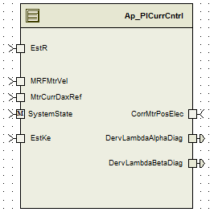

> **Source document:** `TqRsDg/doc/TorqueReasonableDiagnostics.docx`
>
> This page was converted automatically from the original document so it can be browsed online. Original format: Word document (`.docx`, 144 paragraphs, 14 tables, 1 embedded figures).

**Author:** Selva nzt9hv **Last saved by:** Thomas, Vince **Revision:** 6

---

# Module – Torque Reasonable Diagnostics

# High-Level Description

The Torque Reasonableness Diagnostic compares the commanded electromagnetic motor torque (calculated from the commanded Iq and Id currents) to the measured electromagnetic torque (calculated from the measured Iq and Id currents) and sets a diagnostic flag when the error is outside of calibration boundaries for calibration time periods. This diagnostic is intended to trip due to a variety of possible errors within the closed loop control of the motor control, including but not exclusive to certain current measurement errors and output drive errors.

# Figures

## Component Diagram

# Variable Data Dictionary

For details on module input / output variable, refer to the Data Dictionary for the application.  Input / output variable names are listed here for reference.

| Module Inputs | Module Outputs |
| --- | --- |
| DervLambdaAlphaDiag_Volt_f32 |  |
| DervLambdaBetaDiag_Volt_f32 |  |
| OutputRampMult_Uls_f32 |  |
| TrqLimitMin_MtrNm_f32 |  |

## Module Internal Variables

This section identifies the name, range and resolutions for module specific data created by this module.  If there are no range restrictions on the variable, the term “FULL” is placed into the table for legal range.

| Variable Name | Resolution | Legal Range (min) | Legal Range (max) | Software Segment |
| --- | --- | --- | --- | --- |
| TqRsDg_AlpaCurrDiagPrimLPF_M_Str | LPF32KSV_Str | See data dictionary | See data dictionary | TQRSDG_START_SEC_VAR_NOINIT_UNSPECIFIED |
| TqRsDg_BetaCurrDiagPrimLPF_M_Str | LPF32KSV_Str | See data dictionary | See data dictionary | TQRSDG_START_SEC_VAR_NOINIT_UNSPECIFIED |
| TqRsDg_AlpaCurrDiagSecLPF_M_Str | LPF32KSV_Str | See data dictionary | See data dictionary | TQRSDG_START_SEC_VAR_NOINIT_UNSPECIFIED |
| TqRsDg_BetaCurrDiagSecLPF_M_Str | LPF32KSV_Str | See data dictionary | See data dictionary | TQRSDG_START_SEC_VAR_NOINIT_UNSPECIFIED |
| TqRsDg_CurrDiagPrimPNAccum_Cnt_M_u16 | 1 | See data dictionary | See data dictionary | TQRSDG_START_SEC_VAR_CLEARED_16 |
| TqRsDg_CurrDiagSecPNAccum_Cnt_M_u16 | 1 | See data dictionary | See data dictionary | TQRSDG_START_SEC_VAR_CLEARED_16 |
| TqRsDg_DervLambdaAlphaDiagPrimFilt_Volt_D_f32 | Single precision float | See data dictionary | See data dictionary | TQRSDG_START_SEC_VAR_CLEARED_32 |
| TqRsDg_DervLambdaBetaDiagPrimFilt_Volt_D_f32 | Single precision float | See data dictionary | See data dictionary | TQRSDG_START_SEC_VAR_CLEARED_32 |
| TqRsDg_DervLambdaAlphaDiagSecFilt_Volt_D_f32 | Single precision float | See data dictionary | See data dictionary | TQRSDG_START_SEC_VAR_CLEARED_32 |
| TqRsDg_DervLambdaBetaDiagSecFilt_Volt_D_f32 | Single precision float | See data dictionary | See data dictionary | TQRSDG_START_SEC_VAR_CLEARED_32 |

### User defined typedef definition/declaration

This section documents any user types uniquely used for the module.

| Typedef Name | Element Name | User Defined Type | Legal Range (min) | Legal Range (max) |
| --- | --- | --- | --- | --- |

# Constant Data Dictionary

## Calibration Constants

This section lists the calibrations used by the module.  For details on calibration constants, refer to the Data Dictionary for the application.

| Constant Name |
| --- |
| k_CurrDiagPrimLPFKn_Hz_f32 |
| k_CurrDiagSecLPFKn_Hz_f32 |
| k_CurrDiagMtrEnvTblMax_MtrNm_f32 |
| k_CurrDiagSecTrqLmtThresh_Uls_f32 |
| k_CurrDiagPrimErrorThresh_Volt_f32 |
| k_CurrDiagPrim_Cnt_Str |
| k_CurrDiagSec_Cnt_Str |
| k_CurrDiagSecErrorThresh_Volt_f32 |

## Program(fixed) Constants

### Embedded Constants

All embedded constants whose values are provided in Eng units will be evaluated to the equivalent counts by using the FPM_InitFixedPoint_m() macro within the #define statement.

#### Local

| Constant Name | Resolution | Units | Value |
| --- | --- | --- | --- |
| D_BIT0_ULS_U8 | Uint8 | Cnt | 1 |
| D_BIT1_ULS_U8 | Uint8 | Cnt | 2 |

#### Global

This section lists the global constants used by the module.  For details on global constants, refer to the Data Dictionary for the application.

| Constant Name |
| --- |
| D_ZERO_CNT_U8 |
| D_2MS_SEC_F32 |
| D_ONE_ULS_F32 |
| D_ZERO_CNT_U16 |
| D_ZERO_ULS_F32 |

### Module specific Lookup Tables Constants

| Constant Name | Resolution | Value | Software Segment |
| --- | --- | --- | --- |

# Functions/Macros used by the Sub-Modules

## Library Functions / Macros

The library and functions / Macros that are called by the various sub modules are identified below,

Min_m

Abs_f32_m

Limit_m

- LPF32KSV_Str

- DiagSettings_Str

LPF_OpUpdate_f32_m

LPF_Init_f32_m

DiagNStep_m

DiagPStep_m

DiagFailed_m

## Data Hiding Functions

Rte_Call_NxtrDiagMgr_SetNTCStatus

## Global Functions/Macros Defined by this Module

### Global Function #1

None

## Local Functions/Macros Used by this MDD only

### Local Function #1

| Function Name | (Exact name used) | Type | Min | Max | UTP Tol. |
| --- | --- | --- | --- | --- | --- |
| Arguments Passed | (if none, write None) |  |  |  |  |
|  | (Insert more rows for additional passed arguments) |  |  |  |  |
| Return Value | (if no value returned, write N/A) |  |  |  |  |

#### Description

# Software Module Implementation

## Runtime Environment (RTE) Initial Values

This section lists the initial values of data written by this module but controlled by the RTE. After RTE initialization, the data in this table will contain these values.

| Data | Value |
| --- | --- |
| Rte_Init_TqRsDg_Per1_DervLambdaAlphaDiag_Volt_f32 | 0.0f |
| Rte_Init_TqRsDg_Per1_DervLambdaBetaDiag_Volt_f32 | 0.0f |
| Rte_Init_TqRsDg_Per1_OutputRampMult_Uls_f32 | 0.0f |
| Rte_Init_TqRsDg_Per1_TrqLimitMin_MtrNm_f32 | 0.0f |

## Initialization Functions

### Init: TqRsDg_Init1 _Init

#### Design Rationale

None

#### Module Outputs

#### Module Internal

None

#### Processing of function

## Periodic Functions

### Per: TrRsDg_Per1

#### Design Rationale

None

#### Program Flow Start

Rte_Call_TqRsDg_Per1_CP0_CheckpointReached();

#### Store Module Inputs to Local copies

DervLambdaAlphaDiag_Volt_T_f32 = Rte_IRead_TqRsDg_Per1_DervLambdaAlphaDiag_Volt_f32();

DervLambdaBetaDiag_Volt_T_f32  = Rte_IRead_TqRsDg_Per1_DervLambdaBetaDiag_Volt_f32();

OutputRampMult_Uls_T_f32 = Rte_IRead_TqRsDg_Per1_OutputRampMult_Uls_f32();

TrqLimitMin_MtrNm_T_f32 = Rte_IRead_TqRsDg_Per1_TrqLimitMin_MtrNm_f32();

#### Processing of function

#### Store Local copy of outputs into Module Outputs

ModulationIndex_Uls_M_f32 = ModulationIndex_Uls_T_f32

#### Program Flow End

Rte_Call_TqRsDg_Per1_CP1_CheckpointReached()

## Fault Recovery Functions

None

## Shutdown Functions

None

## Interrupt Functions

None

## Serial Communication Functions

### SCom: ModuleName_SCom

#### Design Rationale

None

#### Program Flow Start

N/A

#### Store Module Inputs to Local copies

None

#### Processing of function

#### Store Local copy of outputs into Module Outputs

None

#### Program Flow End

N/A

# Execution Requirements

## Execution Sequence of the Module

## Execution Rates for sub-modules called by the Scheduler

This table serves as reference for the Scheduler design

| Function Name | Calling Frequency | System State(s) in which the function is called |
| --- | --- | --- |
| TqRsDg_Init1 | On init | None |
| TqRsDg_Per1 | 2ms | OPERATE |

## Execution Requirements for Serial Communication Functions

| Function Name | Sub-Module called by (Serial Comm Function Name) |
| --- | --- |

# Memory Map Definition Requirements

## Sub Modules (Functions)

This table identifies the software segments for functions identified in this module.

| Name of Sub Module | Software Segment |
| --- | --- |
| TqRsDg_Init1 | RTE_START_SEC_AP_TQRSDG_APPL_CODE |
| TqRsDg_Per1 | RTE_START_SEC_AP_TQRSDG_APPL_CODE |

## Local Functions

This table identifies the software segments for local functions identified in this module.

| Name of Sub Module | Software Segment |
| --- | --- |
| None |  |

# Known Issues / Limitations With Design

INLINE functions defined in GlobalMacro.h are not unit tested.

# Revision Control Log

| Rev # | Change Description | Date | Author Initials |
| --- | --- | --- | --- |
| 1.0 | Initial Version | 6-Nov-12 | Selva |
| 2.0 | Updated to version to SF-31 version 2 | 23-Feb-13 | Selva |
| 3.0 | Anomaly fix for A_4644 | 25-Mar-13 | Srikanth |
| 4.0 | Fixes for Unit test findings | 15-Apr-13 | Srikanth |
| 5.0 | Anomaly fix for 4931 | 30-Apr-13 | OT |
| 6 | Updated for V3 SF31   (completely new) | 27-Nov-13 | Selva |
