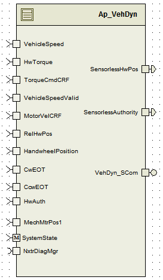

> **Source document:** `VehDyn/doc/VehDyn_MDD.docx`
>
> This page was converted automatically from the original document so it can be browsed online. Original format: Word document (`.docx`, 154 paragraphs, 14 tables, 1 embedded figures).

**Author:** Creager;Kathleen **Last saved by:** Balani, Spandana **Revision:** 4

---

# Module –VehDyn

# High-Level Description

This module calculates HandWheel AutoCentering and determines the Vehicle Dynamics HandWheel Position and Vehicle Dynamics Authority.

# Figures

## Component Diagram

# Variable Data Dictionary

For details on module input / output variable, refer to the Data Dictionary for the application.  Input / output variable names are listed here for reference.

| Module Inputs | Module Outputs | Module Outputs |
| --- | --- | --- |
| TorqueCmdCRF_MtrNm_f32 | TorqueCmdCRF_MtrNm_f32 | SensorlessHwAuth_Uls_f32 |
| VehicleSpeed_Kph_f32 | VehicleSpeed_Kph_f32 | SensorlessHwPos_HwDeg_f32 |
| HwTorque_HwNm_f32 | HwTorque_HwNm_f32 |  |
| VehicleSpeedValid_Cnt_lgc | VehicleSpeedValid_Cnt_lgc |  |
| MotorVelCRF_MtrRadpS_f32 | MotorVelCRF_MtrRadpS_f32 |  |
| RelHwPos_HwDeg_f32 | RelHwPos_HwDeg_f32 |  |
| CcwEOT_HwDeg_f32 | CcwEOT_HwDeg_f32 |  |
| CwEOT_HwDeg_f32 | CwEOT_HwDeg_f32 |  |
| HwAuth_Uls_f32 | HwAuth_Uls_f32 |  |
| HandwheelPosition_HwDeg_f32 | HandwheelPosition_HwDeg_f32 |  |
| MechMtrPos1_Rev_f32 | MechMtrPos1_Rev_f32 |  |

## Module Internal Variables

This section identifies the name, range and resolutions for module specific data created by this module.  If there are no range restrictions on the variable, the term “FULL” is placed into the table for legal range.

| Variable Name | Resolution | Legal Range (min) | Legal Range (max) | Software Segment |
| --- | --- | --- | --- | --- |
| VehDyn_PinTrqSV_M_Str. SV_Uls_f32 | Single Precision Float | See Data Dictionary | See Data Dictionary | VEHDYN_START_VAR_CLEARED_UNSPECIFIED |
| VehDyn_PinTrqSV_M_Str. K_Uls_f32 | Single Precision Float | See Data Dictionary | See Data Dictionary | VEHDYN_START_VAR_CLEARED_UNSPECIFIED |
| VehDyn_AutoCntrLoSpd_M_str. MtrVel_MtrRadpS_f32 | Single Precision Float | See Data Dictionary | See Data Dictionary | VEHDYN_START_VAR_CLEARED_UNSPECIFIED |
| VehDyn_AutoCntrLoSpd_M_str. VehSpd_kph_f32 | Single Precision Float | See Data Dictionary | See Data Dictionary | VEHDYN_START_VAR_CLEARED_UNSPECIFIED |
| VehDyn_AutoCntrLoSpd_M_str. FiltPinTrq_HwNm_f32 | Single Precision Float | See Data Dictionary | See Data Dictionary | VEHDYN_START_VAR_CLEARED_UNSPECIFIED |
| VehDyn_AutoCntrLoSpd_M_str. CntrWindow_HwDeg_f32 | Single Precision Float | See Data Dictionary | See Data Dictionary | VEHDYN_START_VAR_CLEARED_UNSPECIFIED |
| VehDyn_AutoCntrLoSpd_M_str. Timer1Thresh_mS_u16 | 1 | See Data Dictionary | See Data Dictionary | VEHDYN_START_VAR_CLEARED_UNSPECIFIED |
| VehDyn_AutoCntrLoSpd_M_str. Timer2Thresh_mS_u16 | 1 | See Data Dictionary | See Data Dictionary | VEHDYN_START_VAR_CLEARED_UNSPECIFIED |
| VehDyn_AutoCntrLoSpd_M_str. Timer1_mS_u32 | 1 | See Data Dictionary | See Data Dictionary | VEHDYN_START_VAR_CLEARED_UNSPECIFIED |
| VehDyn_AutoCntrLoSpd_M_str. Timer2_mS_u32 | 1 | See Data Dictionary | See Data Dictionary | VEHDYN_START_VAR_CLEARED_UNSPECIFIED |
| VehDyn_AutoCntrLoSpd_M_str. RelHwPosFilt1SV_HwDeg_str. SV_Uls_f32 | Single Precision Float | See Data Dictionary | See Data Dictionary | VEHDYN_START_VAR_CLEARED_UNSPECIFIED |
| VehDyn_AutoCntrLoSpd_M_str. RelHwPosFilt1SV_HwDeg_str. K_Uls_f32 | Single Precision Float | See Data Dictionary | See Data Dictionary | VEHDYN_START_VAR_CLEARED_UNSPECIFIED |
| VehDyn_AutoCntrLoSpd_M_str. RelHwPosFilt2SV_HwDeg_str. SV_Uls_f32 | Single Precision Float | See Data Dictionary | See Data Dictionary | VEHDYN_START_VAR_CLEARED_UNSPECIFIED |
| VehDyn_AutoCntrLoSpd_M_str. RelHwPosFilt2SV_HwDeg_str. K_Uls_f32 | Single Precision Float | See Data Dictionary | See Data Dictionary | VEHDYN_START_VAR_CLEARED_UNSPECIFIED |
| VehDyn_AutoCntrLoSpd_M_str. Filter1Enable_Cnt_lgc | 1 | See Data Dictionary | See Data Dictionary | VEHDYN_START_VAR_CLEARED_UNSPECIFIED |
| VehDyn_AutoCntrLoSpd_M_str. Filter2Enable_Cnt_lgc | 1 | See Data Dictionary | See Data Dictionary | VEHDYN_START_VAR_CLEARED_UNSPECIFIED |
| VehDyn_AutoCntrLoSpd_M_str. Filter1Initialized_Cnt_lgc | 1 | See Data Dictionary | See Data Dictionary | VEHDYN_START_VAR_CLEARED_UNSPECIFIED |
| VehDyn_AutoCntrLoSpd_M_str. Filter2Initialized_Cnt_lgc | 1 | See Data Dictionary | See Data Dictionary | VEHDYN_START_VAR_CLEARED_UNSPECIFIED |
| VehDyn_AutoCntrDetSpd_M_str. MtrVel_MtrRadpS_f32 | Single Precision Float | See Data Dictionary | See Data Dictionary | VEHDYN_START_VAR_CLEARED_UNSPECIFIED |
| VehDyn_AutoCntrDetSpd_M_str. VehSpd_kph_f32 | Single Precision Float | See Data Dictionary | See Data Dictionary | VEHDYN_START_VAR_CLEARED_UNSPECIFIED |
| VehDyn_AutoCntrDetSpd_M_str. FiltPinTrq_HwNm_f32 | Single Precision Float | See Data Dictionary | See Data Dictionary | VEHDYN_START_VAR_CLEARED_UNSPECIFIED |
| VehDyn_AutoCntrDetSpd_M_str. CntrWindow_HwDeg_f32 | Single Precision Float | See Data Dictionary | See Data Dictionary | VEHDYN_START_VAR_CLEARED_UNSPECIFIED |
| VehDyn_AutoCntrDetSpd_M_str. Timer1Thresh_mS_u16 | 1 | See Data Dictionary | See Data Dictionary | VEHDYN_START_VAR_CLEARED_UNSPECIFIED |
| VehDyn_AutoCntrDetSpd_M_str. Timer2Thresh_mS_u16 | 1 | See Data Dictionary | See Data Dictionary | VEHDYN_START_VAR_CLEARED_UNSPECIFIED |
| VehDyn_AutoCntrDetSpd_M_str. Timer1_mS_u32 | 1 | See Data Dictionary | See Data Dictionary | VEHDYN_START_VAR_CLEARED_UNSPECIFIED |
| VehDyn_AutoCntrDetSpd_M_str. Timer2_mS_u32 | 1 | See Data Dictionary | See Data Dictionary | VEHDYN_START_VAR_CLEARED_UNSPECIFIED |
| VehDyn_AutoCntrDetSpd_M_str. RelHwPosFilt1SV_HwDeg_str. SV_Uls_f32 | Single Precision Float | See Data Dictionary | See Data Dictionary | VEHDYN_START_VAR_CLEARED_UNSPECIFIED |
| VehDyn_AutoCntrDetSpd_M_str. RelHwPosFilt1SV_HwDeg_str. K_Uls_f32 | Single Precision Float | See Data Dictionary | See Data Dictionary | VEHDYN_START_VAR_CLEARED_UNSPECIFIED |
| VehDyn_AutoCntrDetSpd_M_str. RelHwPosFilt2SV_HwDeg_str. SV_Uls_f32 | Single Precision Float | See Data Dictionary | See Data Dictionary | VEHDYN_START_VAR_CLEARED_UNSPECIFIED |
| VehDyn_AutoCntrDetSpd_M_str. RelHwPosFilt2SV_HwDeg_str. K_Uls_f32 | Single Precision Float | See Data Dictionary | See Data Dictionary | VEHDYN_START_VAR_CLEARED_UNSPECIFIED |
| VehDyn_AutoCntrDetSpd_M_str. Filter1Enable_Cnt_lgc | 1 | See Data Dictionary | See Data Dictionary | VEHDYN_START_VAR_CLEARED_UNSPECIFIED |
| VehDyn_AutoCntrDetSpd_M_str. Filter2Enable_Cnt_lgc | 1 | See Data Dictionary | See Data Dictionary | VEHDYN_START_VAR_CLEARED_UNSPECIFIED |
| VehDyn_AutoCntrDetSpd _M_str. Filter1Initialized_Cnt_lgc | 1 | See Data Dictionary | See Data Dictionary | VEHDYN_START_VAR_CLEARED_UNSPECIFIED |
| VehDyn_AutoCntrDetSpd _M_str. Filter2Initialized_Cnt_lgc | 1 | See Data Dictionary | See Data Dictionary | VEHDYN_START_VAR_CLEARED_UNSPECIFIED |
| VehDyn_AutoCntrHiSpd_M_str. MtrVel_MtrRadpS_f32 | Single Precision Float | See Data Dictionary | See Data Dictionary | VEHDYN_START_VAR_CLEARED_UNSPECIFIED |
| VehDyn_AutoCntrHiSpd_M_str. VehSpd_kph_f32 | Single Precision Float | See Data Dictionary | See Data Dictionary | VEHDYN_START_VAR_CLEARED_UNSPECIFIED |
| VehDyn_AutoCntrHiSpd_M_str. FiltPinTrq_HwNm_f32 | Single Precision Float | See Data Dictionary | See Data Dictionary | VEHDYN_START_VAR_CLEARED_UNSPECIFIED |
| VehDyn_AutoCntrHiSpd_M_str. CntrWindow_HwDeg_f32 | Single Precision Float | See Data Dictionary | See Data Dictionary | VEHDYN_START_VAR_CLEARED_UNSPECIFIED |
| VehDyn_AutoCntrHiSpd_M_str. Timer1Thresh_mS_u16 | 1 | See Data Dictionary | See Data Dictionary | VEHDYN_START_VAR_CLEARED_UNSPECIFIED |
| VehDyn_AutoCntrHiSpd_M_str. Timer2Thresh_mS_u16 | 1 | See Data Dictionary | See Data Dictionary | VEHDYN_START_VAR_CLEARED_UNSPECIFIED |
| VehDyn_AutoCntrHiSpd_M_str. Timer1_mS_u32 | 1 | See Data Dictionary | See Data Dictionary | VEHDYN_START_VAR_CLEARED_UNSPECIFIED |
| VehDyn_AutoCntrHiSpd_M_str. Timer2_mS_u32 | 1 | See Data Dictionary | See Data Dictionary | VEHDYN_START_VAR_CLEARED_UNSPECIFIED |
| VehDyn_AutoCntrHiSpd_M_str. RelHwPosFilt1SV_HwDeg_str. SV_Uls_f32 | Single Precision Float | See Data Dictionary | See Data Dictionary | VEHDYN_START_VAR_CLEARED_UNSPECIFIED |
| VehDyn_AutoCntrHiSpd_M_str. RelHwPosFilt1SV_HwDeg_str. K_Uls_f32 | Single Precision Float | See Data Dictionary | See Data Dictionary | VEHDYN_START_VAR_CLEARED_UNSPECIFIED |
| VehDyn_AutoCntrHiSpd_M_str.. RelHwPosFilt2SV_HwDeg_str. SV_Uls_f32 | Single Precision Float | See Data Dictionary | See Data Dictionary | VEHDYN_START_VAR_CLEARED_UNSPECIFIED |
| VehDyn_AutoCntrHiSpd_M_str.. RelHwPosFilt2SV_HwDeg_str. K_Uls_f32 | Single Precision Float | See Data Dictionary | See Data Dictionary | VEHDYN_START_VAR_CLEARED_UNSPECIFIED |
| VehDyn_AutoCntrHiSpd_M_str. Filter1Enable_Cnt_lgc | 1 | See Data Dictionary | See Data Dictionary | VEHDYN_START_VAR_CLEARED_UNSPECIFIED |
| VehDyn_AutoCntrHiSpd_M_str. Filter2Enable_Cnt_lgc | 1 | See Data Dictionary | See Data Dictionary | VEHDYN_START_VAR_CLEARED_UNSPECIFIED |
| VehDyn_AutoCntrHiSpd_M_str. Filter1Initialized_Cnt_lgc | 1 | See Data Dictionary | See Data Dictionary | VEHDYN_START_VAR_CLEARED_UNSPECIFIED |
| VehDyn_AutoCntrHiSpd_M_str. Filter2Initialized_Cnt_lgc | 1 | See Data Dictionary | See Data Dictionary | VEHDYN_START_VAR_CLEARED_UNSPECIFIED |
| VehDyn_AllowHiSpdAutoCntr_Cnt_M_lgc | Boolean | See Data Dictionary | See Data Dictionary | VEHDYN_START_SEC_VAR_CLEARED_BOOLEAN |
| VehDyn_LoSpdLearnt_Cnt_M_lgc | Boolean | See Data Dictionary | See Data Dictionary | VEHDYN_START_SEC_VAR_CLEARED_BOOLEAN |
| VehDyn_HiSpdLearnt_Cnt_M_lgc | Boolean | See Data Dictionary | See Data Dictionary | VEHDYN_START_SEC_VAR_CLEARED_BOOLEAN |
| VehDyn_SLPHwPos_HwDeg_M_f32 | Single Precision Float | See Data Dictionary | See Data Dictionary | VEHDYN_START_SEC_VAR_CLEARED_32 |
| VehDyn_SLPHwAuth_Uls_M_f32 | Single Precision Float | See Data Dictionary | See Data Dictionary | VEHDYN_START_SEC_VAR_CLEARED_32 |
| VehDyn_MinOffset_HwDeg_M_f32 | Single Precision Float | See Data Dictionary | See Data Dictionary | VEHDYN_START_SEC_VAR_CLEARED_32 |
| VehDyn_MinAbsHwPos_HwDeg_D_f32 | Single Precision Float | See Data Dictionary | See Data Dictionary | VEHDYN_START_SEC_VAR_CLEARED_32 |
| VehDyn_MaxOffset_HwDeg_M_f32 | Single Precision Float | See Data Dictionary | See Data Dictionary | VEHDYN_START_SEC_VAR_CLEARED_32 |
| VehDyn_MaxAbsHwPos_HwDeg_D_f32 | Single Precision Float | See Data Dictionary | See Data Dictionary | VEHDYN_START_SEC_VAR_CLEARED_32 |
| VehDyn_Initialize_Cnt_M_lgc | Boolean | See Data Dictionary | See Data Dictionary | VEHDYN_START_SEC_VAR_CLEARED_BOOLEAN |
| VehDyn_RelHwPos_HwDeg_M_f32 | Single Precision Float | See Data Dictionary | See Data Dictionary | VEHDYN_START_SEC_VAR_CLEARED_32 |
| VehDyn_RelSLPHwPos_HwDeg_D_f32 | Single Precision Float | See Data Dictionary | See Data Dictionary | VEHDYN_START_SEC_VAR_CLEARED_32 |

### User defined typedef definition/declaration

This section documents any user types uniquely used for the module.

| Typedef Name | Element Name | User Defined Type | Legal Range (min) | Legal Range (max) |
| --- | --- | --- | --- | --- |
| AUTOCNTRTYPE_Str | MtrVel_MtrRadpS_f32 | float32 | 0 | 700 |
| AUTOCNTRTYPE_Str | VehSpd_kph_f32 | float32 | 0 | 255 |
| AUTOCNTRTYPE_Str | FiltPinTrq_HwNm_f32 | float32 | 0 | 20 |
| AUTOCNTRTYPE_Str | CntrWindow_HwDeg_f32 | float32 | 0 | 100 |
| AUTOCNTRTYPE_Str | Timer1Thresh_mS_u16 | uint16 | 0 | 60000 |
| AUTOCNTRTYPE_Str | Timer2Thresh_mS_u16 | uint16 | 0 | 60000 |
| AUTOCNTRTYPE_Str | Timer1_mS_u32 | uint32 | FULL | FULL |
| AUTOCNTRTYPE_Str | Timer2_mS_u32 | uint32 | FULL | FULL |
| AUTOCNTRTYPE_Str | RelHwPosFilt1SV_HwDeg_str | LPF32KSV_Str | N/A | N/A |
| AUTOCNTRTYPE_Str | RelHwPosFilt1SV_HwDeg_str.SV_Uls_f32 | float32 | -3200 | 3200 |
| AUTOCNTRTYPE_Str | RelHwPosFilt1SV_HwDeg_str.K_Uls_f32 | float32 | 2.51327E-06 | 0.001255848 |
| AUTOCNTRTYPE_Str | RelHwPosFilt2SV_HwDeg_str | LPF32KSV_Str | N/A | N/A |
| AUTOCNTRTYPE_Str | RelHwPosFilt2SV_HwDeg_str.SV_Uls_f32 | float32 | -3200 | 3200 |
| AUTOCNTRTYPE_Str | RelHwPosFilt2SV_HwDeg_str.K_Uls_f32 | float32 | 2.51327E-06 | 0.001255848 |
| AUTOCNTRTYPE_Str | Filter1Enable_Cnt_lgc | boolean | FALSE | TRUE |
| AUTOCNTRTYPE_Str | Filter2Enable_Cnt_lgc | boolean | FALSE | TRUE |
| AUTOCNTRTYPE_Str | Filter1Initialized_Cnt_lgc | boolean | FALSE | TRUE |
| AUTOCNTRTYPE_Str | Filter2Initialized_Cnt_lgc | boolean | FALSE | TRUE |

# Constant Data Dictionary

## Calibration Constants

This section lists the calibrations used by the module.  For details on calibration constants, refer to the Data Dictionary for the application.

| Constant Name |
| --- |
| k_AutoCntrPinTrqLPFCoeffKn_Hz_f32 |
| k_AutoCntrLoSpdTimer1MtrVel_MtrRadpS_f32 |
| k_AutoCntrLoSpdTimer1VehSpd_kph_f32 |
| k_AutoCntrLoSpdTimer1PinTrq_HwNm_f32 |
| k_AutoCntrLoSpdTimer1_mS_u16 |
| k_AutoCntrLoSpdFilt1Kn_Hz_f32 |
| k_AutoCntrLoSpdCntrWindow_HwDeg_f32 |
| k_AutoCntrLoSpdFilt2Kn_Hz_f32 |
| k_AutoCntrLoSpdTimer2_mS_u16 |
| k_AutoCntrHiSpdTimer1_MtrVel_MtrRadpS_f32 |
| k_AutoCntrHiSpdTimer1_VehSpd_kph_f32 |
| k_AutoCntrHiSpdTimer1PinTrq_HwNm_f32 |
| k_AutoCntrHiSpdTimer1_mS_u16 |
| k_AutoCntrHiSpdFilt1Kn_Hz_f32 |
| k_AutoCntrHiSpdCntrWindow_HwDeg_f32 |
| k_AutoCntrHiSpdFilt2Kn_Hz_f32 |
| k_AutoCntrHiSpdTimer2_ms_u16 |
| k_SysKinRatio_MtrDegpHwDeg_f32 |
| k_AutoCntrHiSpdTimer4MtrVel_MtrRadpS_f32 |
| k_AutoCntrHiSpdTimer4VehSpd_kph_f32 |
| k_AutoCntrHiSpdTimer4PinTrq_HwNm_f32 |
| k_AutoCntrHiSpdTimer4CntrWindow_HwDeg_f32 |
| k_AutoCntrHiSpdTimer4_mS_u16 |
| k_LoSpdVDAuthority_Uls_f32 |
| k_HiSpdVDAuthority_Uls_f32 |
| k_SLPEnableBFCheck_Cnt_lgc |
| k_SLPHwAuthority_Uls_f32 |
| k_TravelXCDeadband_Uls_f32 |
| k_TravelXCHwAuthority_Uls_f32 |
| k_SLPMinHwAuthToStoreHwPos_Uls_f32 |

## Program(fixed) Constants

### Embedded Constants

All embedded constants whose values are provided in Eng units will be evaluated to the equivalent counts by using the FPM_InitFixedPoint_m() macro within the #define statement.

#### Local

| Constant Name | Resolution | Units | Value |
| --- | --- | --- | --- |
| D_NOAUTH_ULS_F32 | N/A | Unitless | 0 |
| D_MAXAUTH_ULS_F32 | N/A | Unitless | 1 |
| D_VDHWPOSMAX_HWDEG_F32 | N/A | HwDeg | 1600 |
| D_ONEREV_DEGREESPREV_F32 | N/A | DegpRev | 360 |

#### Global

This section lists the global constants used by the module.  For details on global constants, refer to the Data Dictionary for the application.

| Constant Name |
| --- |
| D_2MS_SEC_F32 |
| D_FALSE_CNT_LGC |
| D_TRUE_CNT_LGC |
| D_ZERO_ULS_F32 |

### Module specific Lookup Tables Constants

| Constant Name | Resolution | Value | Software Segment |
| --- | --- | --- | --- |
| None |  |  |  |

# Functions/Macros used by the Sub-Modules

## Library Functions / Macros

The library and functions / Macros that are called by the various sub modules are identified below,

Abs_f32_m

LPF_KUpdate_f32_m

LPF_OpUpdate_f32_m

Limit_m

Min_m

Max_m

Rte_Call_NxtrDiagMgr_GetNTCActive

## Data Hiding Functions

None

## Global Functions/Macros Defined by this Module

None

## Local Functions/Macros Used by this MDD only

### Common Autocenter Algorithm

| Function Name | Autocenter_f32 | Type | Min | Max | UTP Tol. |
| --- | --- | --- | --- | --- | --- |
| Arguments Passed | FiltPinTrq_HwNm_T_f32 | float32 | -18.8 | 18.8 |  |
|  | MotorVelCRF_MtrRadpS_T_f32 | float32 | -1350 | 1350 |  |
|  | VehicleSpeed_Kph_T_f32 | float32 | 0 | 512 |  |
|  | VehSpdValid_Cnt_T_lgc | boolean | FALSE | TRUE |  |
|  | AutoCntr_Cnt_T_str | AUTOCNTRTYPE_Str* | FULL | FULL |  |
|  | OffsetRelHwPos_HwDeg_T_f32 | float32 | -3200 | 3200 |  |
| Return Value | AutoCntrHwPos_HwDeg_T_f32 | float32 | -6400 | 6400 | 0.1 |

#### Description

# Software Module Implementation

## Runtime Environment (RTE) Initial Values

This section lists the initial values of data written by this module but controlled by the RTE. After RTE initialization, the data in this table will contain these values.

| Data | Value |
| --- | --- |
| Rte_InitValue_HwTorque_HwNm_f32 | 0 |
| Rte_InitValue_MotorVelCRF_MtrRadpS_f32 | 0 |
| Rte_InitValue_RelHwPos_HwDeg_f32 | 0 |
| Rte_InitValue_TorqueCmdCRF_MtrNm_f32 | 0 |
| Rte_InitValue_SensorlessAuthority_Uls_f32 | 0 |
| Rte_InitValue_SensorlessHwPos_HwDeg_f32 | 0 |
| Rte_InitValue_VehicleSpeed_Kph_f32 | 0 |
| Rte_InitValue_VehicleSpeedValid_Cnt_lgc | FALSE |
| Rte_InitValue_CcwEOT_HwDeg_f32 | 0 |
| Rte_InitValue_CwEOT_HwDeg_f32 | 0 |
| Rte_InitValue_FaultBFActive_Cnt_lgc | FALSE |
| Rte_InitValue_HandwheelPosition_HwDeg_f32 | 0 |
| Rte_InitValue_HwAuth_Uls_f32 | 0 |

## Initialization Functions

### Init: VehDyn_Init1

#### Design Rationale

Assignment of calibrations to Hi, Lo and Det speed dependant structures for use with vehicle dynamics is done here as the copy of calibrations only needs to be done once and there are variables internal to the structures that must also be initialized.

#### Module Outputs

None

#### Module Internal

## Periodic Functions

### Per: VehDyn_Per1

#### Design Rationale

Vehicle dynamics takes advantage of the fact that the conditions for determining use of the high speed algorithm follow the exact same procedure as in the common autocentering algorithm. Therefore, a third structure is used to determine the switch to high speed using a combination of  cals defined for LoSpd AutoCentering, HiSpd Autocentering, and “HiSpdTimer4” in the FDD. Instead of using the output generated from this autocenterring algorithm, the Filter2Enable_Cnt_lgc flag is examined and when it becomes TRUE, high speed autocentering is allowed.

#### Program Flow Start

Rte_Call_VehDyn_Per1_CP0_CheckpointReached()

#### Store Module Inputs to Local copies

VehicleSpeed_Kph_T_f32 = Rte_IRead_VehDyn_Per1_VehicleSpeed_Kph_f32()

HwTorque_HwNm_T_f32 = Rte_IRead_VehDyn_Per1_HwTorque_HwNm_f32()

TorqueCmdCRF_MtrNm_T_f32 = Rte_IRead_VehDyn_Per1_TorqueCmdCRF_MtrNm_f32()

VehicleSpeedValid_Cnt_T_lgc = Rte_IRead_VehDyn_Per1_VehicleSpeedValid_Cnt_lgc()

MotorVelCRF_MtrRadpS_T_f32 = Rte_IRead_VehDyn_Per1_MotorVelCRF_MtrRadpS_f32()

RelHwPos_HwDeg_T_f32 = Rte_IRead_VehDyn_Per1_RelHwPos_HwDeg_f32()

CwEOTPosition_HwDeg_T_f32 = Rte_IRead_VehDyn_Per1_CwEOT_HwDeg_f32()

CcwEOTPosition_HwDeg_T_f32 = Rte_IRead_VehDyn_Per1_CcwEOT_HwDeg_f32()

#### Description

#### Store Local copy of outputs into Module Outputs

Rte_IWrite_VehDyn_Per1_SensorlessHwPos_HwDeg_f32(SnsrlessHwPos_HwDeg_T_f32)

Rte_IWrite_VehDyn_Per1_SensorlessHwAuth_Uls_f32(SnsrlessHwAuth_Uls_T_f32)

#### Program Flow End

Rte_Call_VehDyn_Per1_CP1_CheckpointReached()

### Trns: VehDyn_Trns1

#### Design Rationale

This function implements the Power Off functions defined in the FDD model

#### Program Flow Start

#### Store Module Inputs to Local copies

HandWheelPos_HwDeg_T_f32 = Rte_IRead_VehDyn_Trns1_HandwheelPosition_HwDeg_f32()

HandWheelAuth_Uls_T_f32 = Rte_IRead_VehDyn_Trns1_HwAuth_Uls_f32()

MechMtrPos1_Rev_T_f32 = Rte_IRead_VehDyn_Trns1_MechMtrPos1_Rev_f32()

#### Description

#### Store Local copy of outputs into Module Outputs

#### Program Flow End

## Shutdown Functions

None

## Interrupt Functions

None

## Serial Communication Functions

VehDyn_SCom

### Scomm: VehDyn_SCom

#### Design Rationale

None

#### Program Flow Start

n/a

#### Store Module Inputs to Local copies

None

#### VehDyn_SCom

#### Store Local copy of outputs into Module Outputs

None

#### Program Flow End

n/a

# Execution Requirements

## Execution Rates for sub-modules called by the Scheduler

This table serves as reference for the Scheduler design

| Function Name | Calling Frequency | System State(s) in which the function is called |
| --- | --- | --- |
| VehDyn_Init1 | On Event | On Init |
| VehDyn_Per1 | 2 ms | ALL |
| VehDyn_Trns1 | On Event | On Entering OFF |

## Execution Requirements for Serial Communication Functions

| Function Name | Sub-Module called by (Serial Comm Function Name) |
| --- | --- |
| None |  |

# Memory Map Definition Requirements

## Sub Modules (Functions)

This table identifies the software segments for functions identified in this module.

| Name of Sub Module | Software Segment |
| --- | --- |
| VehDyn_Init1 | RTE_START_SEC_AP_VEHDYN_APPL_CODE |
| VehDyn_Per1 | RTE_START_SEC_AP_VEHDYN_APPL_CODE |
| VehDyn_Trns1 | RTE_START_SEC_AP_VEHDYN_APPL_CODE |

## Local Functions

This table identifies the software segments for local functions identified in this module.

| Name of Sub Module | Software Segment |
| --- | --- |
| Autocenter_f32() | RTE_START_SEC_AP_VEHDYN_APPL_CODE |

# Known Issues / Limitations With Design

INLINE functions defined in GlobalMacro.h are not unit tested.

- Component name should be changed from “Vehicle Dynamics” or “VehDyn” to “Vehicle Center Determination by Motor Position” or VCDMotPos according to ICR 4616 and FDD rev 002.

- Observed new polyspace errors for not initializing the temp variables VDHiSpdHwPos_HwDeg_T_f32, VDLoSpdHwPos_HwDeg_T_f32 - Even without initialization they are always set to some values before assignment. But, in order for Polyspace not to throw them as defects, these variables are initialized to zero even though code will never follow the path where garbage values gets assigned. Revision Control Log

| Rev # | Change Description | Date | Author Initials |
| --- | --- | --- | --- |
| 1.0 | Initial Version (SF-42 v001) | 19-Aug-13 | KMC |
| 2.0 | Local constant value and  variable ranges/resolutions updated per FDD data dictionary updates. | 11-Sep-13 | KMC |
| 3.0 | Updated to SF-42 VCDMotPos version 002 | 25-Aug-14 | SB |
| 4.0 | Unit Test Findings Resolved | 4-Sep-14 | KPIT, SB |
| 5.0 | Updated to SF-42 VCDMotPos version 3 | 31-Oct-14 | SB |
| 6.0 | Updated to SF-42 VCDMotPos v004 | 16-Jan-15 | SB |
