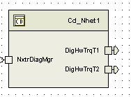

> **Source document:** `ePWM/doc/CD_NHET_1_MDD.docx`
>
> This page was converted automatically from the original document so it can be browsed online. Original format: Word document (`.docx`, 175 paragraphs, 15 tables, 1 embedded figures).

**Author:** Owen Tosh (nzx5jd) **Last saved by:** Windows User **Revision:** 8

---

# Module –Nhet

# High-Level Description

This module implements functionality with respect to  ES-34B ePWM.  This module implements the subfunctions other than the Motor Control Configuration Override subfunction and register initialization.

# Figures

## Component Diagram

# Variable Data Dictionary

For details on module input / output variable, refer to the Data Dictionary for the application.  Input / output variable names are listed here for reference.

| Module Inputs | Module Outputs | Module Outputs |
| --- | --- | --- |
| Nhet_HtuDataTrq_Cnt_G_str | Nhet_HtuDataTrq_Cnt_G_str | DigHwTrqT1_HwNm_f32 |
|  |  | DigHwTrqT2_HwNm_f32 |

## Module Internal Variables

This section identifies the name, range and resolutions for module specific data created by this module.  If there are no range restrictions on the variable, the term “FULL” is placed into the table for legal range.

| Variable Name | Resolution | Legal Range (min) | Legal Range (max) | Software Segment |
| --- | --- | --- | --- | --- |
| Nhet1_NTCParamT1_Cnt_M_u08 | See Data Dictionary | See Data Dictionary | See Data Dictionary | See Data Dictionary |
| Nhet1_NTCParamT2_Cnt_M_u08 | See Data Dictionary | See Data Dictionary | See Data Dictionary | See Data Dictionary |
| Nhet1_FltAccT1_Cnt_M_u16 | See Data Dictionary | See Data Dictionary | See Data Dictionary | See Data Dictionary |
| Nhet1_FltAccT2_Cnt_M_u16 | See Data Dictionary | See Data Dictionary | See Data Dictionary | See Data Dictionary |
| Nhet1_HwTrqT1_HwNm_M_f32 | See Data Dictionary | See Data Dictionary | See Data Dictionary | See Data Dictionary |
| Nhet1_HwTrqT2_HwNm_M_f32 | See Data Dictionary | See Data Dictionary | See Data Dictionary | See Data Dictionary |
| Nhet1_TotalMsg_Cnt_M_u32 | See Data Dictionary | See Data Dictionary | See Data Dictionary | See Data Dictionary |
| Nhet1_T1MissMsg_Cnt_M_u32 | See Data Dictionary | See Data Dictionary | See Data Dictionary | See Data Dictionary |
| Nhet1_T2MissMsg_Cnt_M_u32 | See Data Dictionary | See Data Dictionary | See Data Dictionary | See Data Dictionary |
| Nhet1_PrevPulseCountT1_Cnt_M_u32 | See Data Dictionary | See Data Dictionary | See Data Dictionary | See Data Dictionary |
| Nhet1_PrevPulseCountT2_Cnt_M_u32 | See Data Dictionary | See Data Dictionary | See Data Dictionary | See Data Dictionary |
| Nhet1_T1CalcCRC_Cnt_D_u08 | See Data Dictionary | See Data Dictionary | See Data Dictionary | See Data Dictionary |
| Nhet1_T2CalcCRC_Cnt_D_u08 | See Data Dictionary | See Data Dictionary | See Data Dictionary | See Data Dictionary |

### User defined typedef definition/declaration

This section documents any user types uniquely used for the module.

(Refer the included ref for more details of register)

| Typedef Name | Element Name | User Defined Type | Legal Range (min) | Legal Range (max) |
| --- | --- | --- | --- | --- |
|  | PULSE_MSGCOUNTST | enum | 0u | 0u |
|  | PULSE_SYNC | enum | 1u | 1u |
|  | PULSE_STATUS | enum | 2u | 2u |
|  | PULSE_D0 | enum | 3u | 3u |
|  | PULSE_D1 | enum | 4u | 4u |
|  | PULSE_D2 | enum | 5u | 5u |
|  | PULSE_CRC | enum | 6u | 6u |
|  | PULSE_MSGCOUNTEND | enum | 7u | 7u |

# Constant Data Dictionary

## Calibration Constants

This section lists the calibrations used by the module.  For details on calibration constants, refer to the Data Dictionary for the application.

| Constant Name |
| --- |
| k_HwTrqDiag_Cnt_str |

## Program(fixed) Constants

### Embedded Constants

All embedded constants whose values are provided in Eng units will be evaluated to the equivalent counts by using the FPM_InitFixedPoint_m() macro within the #define statement.

#### Local

| Constant Name | Units | Value |
| --- | --- | --- |
| D_NUMRAWDATA_CNT_U08 | Counts | 8u |
| D_STATUSFAULT_CNT_U08 | Counts | 0x04u |
| D_PROTOCOLFAULT_CNT_U08 | Counts | 0x08u |
| D_CRCFAULT_CNT_U08 | Counts | 0x10u |
| D_SYNCTICKS_ULS_F32 | Counts | 56.0f |
| D_HWTRQSCALE_HWNMPCNT_F32 | HwNmCnt | (20.0f/4095.0f) |
| D_HWTRQOFFSET_HWNM_F32 | HwNm | 10.0f |

#### Global

This section lists the global constants used by the module.  For details on global constants, refer to the Data Dictionary for the application.

| Constant Name |
| --- |
| None |

### Module specific Lookup Tables Constants

| Constant Name | Resolution | Value | Software Segment |
| --- | --- | --- | --- |
| T_SENTCRC_CNT_U08 | 1 | 0,13,7,10,14,3,9,4,1,12,6,11,15,2,8,5 | NHET1_START_SEC_CONST_8 |

# Functions/Macros used by the Sub-Modules

## Library Functions / Macros

The library and functions / Macros that are called by the various sub modules are identified below,

DiagPStep_m

DiagNStep_m

DiagFailed_m

HET Macros

## Data Hiding Functions

Rte_Call_NxtrDiagMgr_SetNTCStatus

## Global Functions/Macros Defined by this Module

### Global Functions #1

| Function Name |  | Type | Min | Max | UTP Tol. |
| --- | --- | --- | --- | --- | --- |
| Arguments Passed | None |  |  |  |  |
| Return Value | None |  |  |  |  |

#### Description

## Local Functions/Macros Used by this MDD only

### Local Macro #1

### Local Function #5

| Function Name | Nhet1_ProcessSENTData | Type | Min | Max | UTP Tol. |
| --- | --- | --- | --- | --- | --- |
| Arguments Passed | RawData_Cnt_T_u32[8] | Uint32 | 0 | 2^32 |  |
|  | *PrevPulseCount_Cnt_T_u08 | Uint8 | 0 | 1 |  |
|  | *HwTrq_HwNm_T_f32 | Float32 | -10 | 10 |  |
|  | *TxCalcCRC_Cnt_T_u08 | Uint8 | 0 | 127 |  |
| Return Value | NTCParam_Cnt_T_u08 | Float32 | 0 | 8 |  |

#### Description

To make sure "RawDataTicks" is rounded off, the type of RawData is converted to float and used in the RawDataTicks calculation.

RawDataTicks is converted again to the nearest fixed point.

RawDataTicks should be a ratio of RawData to ticks per PULSE_SYNC of RawData

# Software Module Implementation

## Runtime Environment (RTE) Initial Values

This section lists the initial values of data written by this module but controlled by the RTE. After RTE initialization, the data in this table will contain these values.

| Data | Value |
| --- | --- |
| None |  |

## Initialization Functions

### Init:

#### Design Rationale

None

#### Module Outputs

None

#### Module Internal

None

#### Initialize NHET 1 Direction Register

### Per: NHET 1_Per1

#### Design Rationale

#### Program Flow Start

Rte_Call_Nhet1_Per1_CP0_CheckpointReached()

#### Processing

#### Store Local copy of outputs into Module Outputs

#### Program Flow End

Rte_Call_Nhet1_Per2_CP1_CheckpointReached()

### Per: NHET 1_Per2

#### Design Rationale

#### Program Flow Start

#### Processing

#### Store Local copy of outputs into Module Outputs

#### Program Flow End

### Per: NHET 1_Per3

#### Design Rationale

Per3 updates the Nhet1 buffer or DMA buffer with the adjusted PWM Period and writes the BUF_RDY flag to signal to the Nhet that the data is available.

The adjusted PWM period is communicated from the ePWM module via a global variable; both these functions are called by the motor control ISR and therefore cannot communicate via the RTE.   The global variable extern declaration is in Cd_Nhet1.c instead of ePWM.h in order to limit its visibility.

The adjusted period data must be written to the buffer before the BUF_RDY flag is set; therefore all relevant variables must be volatile to guarantee execution order.

#### Program Flow Start

None

#### Processing

:

#### Store Local copy of outputs into Module Outputs

None

#### Program Flow End

None

## Fault Recovery Functions

None

## Shutdown Functions

None

## Interrupt Functions

None

## Serial Communication Functions

None

## Transition Functions

None

# Execution Requirements

## Execution Rates for sub-modules called by the Subroutine

This table serves as reference for the Scheduler design

| Global Function Name | Calling Frequency |  |
| --- | --- | --- |
| Nhet1_Per1 | 2ms |  |
| Nhet1_Per2 | 2ms |  |
| Nhet1_Per3 | Motor control ISR |  |

## Execution Requirements for Serial Communication Functions

| Function Name | Sub-Module called by (Serial Comm Function Name) |
| --- | --- |
| None |  |

# Memory Map Definition Requirements

## Sub Modules (Functions)

This table identifies the software segments for functions identified in this module.

| Name of Sub Module | Software Segment |
| --- | --- |
| Nhet1_Per1 | RTE_START_SEC_CD_NHET1_APPL_CODE |
| Nhet1_Per2 | RTE_START_SEC_CD_NHET1_APPL_CODE |
| Nhet1_Per3 | Nhet1_CODE |

## Local Functions

This table identifies the software segments for local functions identified in this module.

| Name of Sub Module | Software Segment |
| --- | --- |
| None |  |

# Known Issues / Limitations With Design

None

# Reference

Register Reference

# Revision Control Log

| Rev # | Change Description | Date | Author Initials |
| --- | --- | --- | --- |
| 1 | Updated to FDD 34B v003 | 28-July-13 | Selva |
| 2 | Corrected NumPulses_Cnt_T_u08 check from 8 to 7 | 01-Aug-13 | Selva |
| 3 | Updated for v5 of FDD34B | 7-Apr-14 | Selva |
| 4 | Nhet1_Per3 and related material updated for ES-34B v008 | 25-Jan-15 | KMC |
