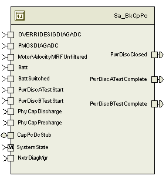

> **Source document:** `BkCpPc/doc/Bulk_Cap_Precharge_MDD.docx`
>
> This page was converted automatically from the original document so it can be browsed online. Original format: Word document (`.docx`, 202 paragraphs, 14 tables, 1 embedded figures).

**Author:** Owen Tosh (nzx5jd) **Last saved by:** Kaur, Lovepreet **Revision:** 17

---

# Module –

# High-Level Description

This module handles precharging of the bulk capacitor during initialization.  It is part of a larger initialization sequence, along with motor driver diagnostics and temporal monitor.

# Figures

## Component Diagram

# Variable Data Dictionary

For details on module input / output variable, refer to the Data Dictionary for the application.  Input / output variable names are listed here for reference.

| Module Inputs | Module Outputs | Module Outputs |
| --- | --- | --- |
| OVERRIDESIGDIAGADC_Volt_f32 | OVERRIDESIGDIAGADC_Volt_f32 | PwrDiscClosed_Cnt_lgc |
| PMOSDIAGADC_Volt_f32 | PMOSDIAGADC_Volt_f32 | PwrDiscATestComplete_Cnt_lgc |
| MotorVelocityMRFUnfiltered_MtrRadpS_f32 | MotorVelocityMRFUnfiltered_MtrRadpS_f32 | PwrDiscBTestComplete_Cnt_lgc |
| Batt_Volt_f32 | Batt_Volt_f32 |  |
| BattSwitched_Volt_f32 | BattSwitched_Volt_f32 |  |
| PwrDiscATestStart_Cnt_lgc | PwrDiscATestStart_Cnt_lgc |  |
| PwrDiscBTestStart_Cnt_lgc | PwrDiscBTestStart_Cnt_lgc |  |

## Module Internal Variables

This section identifies the name, range and resolutions for module specific data created by this module.  If there are no range restrictions on the variable, the term “FULL” is placed into the table for legal range.

| Variable Name | Resolution | Legal Range (min) | Legal Range (max) | Software Segment |
| --- | --- | --- | --- | --- |
| FirstRunComplete_Cnt_M_lgc | n/a | FALSE | TRUE | BKCPPC_START_SEC_VAR_CLEARED_UNSPECIFIED |
| PowerRelayInitFltFailed_Cnt_M_lgc | n/a | FALSE | TRUE | BKCPPC_START_SEC_VAR_CLEARED_UNSPECIFIED |
| PwrDiscATestComplete_Cnt_M_lgc | n/a | FALSE | TRUE | BKCPPC_START_SEC_VAR_CLEARED_UNSPECIFIED |
| PwrDiscBTestComplete_Cnt_M_lgc | n/a | FALSE | TRUE | BKCPPC_START_SEC_VAR_CLEARED_UNSPECIFIED |
| PwrDiscClosed_Cnt_M_lgc | n/a | FALSE | TRUE | BKCPPC_START_SEC_VAR_CLEARED_UNSPECIFIED |
| BulkCapPrechargeState_Cnt_M_enum | 1 | 0 | 7 | BKCPPC_START_SEC_VAR_CLEARED_UNSPECIFIED |
| RunTimeFaultAcc_Cnt_M_u16 | 1 | FULL | FULL | BKCPPC_START_SEC_VAR_CLEARED_16 |
| VerifyDiscOpenDiagTimer_mS_M_u32 | 1 | FULL | FULL | BKCPPC_START_SEC_VAR_CLEARED_32 |
| WaitForSqrWaveDiagTimer_mS_M_u32 | 1 | FULL | FULL | BKCPPC_START_SEC_VAR_CLEARED_32 |
| PrechargeDiagTimer_mS_M_u32 | 1 | FULL | FULL | BKCPPC_START_SEC_VAR_CLEARED_32 |
| PostCloseDiagTimer_mS_M_u32 | 1 | FULL | FULL | BKCPPC_START_SEC_VAR_CLEARED_32 |
| VerifyCloseDiagTimer_mS_M_u32 | 1 | FULL | FULL | BKCPPC_START_SEC_VAR_CLEARED_32 |
| VdischMax_Volts_M_f32 | Single Precision Float | 0 | 21 | BKCPPC_START_SEC_VAR_CLEARED_32 |
| VdischMin_Volts_M_f32 | Single Precision Float | 0 | 19 | BKCPPC_START_SEC_VAR_CLEARED_32 |
| VbattStart_Volts_M_f32 | Single Precision Float | 0 | 30 | BKCPPC_START_SEC_VAR_CLEARED_32 |
| VswitchStart_Volts_M_f32 | Single Precision Float | 0 | 20 | BKCPPC_START_SEC_VAR_CLEARED_32 |
| MotionDetected_Cnt_D_lgc | n/a | FALSE | TRUE | BKCPPC_START_SEC_VAR_CLEARED_UNSPECIFIED |
| DeltaV_Volts_D_f32 | Single Precision Float | -20 | 30 | BKCPPC_START_SEC_VAR_CLEARED_32 |
| VswitchCorrected_Volts_D_f32 | Single Precision Float | 0 | 120 | BKCPPC_START_SEC_VAR_CLEARED_32 |

### User defined typedef definition/declaration

This section documents any user types uniquely used for the module.

| Typedef Name | Element Name | User Defined Type | Legal Range (min) | Legal Range (max) |
| --- | --- | --- | --- | --- |
| BulkCapPrechargeSequenceType | BULKCAP_WAITFORSTARTA = 0 BULKCAP_VERIFYDISCOPEN = 1 BULKCAP_WAITFORSQRWAVE = 2 BULKCAP_PRECHARGE = 3 BULKCAP_WAITFORSTARTB = 4 BULKCAP_POSTCLOSE = 5 BULKCAP_VERIFYCLOSE = 6 BULKCAP_RUNTIMEDIAG = 7 | uint8 | 0 | 7 |

# Constant Data Dictionary

## Calibration Constants

This section lists the calibrations used by the module.  For details on calibration constants, refer to the Data Dictionary for the application.

| Constant Name |
| --- |
| k_MtrMotionThresh_MtrRadpS_f32 |
| k_MaxSwitchedVolt_Volts_f32 |
| k_PwrDiscOpenThresh_Volts_f32 |
| k_PMOSDIAGOpenThresh_Volts_f32 |
| k_OVERRIDESIGDIAGOpenThresh_Volts_f32 |
| k_VerifyPwrDiscOpenThresh_mS_u16 |
| k_WaitForSqrWaveThresh_mS_u16 |
| k_PwrDiscCloseThresh_Volts_f32 |
| k_PrechargeThresh_mS_u16 |
| k_PMOSVError_Volts_f32 |
| k_PMOSTError_mS_u16 |
| k_MaxDischEst_Uls_f32 |
| k_MinDischEst_Uls_f32 |
| k_VswitchDeltaThresh_Volts_f32 |
| k_VerifyPwrDiscCloseThresh_mS_u16 |
| k_ChargeMinDelta_Volts_f32 |
| k_VbattSwitchThreshNonExt_Volt_f32 |
| k_VbattSwitchThreshExNorm_Volt_f32 |
| k_ChargeMinDeltaNonOp_Volt_f32 |
| k_ChargeMinDeltaExtOp_Volt_f32 |
| k_ChargeMinDeltaNormlOp_Volt_f32 |
| k_ChargePumpDiag_Cnt_str |

## Program(fixed) Constants

### Embedded Constants

All embedded constants whose values are provided in Eng units will be evaluated to the equivalent counts by using the FPM_InitFixedPoint_m() macro within the #define statement.

#### Local

| Constant Name | Resolution | Units | Value |
| --- | --- | --- | --- |
| D_VDISCHMAXFACTOR_ULS_F32 | Single Precision Float | Unitless | 1.05 |
| D_VDISCHMINFACTOR_ULS_F32 | Single Precision Float | Unitless | 0.95 |
| D_PWRDISCCONFIGB_CNT_U08 | 1 | Count | 2 |

#### Global

This section lists the global constants used by the module.  For details on global constants, refer to the Data Dictionary for the application.

| Constant Name |
| --- |
| STD_LOW |
| STD_HIGH |
| D_ZERO_CNT_U16 |
| RTE_E_OK (0) - see Data Dictionary |
| D_PWRDISCCONFIGURATION_CNT_U08 - see Data Dictionary |

### Module specific Lookup Tables Constants

| Constant Name | Resolution | Value | Software Segment |
| --- | --- | --- | --- |
| None |  |  |  |

# Functions/Macros used by the Sub-Modules

## Library Functions / Macros

The library and functions / Macros that are called by the various sub modules are identified below,

Abs_f32_m

Min_m

DiagPStep_m

DiagNStep_m

DiagFailed_m

## Data Hiding Functions

Rte_Call_SystemTime_GetSystemTime_mS_u32

Rte_Call_SystemTime_DtrmnElapsedTime_mS_u16

Rte_Call_NxtrDiagMgr_SetNTCStatus

- Rte_Call_Vbatt_Batt_V_f32

- Rte_Call_Vswitch_BattSwitched_V_f32

- Rte_Call_PhyCapPrecharge_OP_SET

- Rte_Call_PhyCapDischarge_OP_SET

## Global Functions/Macros Defined by this Module

None

# Software Module Implementation

## Runtime Environment (RTE) Initial Values

This section lists the initial values of data written by this module but controlled by the RTE. After RTE initialization, the data in this table will contain these values.

| Data | Value |
| --- | --- |
| Rte_InitValue_MotorVelocityMRFUnfiltered_MtrRadpS_f32 | 0 |
| Rte_InitValue_OVERRIDESIGDIAGADC_Volt_f32 | 0 |
| Rte_InitValue_PMOSDIAGADC_Volt_f32 | 0 |
| Rte_InitValue_PwrDiscATestComplete_Cnt_lgc | FALSE |
| Rte_InitValue_PwrDiscATestStart_Cnt_lgc | FALSE |
| Rte_InitValue_PwrDiscBTestComplete_Cnt_lgc | FALSE |
| Rte_InitValue_PwrDiscBTestStart_Cnt_lgc | FALSE |
| Rte_InitValue_PwrDiscClosed_Cnt_lgc | FALSE |

## Initialization Functions

None

## Periodic Functions

### Per: BkCpPc_Per1

#### Design Rationale

#### Program Flow Start

Rte_Call_BkCpPc_Per1_CP0_CheckpointReached()

#### Store Module Inputs to Local copies

MotorVelocityMRFUnfiltered_MtrRadpS_T_f32 = Rte_IRead_BkCpPc_Per1_MotorVelocityMRFUnfiltered_MtrRadpS_f32()

OVERRIDESIGDIAGADC_Volt_T_f32 = Rte_IRead_BkCpPc_Per1_OVERRIDESIGDIAGADC_Volt_f32()

PMOSDIAGADC_Volt_T_f32 = Rte_IRead_BkCpPc_Per1_PMOSDIAGADC_Volt_f32()

PwrDiscATestStart_Cnt_T_lgc = Rte_IRead_BkCpPc_Per1_PwrDiscATestStart_Cnt_lgc()

PwrDiscBTestStart_Cnt_T_lgc = Rte_IRead_BkCpPc_Per1_PwrDiscBTestStart_Cnt_lgc()

Vbatt_Volts_T_f32 = Rte_IRead_BkCpPc_Per1_Batt_Volt_f32()

Vswitch_Volts_T_f32 = Rte_IRead_BkCpPc_Per1_BattSwitched_Volt_f32()

#### Motor Motion Check, Calculate Delta Voltage

#### Determine State

#### State – Wait for Start A

#### State – Verify Disconnect Open

#### State – Wait for Square Wave

#### State – Bulk Capacitor Precharge

#### State – Wait for Start B

#### State – Post Close Power Disconnect

#### State – Verify Power Disconnect Closed

#### State – Run Time Diagnostics

#### Store Local copy of outputs into Module Outputs

Rte_IWrite_BkCpPc_Per1_PwrDiscATestComplete_Cnt_lgc(PwrDiscATestComplete_Cnt_M_lgc)

Rte_IWrite_BkCpPc_Per1_PwrDiscBTestComplete_Cnt_lgc(PwrDiscBTestComplete_Cnt_M_lgc)

Rte_IWrite_BkCpPc_Per1_PwrDiscClosed_Cnt_lgc(PwrDiscClosed_Cnt_M_lgc)

#### Program Flow End

Rte_Call_BkCpPc_Per1_CP1_CheckpointReached()

## Fault Recovery Functions

None

## Shutdown Functions

None

## Interrupt Functions

None

## Serial Communication Functions

None

## Server Functions

### OP_SET: CapPcDcStub

#### Design Rationale

The digital output ports PhyCapDischarge_OP_SET and PhyCapPrecharge_OP_SET that are applicable only to Configuration B require a client/server port in Davinci Developer. However, for programs that only supports Configuration A, where these physical capacitor pins are NOT available, the Developer tool flags an error during integration of the component, since the client server ports are not connected. This server function stub will be connected to both the Client/Server ports, PhyCapDischarge_OP_SET and PhyCapPrecharge_OP_SET, to avoid the configuration error flaged by the Davinci Developer tool during integration.

#### Program Flow Start

N/A

#### Store Module Inputs to Local copies

None

#### Capacitor Discharge/Precharge server stub – for Configuration A

| CapPcDcStub_OP_SET |  | Type | Min | Max | UTP Tol. |
| --- | --- | --- | --- | --- | --- |
| Arguments Passed | signal | Uint8 (IoHwAb_BoolType is a uint8) | 0 | 1 | 0 |
| Return Value | RTE_E_OK | Uint8 | 0 | 0 | 0 |

#### Store Local copy of outputs into Module Outputs

None

#### Program Flow End

N/A

## Transition Functions

### Trns: BkCpPc_Trns1

#### Design Rationale

None

#### Program Flow Start

N/A

#### Store Module Inputs to Local copies

None

#### Set Outputs to Safe Conditions

#### Store Local copy of outputs into Module Outputs

None

#### Program Flow End

N/A

### Trns: BkCpPc_Trns2

#### Design Rationale

None

#### Program Flow Start

N/A

#### Store Module Inputs to Local copies

None

#### Initialize Outputs

None

#### Store Local copy of outputs into Module Outputs

None

#### Program Flow End

N/A

# Execution Requirements

## Execution Rates for sub-modules called by the Scheduler

This table serves as reference for the Scheduler design

| Function Name | Calling Frequency | System State(s) in which the function is called |
| --- | --- | --- |
| BkCpPc_Per1 | 2 ms | WARMINIT, OPERATE |
| BkCpPc_Trns1 | On Event | On Entering DISABLE |
| BkCpPc_Trns2 | On Event | On Entering WARMINIT |
| CapPcDcStub_OP_SET | N/A – stub only | N/A – stub only |

## Execution Requirements for Serial Communication Functions

| Function Name | Sub-Module called by (Serial Comm Function Name) |
| --- | --- |
| None |  |

# Memory Map Definition Requirements

## Sub Modules (Functions)

This table identifies the software segments for functions identified in this module.

| Name of Sub Module | Software Segment |
| --- | --- |
| BkCpPc_Per1 | RTE_START_SEC_SA_BKCPPC_APPL_CODE |
| BkCpPc_Trns1 | RTE_START_SEC_SA_BKCPPC_APPL_CODE |
| BkCpPc_Trns2 | RTE_START_SEC_SA_BKCPPC_APPL_CODE |
| CapPcDcStub_OP_SET | RTE_START_SEC_SA_BKCPPC_APPL_CODE |

## Local Functions

This table identifies the software segments for local functions identified in this module.

| Name of Sub Module | Software Segment |
| --- | --- |
| None |  |

# Known Issues / Limitations With Design

INLINE functions defined in GlobalMacro.h are not unit tested.

# Revision Control Log

| Item # | Rev # | Change Description | Date | Author Initials |
| --- | --- | --- | --- | --- |
| 1 | 1.0 | Initial Version (FDD 11B v001) | 13-Sep-12 | OT |
| 2 | 2.0 | UTP Updates | 20-Sep-12 | OT |
| 3 | 3.0 | Added Trns2 function to initialize startup sequence | 27-Sep-12 | OT |
| 4 | 4.0 | Anomaly 3912 – write outputs in all branches | 24-Oct-12 | OT |
| 5 | 5.0 | Added checkpoint statements | 21-Nov-12 | OT |
| 6 | 6.0 | Updated to version 3 FDD 11B | 28-Feb-13 | Selva |
| 7 | 7.0 | Set RunTimeFaultAcc_Cnt_M_u16 to zero  in tans 2 | 1-Mar-13 | Selva |
| 8 | 8.0 | Anomaly 5092 – add power disconnect configurable parameter | 29-May-13 | BDO |
| 9 | 9.0 | Anomaly 5122 – updates to address integration issues | 04-June-13 | BDO |
| 10 | 10.0 | Set PwrDiscATestComplete in BULKCAP_PRECHARGE state for Configuration A | 05-June-13 | BDO |
| 11 | 11.0 | Updated to add clarification for unit testing. | 21-June-13 | BDO |
| 12 | 12.0 | Flowcharts updated to show fixes for anomalies 5150 and 5763 | 1-Nov-13 | KMC |
| 13 | 13.0 | Updated flowcharts to remove trailing if else statements | 7-Jan-14 | LK |
