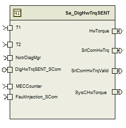

> **Source document:** `DigHwTrqSENT/doc/DigHwTrqSENT_MDD.docx`
>
> This page was converted automatically from the original document so it can be browsed online. Original format: Word document (`.docx`, 261 paragraphs, 18 tables, 1 embedded figures).

**Author:** Owen Tosh (nzx5jd) **Last saved by:** Windows User **Revision:** 13

---

# Module -- Digital Handwheel Torque Function (SENT)

# High-Level Description

This module computes the digital handwheel torque signal from the SENT digital sensor inputs.  It takes the sensor inputs, calculates the hw torque, compensates for trim,  applies filtering and limits, and outputs the handwheel torque in HwNm.  It uses long term correlated compensation to provide a T1 vs T2 correlation fault diagnostic.  It also contains the service calls for a trim to be set or cleared.

# Figures

## Component Diagram

# Variable Data Dictionary

For details on module input / output variable, refer to the Data Dictionary for the application.  Input / output variable names are listed here for reference.

| Module Inputs | Module Outputs | Module Outputs |
| --- | --- | --- |
| T1_HwNm_f32 | T1_HwNm_f32 | HwTorque_HwNm_f32 |
| T2_HwNm_f32 | T2_HwNm_f32 | SrlComHwTrq_HwNm_f32 |
| MECCounter_Cnt_enum | MECCounter_Cnt_enum | SrlComHwTrqValid_Cnt_Lgc |
|  |  | SysCHwTorque_HwNm_f32 |

## Module Internal Variables

This section identifies the name, range and resolutions for module specific data created by this module.  If there are no range restrictions on the variable, the term “FULL” is placed into the table for legal range.

| Variable Name | Resolution | Legal Range (min) | Legal Range (max) | Software Segment |
| --- | --- | --- | --- | --- |
| DigHwTrqSENT_T1_HwNm_M_f32 | See Data Dictionary | See Data Dictionary | See Data Dictionary | DIGHWTRQSENT_START_SEC_VAR_CLEARED_32 |
| DigHwTrqSENT_T2_HwNm_M_f32 | See Data Dictionary | See Data Dictionary | See Data Dictionary | DIGHWTRQSENT_START_SEC_VAR_CLEARED_32 |
| DigHwTrqSENT_HwTrq_HwNm_M_f32 | See Data Dictionary | See Data Dictionary | See Data Dictionary | DIGHWTRQSENT_START_SEC_VAR_CLEARED_32 |
| DigHwTrqSENT_TDiagFiltOut_HwNm_M_f32 | See Data Dictionary | See Data Dictionary | See Data Dictionary | DIGHWTRQSENT_START_SEC_VAR_CLEARED_32 |
| DigHwTrqSENT_SSDiagFiltOut_HwNm_M_f32 | See Data Dictionary | See Data Dictionary | See Data Dictionary | DIGHWTRQSENT_START_SEC_VAR_CLEARED_32 |
| DigHwTrqSENT_CMCFiltOut_HwNm_M_f32 | See Data Dictionary | See Data Dictionary | See Data Dictionary | DIGHWTRQSENT_START_SEC_VAR_CLEARED_32 |
| DigHwTrqSENT_TrqSum_HwNm_M_f32 | See Data Dictionary | See Data Dictionary | See Data Dictionary | DIGHWTRQSENT_START_SEC_VAR_CLEARED_32 |
| DigHwTrqSENT_DigHwTrqKSV_M_str | See Data Dictionary | See Data Dictionary | See Data Dictionary | DIGHWTRQSENT_START_SEC_VAR_CLEARED_UNSPECIFIED |
| DigHwTrqSENT_TDiagFiltKSV_M_str | See Data Dictionary | See Data Dictionary | See Data Dictionary | DIGHWTRQSENT_START_SEC_VAR_CLEARED_UNSPECIFIED |
| DigHwTrqSENT_SSFiltKSV_M_str | See Data Dictionary | See Data Dictionary | See Data Dictionary | DIGHWTRQSENT_START_SEC_VAR_CLEARED_UNSPECIFIED |
| DigHwTrqSENT_CMCFiltKSV_M_str | See Data Dictionary | See Data Dictionary | See Data Dictionary | DIGHWTRQSENT_START_SEC_VAR_CLEARED_UNSPECIFIED |
| DigHwTrqSENT_CMCFiltSV_HwNm_M_f32 | See Data Dictionary | See Data Dictionary | See Data Dictionary | DIGHWTRQSENT_START_SEC_VAR_SAVED_ZONEH_32 |

### User defined typedef definition/declaration

This section documents any user types uniquely used for the module.

| Typedef Name | Element Name | User Defined Type | Legal Range (min) | Legal Range (max) |
| --- | --- | --- | --- | --- |
| DigHwTrqSENTTrim_DataType | kEOLHwTrqTrim_HwNm_f32 | float | FULL | FULL |
|  | kEOLHwTrqTrimPerformed_Cnt_Lgc | boolean | FALSE | TRUE |

## Module Display Variables

| Variable Name | Variable Name | Resolution | Legal Range (min) | Legal Range (max) | Software Segment |
| --- | --- | --- | --- | --- | --- |
| DigHwTrqSENT_SumFiltOut_HwNm_D_f32 | See Data Dictionary | See Data Dictionary | See Data Dictionary | DIGHWTRQSENT_START_SEC_VAR_CLEARED_32 |  |
| DigHwTrqSENT_CorrDiagFiltOut_HwNm_D_f32 | See Data Dictionary | See Data Dictionary | See Data Dictionary | DIGHWTRQSENT_START_SEC_VAR_CLEARED_32 |  |
| DigHwTrqSENT_DigHwTrq_HwNm_D_f32 | See Data Dictionary | See Data Dictionary | See Data Dictionary | DIGHWTRQSENT_START_SEC_VAR_CLEARED_32 |  |
| DigHwTrqSENT_HwTrqTrim_HwNm_D_f32 | See Data Dictionary | See Data Dictionary | See Data Dictionary | DIGHWTRQSENT_START_SEC_VAR_CLEARED_32 |  |
| DigHwTrqSENT_TmpDigHwTrq_HwNm_D_f32 | See Data Dictionary | See Data Dictionary | See Data Dictionary | DIGHWTRQSENT_START_SEC_VAR_CLEARED_32 |  |

# Constant Data Dictionary

## Calibration Constants

This section lists the calibrations used by the module.  For details on calibration constants, refer to the Data Dictionary for the application.

| Constant Name |
| --- |
| k_HwTrqLPFFc_Hz_f32 |
| k_T1vsT2TrqSum_HwNm_f32 |
| k_T1T2TransFltLim_HwNm_f32 |
| k_T1T2CMCLPFEnable_HwNm_f32 |
| k_T1T2CMCLPFFc_Hz_f32 |
| k_CMCLPFOutLim_HwNm_f32 |
| k_T1T2SSLPFFc_Hz_f32 |
| k_T1T2SSLim_HwNm_f32 |
| t_T1T2DepTrsTimecon_Hz_u6p10 |
| t_T1T2IndTrsTimecon_HwNm_u5p11 |
| k_MaxHwTrqTrim_HwNm_f32 |

## Program(fixed) Constants

### Embedded Constants

All embedded constants whose values are provided in Eng units will be evaluated to the equivalent counts by using the FPM_InitFixedPoint_m() macro within the #define statement.

#### Local

| Constant Name | Resolution | Units | Value |
| --- | --- | --- | --- |
| D_DIFFTRQSCALE_ULS_F32 | Single precision floating point | unitless | 2.0 |
| D_HWTRQMAXRANGE_HWNM_F32 | Single precision floating point | HwNm | 10.0 |
| D_TRIMPERFORMED_CNT_LGC | boolean | boolean | TRUE |
| D_TRIMNOTPERFORMED_CNT_LGC | boolean | boolean | FALSE |
| D_MFGMODE_CNT_ENUM | enum | counts | ManufacturingMode |
| D_ONERESOLUTIONCOUNT_HWNM_F32 | Single precision floating point | HwNm | 0. 00390625f |
| D_DEFDIGHWTRQTRIM_HWNM_F32 | Single precision floating point | HwNm | 0.0 |
| D_DEFSSDIAGFILTOUT_HWNM_F32 | Single precision floating point | HwNm | 0.0 |
| D_HWTRQLPFSAMPLEINT_SEC_F32 | Single precision floating point | sec | D_2MS_SEC_F32 |
| D_TDIAGLPFSAMPLEINT_SEC_F32 | Single precision floating point | sec | 0.004 |
| D_CMCLPFSAMPLEINT_SEC_F32 | Single precision floating point | sec | 0.1 |
| D_SSLPFSAMPLEINT_SEC_F32 | Single precision floating point | sec | 0.1 |
| D_SSFILTSVLMT_HWNM_F32 | Single precision floating point | HwNm | k_T1T2SSLim_HwNm_f32 + D_ONERESOLUTIONCOUNT_HWNM_F32 |
| D_FAILEDANDFAILEDTHISOPCYCLE_CNT_U08 | 1 | counts | D_TESTFAILEDBIT_CNT_B8 \| D_TESTFAILEDTHISOPCYCLEBIT_CNT_B8 |

#### Global

This section lists the global constants used by the module.  For details on global constants, refer to the Data Dictionary for the application.

| Constant Name |
| --- |
| NULL_PTR |
| D_2MS_SEC_F32 |
| RTE_E_OK |
| NVM_REQ_OK |
| FLTINJ_DIGHWTRQSENT_T1FAULT |
| FLTINJ_DIGHWTRQSENT_T2FAULT |

### Module specific Lookup Tables Constants

(This is for lookup tables (arrays) with fixed values, same name as other tables)

| Constant Name | Resolution | Value | Software Segment |
| --- | --- | --- | --- |
| None |  |  |  |

# Functions/Macros used by the Sub-Modules

## Library Functions / Macros

The library and functions / Macros that are called by the various sub modules are identified below,

Limit_m()

Abs_f32_m()

FPM_FloatToFixed_m()

- FPM_FixedToFloat_m

IntplVarXY_u16_u16Xu16Y_Cnt()

LPF_Init_f32_m()

LPF_OpUpdate_f32_m ()

LPF_KUpdate_f32_m()

Tablesize_m()

## Data Hiding Functions

Rte_Call_NxtrDiagMgr_SetNTCStatus()

Rte_Call_NxtrDiagMgr_GetNTCStatus()

Rte_Pim_DigTrqTrim()

Rte_Call_NvM_DigHwTrqSENTTrim_Srv_GetErrorStatus()

Rte_Call_NvM_DigHwTrqSENTTrim_Srv_WriteBlock()

## Global Functions/Macros Defined by this Module

None

## Local Functions/Macros Used by this MDD only

### Trim Not Performed Diagnostic

| Function Name | TrimNotPerfDiag | Type | Min | Max | UTP Tol. |
| --- | --- | --- | --- | --- | --- |
| Arguments Passed | MECCounter_Cnt_T_enum | ManufModeType | 0 | 2 | n/a |
| Return Value | n/a |  |  |  |  |

#### Description

# Software Module Implementation

## Runtime Environment (RTE) Initial Values

This section lists the initial values of data written by this module but controlled by the RTE. After RTE initialization, the data in this table will contain these values.

| Data | Value |
| --- | --- |
| Rte_InitValue_T1_HwNm_f32 | 0.0 |
| Rte_InitValue_T2_HwNm_f32 | 0.0 |
| Rte_InitValue_HwTorque_HwNm_f32 | 0.0 |
| Rte_InitValue_SrlComHwTrq_HwNm_f32 | 0.0 |
| Rte_InitValue_SrlComHwTrqValid | FALSE |
| Rte_InitValue_MECCounter_Cnt_enum | 0 |
| Rte_InitValue_SysCHwTorque | 0 |

## Initialization Functions

### Init: SENT_Init1

#### Design Rationale

TDiag filter does not need initialization because the state variable initialization value is zero and the filter constant is calculated each time the filter is updated.

#### Module Outputs

None

#### Module Internal

#### Check NvM Error Status

## Periodic Functions

### Per: SENT_Per1

#### Design Rationale

None

#### Program Flow Start

Rte_Call_DigHwTrqSENT_Per1_CP0_CheckpointReached()

#### Store Module Inputs to Local copies

DigHwTrqSENT_T1_HwNm_M_f32 = Rte_IRead__DigHwTrqSENT_Per1_T1_HwNm_f32();

DigHwTrqSENT_T2_HwNm_M_f32 = Rte_IRead_DigHwTrqSENT_Per1_T2_HwNm_f32();

#### Handwheel Torque Calculation

#### Store Local copy of outputs into Module Outputs

DigHwTrqSENT_TmpDigHwTrq_HwNm_D_f32 = TmpDigHwTrq_HwNm_T_f32

DigHwTrqSENT_DigHwTrq_HwNm_D_f32 = DigHwTrq_HwNm_T_f32

Rte_IWrite_DigHwTrqSENT_Per1_HwTorque_HwNm_f32(DigHwTrqSENT_HwTrq_HwNm_M_f32)

Rte_IWrite_DigHwTrqSENT_Per1_SysCHwTorque_HwNm_f32(DigHwTrqSENT_HwTrq_HwNm_M_f32);

#### Program Flow End

Rte_Call_DigHwTrqSENT_Per1_CP1_CheckpointReached()

### Per: DigHwTrqSENT_Per2

#### Design Rationale

None

#### Program Flow Start

Rte_Call_DigHwTrq_Per2_CP0_CheckpointReached()

#### Store Module Inputs to Local copies

None

#### T1 vs T2 Comparison Diagnostic

#### Serial Comm Outputs

#### Store Local copy of outputs into Module Outputs

Rte_IWrite_DigHwTrqSENT_Per2_SrlComHwTrq_HwNm_f32 (DigHwTrqSENT_HwTrq_HwNm_M_f32)

Rte_IWrite_DigHwTrqSENT_Per2_SrlComHwTrqValid_Cnt_lgc (SrlComHwTrqValid_Cnt_T_lgc)

#### Program Flow End

Rte_Call_DigHwTrqSENT_Per2_CP1_CheckpointReached()

### Per: DigHwTrqSENT_Per3

#### Design Rationale

None

#### Program Flow Start

#### Store Module Inputs to Local copies

None

#### Steady State Filter

#### Common Mode Compensation

#### Program Flow End

Rte_Call_DigHwTrq_Per3_CP1_CheckpointReached()

## Fault Recovery Functions

None

## Shutdown Functions

None

## Interrupt Functions

None

## Serial Communication Functions

### Scomm: DigHwTrqSENT_Scom_ClrTrqTrim

#### Design Rationale

None

#### Program Flow Start

n/a

#### Store Module Inputs to Local copies

None

#### Clear Handwheel Torque Trim

#### Store Local copy of outputs into Module Outputs

None

#### Program Flow End

n/a

### Scomm: DigHwTrqSENT_Scom_SetTrqTrim

| Function Name | DigHwTrqSENT_SCom_SetTrqTrim | Type | Min | Max |
| --- | --- | --- | --- | --- |
| Arguments Passed | NA |  |  |  |
| Return Value | RetValue | Uint8 | 0 | 34 |

#### Design Rationale

None

#### Program Flow Start

n/a

#### Store Module Inputs to Local copies

None

#### Set Handwheel Torque Trim

#### Store Local copy of outputs into Module Outputs

DigHwTrqSENT_HwTrqTrim_HwNm_D_f32 = HwTrqTrim_HwNm_T_f32

#### Program Flow End

n/a

### Scomm: DigHwTrqSENT_Scom_TrimData

|  |  |  | -10 False | 10 True |
| --- | --- | --- | --- | --- |

#### Design Rationale

None

#### Program Flow Start

n/a

#### Store Module Inputs to Local copies

None

#### Handwheel Torque Trim Data

#### Store Local copy of outputs into Module Outputs

#### Program Flow End

n/a

### Scomm: DigHwTrqSENT_Scom_WriteData

| Function Name | DigHwTrqSENT_SCom_WriteData | Type | Min | Max |
| --- | --- | --- | --- | --- |
| Arguments Passed | HwTrqTrim_HwNm_f32 | Float | -10 | 10 |
| Return Value | n/a |  |  |  |

#### Design Rationale

None

#### Program Flow Start

n/a

#### Store Module Inputs to Local copies

None

#### Handwheel Torque Write Data

#### Store Local copy of outputs into Module Outputs

n/a

#### Program Flow End

n/a

# Execution Requirements

## Execution Sequence of the Module

## Execution Rates for sub-modules called by the Scheduler

This table serves as reference for the Scheduler design

| Function Name | Calling Frequency | System State(s) in which the function is called |
| --- | --- | --- |
| DigHwTrqSENT_Init1() | Once (at initialization) | STARTUP |
| DigHwTrqSENT_Per1() | 2 ms | ALL |
| DigHwTrqSENT_Per2() | 4 ms | ALL |
| DigHwTrqSENT_Per3() | 100 ms | ALL |

## Execution Requirements for Serial Communication Functions

| Function Name | Sub-Module called by (Serial Comm Function Name) |
| --- | --- |
| DigHwTrqSENT_SCom_ClrTrqTrim () | EPSInternalRoutineControl() |
| DigHwTrqSENT_SCom_SetTrqTrim () | EPSInternalRoutineControl() |
| DigHwTrqSENT_SCom_TrimData() | EPSInternalRoutineControl() |
| DigHwTrqSENT_SCom_WriteData() | EPSInternalRoutineControl() |

# Memory Map Definition Requirements

## Sub Modules (Functions)

This table identifies the software segments for functions identified in this module.

| Name of Sub Module | Software Segment |
| --- | --- |
| DigHwTrqSENT_Init1() | RTE_ SA_DIGHWTRQSENT_APPL_CODE |
| DigHwTrqSENT_Per1() | RTE_ SA_DIGHWTRQSENT_APPL_CODE |
| DigHwTrqSENT_Per2() | RTE_ SA_DIGHWTRQSENT_APPL_CODE |
| DigHwTrqSENT_Per3() | RTE_ SA_DIGHWTRQSENT_APPL_CODE |
| DigHwTrqSENT_SCom_ClrTrqTrim () | RTE_ SA_DIGHWTRQSENT_APPL_CODE |
| DigHwTrqSENT_SCom_SetTrqTrim () | RTE_ SA_DIGHWTRQSENT_APPL_CODE |
| DigHwTrqSENT_SCom_TrimData() | RTE_SA_DIGHWTRQSENT_APPL_CODE |
| DigHwTrqSENT_SCom_WriteData() | RTE_SA_DIGHWTRQSENT_APPL_CODE |

## Local Functions

This table identifies the software segments for local functions identified in this module.

| Name of Sub Module | Software Segment |
| --- | --- |
| TrimNotPerfDiag | SA_DIGHWTRQSENT_CODE |

# Known Issues / Limitations With Design

- INLINE functions defined in globalmacro.h are not unit tested

- Serial communication outputs are being processed in the DigHwTrqSENT_Per2() function which is called every 4ms. Processing is done at 4 ms instead of 2 ms for processor throughput considerations. If the actual serial outputs are transmitted at a rate that is not a multiple of 4 ms, there will be corresponding jitter in the outputs. E.g. if the outputs are transmitted at 10 ms, the torque value will be updated over an 8ms interval one time, and a 12 ms interval the next.

Revision Control Log

| Rev # | Change Description | Date | Author Initials |
| --- | --- | --- | --- |
| 1.0 | Initial Version per ES04C_HWTrqFunc_v003.mdl and ES_04C_HwTrqFunc_Calibrations_Constants.m | 01-Jul-13 | KMC |
| 2.0 | Correct name of HwTrq_HwNm_M_f32 in section 3.1.  Add RTE_E_OK and NVM_REQ_OK in section 4.2.1.2. | 15-Jul-13 | KMC |
| 3.0 | Correct reads from SCom functions to be direct rather than buffered. | 31-Jul-13 | KMC |
| 4.0 | Add Scom function to read TrimData | 14-Jan-14 | LK |
| 5.0 | Updated MDD to match with latest source file | 16-Jan-14 | LK |
| 6.0 | Updated per Design Review CR 11619 | 03-Mar-14 | SB |
| 7.0 | Updated per Design Review CR 11619 | 27-Mar-14 | SB |
| 8.0 | Implemented ES04C Rev 006 | 09-Jun-14 | SB |
| 9.0 | Implemented ESC04C Rev 007 and added the function DigHwScomm_WriteData | 30-July-14 | VS |
